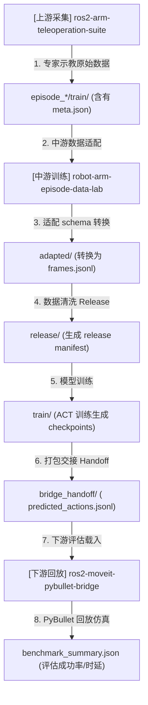

# 闭环仿真智能体系统规范 (AGENTS.md) - V2.1

Canonical 三仓 Agent 总览。各仓实现映射见：

- 上游：`ros2-arm-teleoperation-suite/docs/AGENTS.md`
- 下游：`ros2-moveit-pybullet-bridge/docs/AGENTS.md`
- 闭环跑法：`docs/CLOSED_LOOP_RUNBOOK.md`
- E2 单红块续跑（止损后转评测框架）：`docs/E2_SINGLE_RED_DATA_EXPANSION_RUNBOOK.md`
- 模型无关评测：`docs/POLICY_ADAPTER_CONTRACT.md`、`docs/SINGLE_BLOCK_GENERALIZATION_BENCHMARK.md`

---

## 1. 三仓边界与 Agent 分布

| 仓库 | 实时 Agent | 离线 Agent |
|------|------------|------------|
| **上游** | Task / Motion / Evaluation | — |
| **中游（本仓）** | — | Data Adapter / Inspector / Training / Handoff |
| **下游** | Replay / Risk / Sensor Fusion | Handoff Loader |

**Legacy 分流**：本仓 `agents/`、`core/` 为 PyBullet/KUKA 历史 Agent，**不得**与 Panda training release 混用。索引见 [archive/README.md](archive/README.md)。

---

## 2. 上游实时 Agent（摘要）

### Task Planning Agent
- **位置**：`batch_generator` 或 L0 `teleop_input`
- **FSM**：Hover → Descend → Close → Lift → Transport → Place → Release

### Motion Planning & Control Agent
- **位置**：L2 `moveit_servo` + L3 `cartesian_impedance_controller`
- **行为**：笛卡尔伺服 + 阻抗力矩（仿真 `500 Hz` / 真机路径 `1 kHz`，见上游 `control_rate_{sim,real}.yaml`）；**不含** RRT（RRT 在 legacy/下游）

### Evaluation Agent（双轨）
| 轨道 | 实现 | 批采默认 |
|------|------|----------|
| **主轨** | `batch_generator._validate_episode` → `discard` / `stop_success` | 启用 |
| **辅轨** | `grasp_monitor` → `/grasp/status` | `enable_grasp_monitor:=true` |

**硬约束**：训练数据必须 `grasp_assist_enabled:=false`。

---

## 3. 中游离线 Agent（本仓）

| Agent | 实现 | 职责 | 不做 |
|-------|------|------|------|
| **Data Adapter** | `training/adapters/upstream_m6.py` | state[7+1]、action 语义转换 | 物理 lift/place 判定 |
| **Dataset Inspector** | `training/scripts/inspect_dataset.py` | schema + training split | 重复 object_pose 物理判定 |
| **Release** | `prepare_dataset_release.py` | 不可变 release manifest | ROS 运行时 |
| **Training** | `train_act_smoke.py` / `train_act_lerobot.py` | smoke / ACT 训练 | 仿真控制 |
| **Handoff** | `prepare_bridge_handoff.py` | JSONL + manifest 打包 | PyBullet 执行 |

---

## 4. 下游运行时 Agent（摘要）

| Agent | 实现 | 职责 |
|-------|------|------|
| **Handoff Loader** | `learning/panda_handoff.py` | 静态校验 handoff bundle |
| **Replay / Policy** | `PolicyRunner` + `PandaActionAdapter` | JSONL → PyBullet 关节命令 |
| **Risk / Monitor** | `dist_monitor` + `risk_engine` | 漂移、E-stop、Hold |
| **Sensor Fusion** | `sensor_fusion_node` | 多源对齐、接触估计（Sim2Sim） |

---

## 5. Gate 协议（清洗边界）

### 上游 episode meta (`episode_*/meta.json`)
```yaml
upstream_gate: batch_generator | teleop
success: true
```

### 中游 adapted / release manifest
```yaml
upstream_gate: batch_generator
filter_scope: training_split_only   # 物理门禁已在上游
physical_validation_applied: true
action_type: ee_delta_gripper
```

**规则**：
- `filter_scope=training_split_only` 时，中游只校验 schema 与 `success`/`safety_estop`/`drive_fault` 训练 split。
- 中游**不得**从 `observation.object_pose` 重新推导 lift/place 成败。

---

## 6. 话题与交接（Panda 主线）

| 阶段 | 关键产物 |
|------|----------|
| 上游采集 | `episode_*/train/` + `meta.json` |
| 中游 release | `frames.jsonl` + `manifest.json` |
| 中游 handoff | `bridge_handoff/` + `predicted_actions.jsonl` |
| 下游 replay | `benchmark_summary.json` |

一键 midstream 链：`scripts/run_three_repo_closed_loop.sh`

---

## 7. 与 V2.0 的差异（V2.1 修订）

1. 明确 Evaluation **双轨**（batch_generator 主轨 + grasp_monitor 辅轨）
2. Motion Agent 去掉「Servo 做 RRT」表述
3. 新增中游 / 下游 Agent 表
4. 新增 `upstream_gate` / `filter_scope` 边界
5. Legacy PyBullet Agent 与 Panda 主线分离

---

## 8. Codex / AI 项目事实检索规则

### 8.1 基本原则

涉及本项目实际实现、三仓数据流、接口协议、训练流程、评估、handoff 或故障排查的问题时，不得仅依据通用机器人、机器学习或软件工程经验回答。

回答前必须优先检索当前项目中的代码、配置、测试和文档。

项目事实的证据优先级如下：

1. 自动化测试及实际运行产物
2. 当前代码实现
3. 配置文件与数据 schema
4. 当前版本技术文档
5. README 与作品集描述
6. 行业通用经验

当代码、测试与文档不一致时，应优先采用测试和代码，并明确指出冲突。

### 8.2 RAG 调用条件

当用户问题涉及以下内容时，回答前必须调用项目 RAG：

- 三仓之间的数据流与职责边界
- Panda episode、state、observation、action 的真实字段
- Data Adapter、Inspector、Release、Training、Replay、Handoff
- MLP BC、ACT、离线评估与模型输出
- Gate、schema、manifest 和训练数据筛选
- 上游采集、中游训练、下游执行之间的接口
- 当前项目是否已经实现某项功能
- 故障排查、接口不一致或文档与代码冲突

调用方式：

```bash
python3 -m project_knowledge.cli query --mode auto --no-llm --query "<用户原始问题>"
```

兼容入口仍可使用：

```bash
python3 scripts/rag_assistant.py --query "<用户原始问题>"
```

也可以使用：

```bash
bin/ask-project "<用户原始问题>"
```

只读知识源审计与 Git 影响分析：

```bash
python3 -m project_knowledge.cli audit --json-out /tmp/project-audit.json --markdown-out /tmp/project-audit.md
python3 -m project_knowledge.cli impact --base HEAD~1 --head HEAD
```

### 8.3 检索范围

项目 RAG 应覆盖以下三个仓库：

- `../ros2-arm-teleoperation-suite`
- `.`
- `../ros2-moveit-pybullet-bridge`

优先检索：

- `README.md`
- `AGENTS.md`
- `docs/**/*.md`
- `scripts/**/*.py`
- `training/**/*.py`
- `configs/**/*.yaml`
- `tests/**/*.py`
- 相关 ROS 2 launch、节点和接口定义

不得索引或引用：

- `.git/`
- `.venv/`
- `build/`
- `install/`
- `log/`
- `node_modules/`
- `dataset/`
- `checkpoints/`
- 二进制文件及大型生成产物

### 8.4 回答格式

回答项目问题时，必须明确区分以下四类内容：

#### 已实现

存在直接代码、配置或测试证据，可以确认当前仓库已经实现。

#### 文档声明，代码未确认

文档中提到或规划了该能力，但当前检索结果未能找到充分的代码或测试证据。

#### 基于证据的推断

可以根据调用关系或数据流作出合理判断，但不存在直接实现证据。

#### 通用背景知识

属于机器人、机器学习或软件工程的一般规律，不代表当前项目已经采用。

每次回答至少包含：

- 直接结论
- 仓库名
- 相对文件路径
- 相关函数、类、配置字段或章节
- 行号或代码位置
- 当前证据是否充分

如果证据不足，应明确回答：

> 当前项目证据不足，无法确认。

禁止通过行业惯例补全项目现状。

#### 8.4.1 面试知识库固化机制

当用户提问关于运动控制、总线通信、安全限位、DDS优化或节点编排等底层原理性/系统架构性问题，以及高频 Linux/ROS 2 系统级调试与日志诊断命令时，Agent 在完成解答后，必须主动将该问题以 FAQ 形式追加到下游仓库的面试知识库文档中：[docs/portfolio/INTERVIEW_PREP.md](file:///home/ina/ros2_ws/src/ros2-moveit-pybullet-bridge/docs/portfolio/INTERVIEW_PREP.md)。

固化要求：
1. FAQ 必须条理清晰，至少包含“核心原理解析/常用命令”与“对应项目代码事实”。
2. 涉及到的具体代码、配置文件路径，必须使用包含 `file://` 协议的绝对路径超链接，确保用户可以直接点击跳转代码行。
3. FAQ 的内容口径必须与 AGENTS.md 中的项目现状（8.6）严格一致，区分“已实现”和“设计规划”。

### 8.5 修改代码前的要求

修改涉及三仓接口、schema、action 语义、release、handoff 或训练流程的代码前，必须：

1. 检索三个仓库中的相关实现；
2. 确认当前调用链和数据格式；
3. 检查对应测试；
4. 说明将修改哪个仓库以及为什么；
5. 避免在多个仓库重复实现同一职责；
6. 不得破坏以下既定边界：

- 上游负责遥操作、仿真交互、任务执行和数据采集；
- 中游负责数据适配、检查、release、训练、评估和 handoff；
- 下游负责 handoff 加载、回放执行和风险验证。

### 8.6 项目范围约束

当前项目应描述为：

> Panda 机械臂的多仓数据、训练、离线评估与 Sim2Sim / Sim2Real-readiness 验证闭环。

当前不得默认声称：

- 已完成真实机械臂部署；
- 已完成真实 Sim2Real；
- 已实现稳定在线自主抓取；
- 离线 loss 提升等同于任务成功率提升；
- 文档中出现的规划功能已经全部实现；
- LingBot-VLA 为本仓第一后训练策略或已完成 Gate V1；
- SmolVLA 已适配 Panda / 已完成 VLA 抓取 / 已验证任务成功；
- SmolVLA S2 接口 Pass 等同于可进入 Isaac 或 S3 LoRA；
- SmolVLA **S3 Ready** / **S3 Hold** 等同于已完成 LoRA / 任务成功 / 可进 Isaac。

**VLA / 评测接力硬禁止（防 Codex 误推进）**：

- 不得自动恢复 LingBot Gate V1；
- 不得下载 LingBot 6B 权重；
- 不得把 55-D 通道切片视为 Panda 执行映射；
- 不得因 SmolVLA S2 接口 Pass、S3 Ready 或 S3 Hold 而进入 Isaac；
- SmolVLA S3 任何继续修复 / 重训需要显式人工批准和外部 GPU；`max_data_fix_retries: 1` **已用尽**，不得自动开启第二次 data-fix；未过 open-loop Pass 不得进 S4；
- ACT 保持冻结诊断基线，不继续盲目训练；
- 当前优先事项：SmolVLA **S3 Hold**。v1 griptiming + α64 LoRA 的 canonical 全帧 `stride=1` open-loop 为 EE `0.0547 m`、gripper balanced accuracy `0.7128`、闭合平均提前 `65` 帧 / `6.5 s`、smoothness p90 `0.103 m`、raw gripper OOB `20.47%`。人工例外 Round-2 v2 late-close 的同口径 3,108 帧 open-loop 仍为 **Hold**：EE `0.0669 m`、gripper balanced accuracy `0.7203`、闭合平均提前 `68.625` 帧 / `6.862 s`、smoothness p90 `0.1196 m`、raw gripper OOB `21.07%`；8/8 episode 均提前闭合，timing / smooth / sat 相比 v1 未改善。当前帧 action、`range(50)` chunk 标签和 reset 后首动作 `popleft()` 的索引链已审计排除；该结论不等于已执行 action-chunk queue。**默认停止**；禁止自动扩采、第三次 data-fix、重训或进入 Isaac（见 `docs/SMOLVLA_S3_GRIP_TIMING_ROUND2_PLAN.md`）。
- 2026-07-23 Recovery Phase 0 决策已冻结：`observation.state[15]`（joint7+ee_pose7+gripper1）+ 官方精确 PEFT 正则（非 full_training_modules）。Phase 1 wrist 已止损：原 4 条目标不可见；仅翻转视轴的 P0 重试仍为 Hold，P1 按约定跳过；v3 相机冻结为 **scene-only**。见 `docs/SMOLVLA_S3_RECOVERY_IMPLEMENTATION_PLAN.md`、`configs/smolvla_s3/recovery_decisions.yaml`。
- 2026-07-23 Phase 2 的 scene-only 50 条采集与 immutable `smolvla_s3_panda_abs_eef_scene_v3_phaseaware50` release 已单独获人工批准；该次批准当时不扩展到 wrist、额外 data-fix、正式训练、AutoDL 计费或 Isaac；后续正式训练由用户另行明确批准。
- 2026-07-23 Recovery 本地入口修复已完成：train-only 物化可写 `state[15]`；训练配置显式覆盖 `state15+camera1/action8`，把 chunk10 与 `n_action_steps=5` 解耦；checkpoint audit 同时核验 policy/preprocessor state、camera、action、K 与 PEFT；evaluator v2 显式分开 `canonical_first_action` 与 `queued_diagnostic`（后者消费队列但禁止 canonical Pass），并记录 latency p50/p95。Recovery 唯一配置且提供 `camera1`；按 LeRobot 0.5.1 `prepare_images` 的 missing-feature 语义，`empty_cameras=0`、预期追加空图为 0，已由本地契约测试固定。结构上已排除空图补位，但 full-forward latency、真实 Recovery checkpoint 与异步部署 runtime **仍未验证/未实现**；这不扩大已批准的 Phase 2 范围，也不授权正式训练、AutoDL 计费或 Isaac。
- 2026-07-23 经人工批准只跑无训练 probe 后，AutoDL RTX 4090D Recovery real preflight **Pass**：完整 SmolVLA 权重、32 steps、官方 PEFT 正则解析 74 个 trainable parameter names、LoRA 参数更新和 adapter 保存成功、无 OOM、峰值约 `939.99 MiB`、约 `25.17 ms/step`。该 probe 明确 `policy_forward_executed=false`、`inference_latency_measured=false`，不是推理延迟结论。Recovery draft 已把实际栈（含 `peft==0.19.1`）冻结为 preflight-qualified versions，并新增训练前依赖匹配硬门禁；旧 report 发生在该合同修订前，仅保留为 live-resolve 证据，修订后的配置需重新跑获批的无训练 preflight，且 report 必须含 `dependency_version_audit.passed=true`。该 probe 本身不授权正式训练或 Isaac；后续训练由用户另批。证据：`runs/smolvla_s3/recovery_preflight_nont_20260723T123500Z/preflight_report.json`。
- 2026-07-23 经后续人工批准，Recovery v3 使用 train-only 36 episodes 完成 5,705-step LoRA，checkpoint audit Pass；14 条 / 3,413 帧 canonical first-action open-loop 在冻结的 `eval_gate_v1` 下仍为 **Hold**，唯一失败项是 `sat`：EE `0.037900 m`、gripper balanced accuracy `0.993587`、close timing error `2.142857 frames`、smoothness p90 `0.026814 m`、raw gripper OOB `33.6068%`。K5 queued diagnostic 仍为 Hold 且不可获 canonical Pass。本地 gripper range/clip/normalization 审计 Pass：checkpoint/release `MEAN_STD` 一致；postprocessor 只反归一化，执行 adapter clamp `[0,1]`；canonical 超边界超过 `0.05` 的比例为 `0.7032%`、clip MAE `0.004358`，clip 对开关分类与 3-frame 首次关爪时序均零变化。用户已批准独立 severity-aware `eval_gate_v2` 设计；`configs/smolvla_s3/eval_gate_v2.yaml` 已冻结（SHA256 `31101fce...daa0a`），evaluator v3 与契约测试已实现。v3 Pass 强制校验 gate/splits SHA、精确 eval refs、零 train/design overlap、canonical 全帧采样和 run-specific 人工授权 manifest；旧 Recovery 报告在 v2 下仍为 Hold（`prospective_eligibility`），不能追溯改判。尚未运行 prospective GPU evaluation，未授权 Isaac。证据：`docs/SMOLVLA_S3_GRIPPER_RANGE_CLIP_AUDIT.md`、`configs/smolvla_s3/eval_gate_v2.lock.json`、`runs/smolvla_s3/gripper_range_clip_audit_20260723/v2_historical_reclassification_audit.json`。
- 2026-07-23 人工例外批准的 Round-2 已完整收口：upstream seed56/57 各 `10/10 accepted`，联合数据 QA Pass；独立 v2 release validate Pass（20 episodes / 7,765 frames）；RTX 4090 D 真实 GPU preflight Pass；正式 1000-step LoRA 与 checkpoint config audit 全项 Pass（adapter SHA256 `c9b93c4d994539c240b795242663f3758a578343ee245dfd20697180b129fe6d`）；全帧 open-loop 结果为 Hold。事后审计确认训练根含全部 20 episodes，未按 release 的 12/4/4 split 过滤，因此 validation/benchmark 不能称真正 held-out/OOD；在训练见过这些 episode 的条件下仍 Hold。训练产物有效，但 late-close data-fix 没有修复策略时序，未过 Pass，**不得进入 Isaac**。任何新实验必须先按 `docs/SMOLVLA_S3_RECOVERY_IMPLEMENTATION_PLAN.md` 修复 split、policy input 与 PEFT target，且需重新人工批准。

权威路线表：中游 `docs/portfolio/THREE_REPO_CANONICAL_FACTS.md`「VLA 候选路线状态」。

Legacy PyBullet/KUKA 实现不得与 Panda 主线混用。

### 8.7 调试与测试运行的物理收尾规则

Agent 在使用 `run_command` 工具调试、执行 ROS 2 节点、MuJoCo 仿真器或录制任务时，必须严格遵守以下“物理收尾”铁律，防止后台僵尸进程残留造成系统过载或下一次冲突：

1. **生命周期必须显式受限**：
   严禁运行无时限的常驻后台命令。对于拉起仿真或录制的测试任务，必须带有自动退出的参数（例如 `auto_record_seconds`）或者在 Bash 中加上强制超时前缀（如 `timeout 60s ros2 launch ...`）。
2. **退出前的物理扫尾责任（Nuke On Done）**：
   在向用户汇报测试结果、或者结束当前 Turn 之前，**Agent 必须主动发起一次强杀命令**，强行把刚刚拉起的所有相关后台进程杀死并确认退干净。推荐清理指令：
   ```bash
   pkill -9 -f "teleop_bringup" || true
   pkill -9 -f "mujoco_sim" || true
   pkill -9 -f "lerobot_recorder" || true
   pkill -9 -f "servo_node" || true
   pkill -9 -f "ros2_control" || true
   ```
3. **禁止将“清理工作”推卸给用户**。

---

## 9. 三仓联合开发拓扑与核心指令集

为了防止多仓联合开发时接口混乱、定位不清，以下梳理了完整的数据流拓扑与开发常用指令集。

### 9.1 数据流生命周期拓扑 (Embodied Data Loop)



### 9.2 开发核心指令集速查 (Developer Cheat Sheet)

#### 9.2.1 上游：编译与数据采集
* **路径**：`~/dev/ros2-arm-teleoperation-suite` （系统 Python 环境编译）
* **一键编译**：
  ```bash
  colcon build --symlink-install --packages-select lerobot_recorder teleop_bringup mujoco_sim
  ```
* **一键启动多模态采集（带优化参数，限制 CPU 负荷）**：
  ```bash
  source install/setup.bash
  ros2 launch teleop_bringup full_system.launch.py \
    record:=true \
    capture_mode:=portfolio \
    camera_rate:=10.0 \
    camera_width:=320 \
    camera_height:=240 \
    sync_slop:=0.2 \
    auto_record_seconds:=15.0 \
    auto_record_delay_s:=22.0
  ```

#### 9.2.2 中游：数据转换与模型训练
* **路径**：`~/robot-sim-lab/robot-arm-episode-data-lab` （Conda 虚拟环境运行）
* **当前接力点（2026-07-23）**：SmolVLA **S3 Hold**（见 `docs/SMOLVLA_GATE_S3_READY.md`、`docs/portfolio/THREE_REPO_CANONICAL_FACTS.md`「VLA 候选路线状态」）。
  SmolVLA 为**唯一活动预训练候选**；v1 griptiming + α64 LoRA 已训（checkpoint 审计通过）；canonical 全帧 open-loop **Hold**（EE / grip 已过 Pass 线；timing / smooth / sat 未过 Pass）；索引链已排除；`max_data_fix_retries: 1` **已用尽**；**默认停止**。
  Recovery Phase 0 已冻结：`observation.state[15]` + 官方精确 PEFT 正则；Phase 1 wrist 已完成并 **Hold**（原 4 条目标不可见；翻转视轴 P0 仍失败，P1 跳过），v3 相机冻结为 **scene-only**。见 `configs/smolvla_s3/recovery_decisions.yaml`。
  LingBot-VLA 2.0 执行路线 **CLOSED / ARCHIVED**（审计保留：`docs/VLA_GATE_V0_COMPATIBILITY_AUDIT.md`）。
  ACT 为 frozen diagnostic baseline（`docs/ACT_HOME_NO_CLOSE_HYPOTHESIS_MATRIX.md`）。
  接手 AI 必须从 `docs/SMOLVLA_GATE_S3_READY.md` 与
  `docs/portfolio/THREE_REPO_CANONICAL_FACTS.md`「VLA 候选路线状态」继续。
  **硬禁止（防误推进）**：
  - 不得自动恢复 LingBot Gate V1；
  - 不得下载 LingBot 6B 权重；
  - 不得把 55-D 通道切片视为已验证的 Panda 执行映射；
  - 不得因 SmolVLA S2 接口 Pass、S3 Ready、S3 Hold 或历史 No-Go 而进入 Isaac / 跳过门禁；
  - SmolVLA S3 任何继续修复需要显式人工批准；data-fix 配额已用尽，不得自动开启第二次修复；若人工例外批准，只允许围绕关爪时序、输出饱和与平滑度做定向数据/标签 A/B，不得泛化扩采或盲扫超参；未过 open-loop Pass 不得进 S4；
  - ACT 保持冻结诊断基线，不继续盲目训练 / 不启动完整 E4；
  - 不得从零重跑、混入旧 1000 Hz 数据、盲扫 stage weight；
  - 不得用 ACT `ee_delta` release 作为 VLA S3 训练标签；
  - 不得把首次漂移 checkpoint 或当前 Hold 计作 canonical S3 Pass / 任务成功。
* **S3 本地入口**：
  ```bash
  ./scripts/run_smolvla_s3_preflight.sh          # 默认 mock-preflight
  # AutoDL real: S3_PREFLIGHT_MODE=preflight ./scripts/run_smolvla_s3_preflight.sh
  # Formal train only after REAL preflight + human confirm:
  # S3_I_UNDERSTAND_BILLING=1 SMOLVLA_S3_EXECUTE_TRAIN=1 ./scripts/run_smolvla_s3_train.sh
  # Phase-1 wrist smoke 已结束为 Hold；禁止继续扩采或自动转训练。
  ```
* **一键运行三仓闭环数据流水线（Adapted -> Release -> Smoke Train -> Handoff）**：
  ```bash
  # 运行离线数据闭环，生成 handoff 压缩包
  ./scripts/run_three_repo_closed_loop.sh
  ```
* **手动运行数据集适配器**：
  ```bash
  python3 training/scripts/adapt_upstream_panda_dataset.py \
    --input ./data/episodes \
    --output ./data/adapted \
    --schema ./configs/robot_schemas/panda.yaml
  ```

#### 9.2.3 下游：Handoff 部署与回放评估
* **路径**：`~/ros2_ws` （系统 ROS 2 环境编译）
* **一键编译下游桥梁**：
  ```bash
  colcon build --symlink-install --packages-select pybullet_bridge
  ```
* **一键跑通 Handoff 回放评估 Benchmark**：
  ```bash
  source install/setup.bash
  python3 src/ros2-moveit-pybullet-bridge/scripts/benchmark_system.py \
    --strategy panda_jsonl_replay \
    --panda-handoff-path /tmp/three_repo_closed_loop_xxx/train/bridge_handoff \
    --episodes 1 \
    --duration-sec 10.0 \
    --launch-stack
  ```
* **运行物理清理（防后台残留冲突，本仓 Agent 必须主动调用）**：
  ```bash
  pkill -9 -f "teleop_bringup" || true
  pkill -9 -f "mujoco_sim" || true
  pkill -9 -f "lerobot_recorder" || true
  pkill -9 -f "servo_node" || true
  pkill -9 -f "ros2_control" || true
  ```
