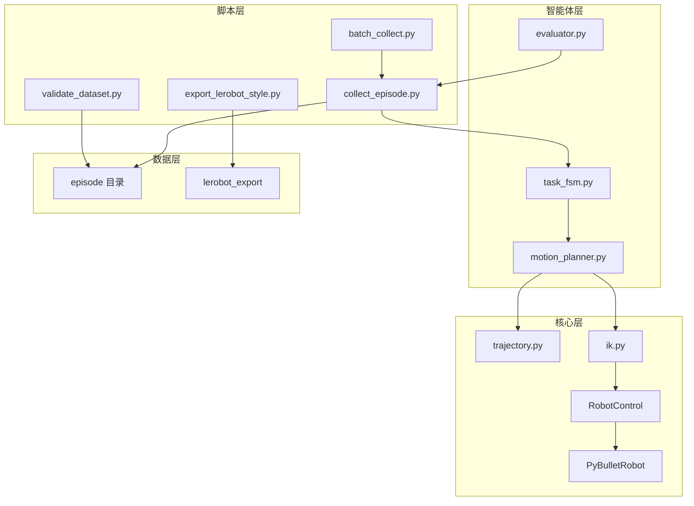

# robot-arm-episode-data-lab


<!-- AUTO_STATUS_START -->
## 自动进度快照

> 这个区块由 `python scripts/update_project_docs.py` 根据仓库文件自动生成；
> 手动修改会在下次运行时被覆盖。

### 作品集基线

- [x] V0 最小样例：`dataset_sample/v0/`
- [x] V1 episode 数据闭环：`dataset_sample/episode_000001/`
- [x] 数据校验脚本：`scripts/validate_dataset.py`
- [x] 回放 GIF 脚本：`scripts/visualize_episode.py`
- [x] 数据结构与采集流程文档：`docs/data_schema.md`, `docs/collection_pipeline.md`

### Phase 0.5 工程与展示（广撒网）

- [x] config 接入采集脚本：`collect_episode.py --config configs/default.yaml`
- [ ] 统一样例 episode：`dataset_sample/episode_000001/`（100 步、640×480）
- [x] 展示 GIF：`assets/gifs/demo_replay.gif`
- [x] pytest 测试：`pytest -q`
- [x] GitHub Actions CI：`.github/workflows/ci.yml`
- [x] LICENSE：`LICENSE`

### Phase 1 HAL + IK + 笛卡尔

- [x] 任务 1：PyBullet 控制逻辑审计：`docs/phase1_task1_pybullet_audit.md`
- [x] 任务 2：RobotControl 抽象基类：`core/hal.py`
- [x] 任务 3：PyBulletRobot 控制封装：`core/pybullet_robot.py`
- [x] 任务 4：HAL smoke demo：`scripts/run_cartesian_demo.py`
- [x] 任务 5：IK 求解封装：`core/ik.py`
- [x] 任务 6：笛卡尔直线插补：`core/trajectory.py`
- [x] 任务 8：采集脚本接入 cartesian_ik 模式：`collect_episode.py --control-mode cartesian_ik`

### Phase 1.5 任务可信度（广撒网）

- [x] Task FSM：`agents/task_fsm.py`
- [x] Evaluator Agent：`agents/evaluator.py`
- [x] Motion planner 模块：`agents/motion_planner.py`
- [x] 成功 pick/lift GIF：`assets/gifs/demo_pick_success.gif`

### Phase 2 批量数据 + LeRobot（广撒网）

- [x] 批量采集脚本：`scripts/batch_collect.py`
- [x] 数据集目录 ≥ 20 episode：`dataset/v1/`
- [x] LeRobot 真导出：`export_lerobot_style.py`
- [x] 数据集 README：`dataset/v1/README.md`

### Phase 3 展示与迁移叙事（广撒网）

- [x] 面试讲稿：`docs/interview_walkthrough.md`
- [x] ROS/MoveIt 迁移设计：`docs/migration_ros2_moveit.md`
- [x] 广撒网路线图文档：`docs/portfolio_roadmap_broad.md`

<!-- AUTO_STATUS_END -->


一个用于求职作品集的 **PyBullet 机械臂仿真数据采集平台**：覆盖 HAL 控制抽象、笛卡尔 IK 轨迹、FSM 驱动 pick-lift 任务、自动 success 评测、批量 episode 采集与 LeRobot 导出。

## 快速开始

```bash
python -m pip install -r requirements.txt
python scripts/validate_dataset.py dataset/v1
python scripts/visualize_episode.py dataset_sample/episode_pick_001
```

## 系统架构



## 能力矩阵

| 能力领域 | 本项目体现 | 关键路径 |
|----------|------------|----------|
| 仿真环境 | PyBullet KUKA iiwa + cube 桌面场景 | `scripts/collect_episode.py` |
| 控制抽象 | `RobotControl` HAL，隔离上层与仿真 API | `core/hal.py`, `core/pybullet_robot.py` |
| 运动学 / 轨迹 | 笛卡尔直线插补 + IK | `core/trajectory.py`, `core/ik.py` |
| 任务编排 | reach → approach → close_gripper → lift | `agents/task_fsm.py` |
| 自动评测 | success 标签、物体抬升判定 | `agents/evaluator.py` |
| 数据 schema | image-state-action 按 step 对齐 | `docs/data_schema.md` |
| 数据门禁 | 帧数 / 维度 / metadata 校验 | `scripts/validate_dataset.py` |
| 批量采集 | 20+ episode、成功率统计 | `scripts/batch_collect.py`, `dataset/v1/` |
| LeRobot 导出 | v2.1 parquet + meta | `scripts/export_lerobot_style.py` |
| 工程化 | pytest + GitHub Actions CI | `tests/`, `.github/workflows/ci.yml` |
| 迁移设计 | HAL → ROS2 / MoveIt 映射 | `docs/migration_ros2_moveit.md` |

## 项目展示能力

- PyBullet 机械臂仿真环境搭建
- RGB 图像、关节状态、动作、末端位姿、物体位姿的同步采集
- `image-state-action-episode` 数据结构设计
- FSM 驱动 pick-lift 与 `success` 自动标签
- 批量采集与 LeRobot v2.1 导出
- `episode` 元数据设计与完整性校验
- 带标注的轨迹回放
- HAL 抽象与 ROS2 / MoveIt 迁移设计文档

## 明确不做

第一阶段不做 ROS2、DDS、MoveIt、`ros2_control`、Isaac Sim、真实机械臂硬件、强化学习训练、大规模数据集采集或完整机器人控制系统。

## 环境安装

```bash
python -m venv .venv
source .venv/bin/activate
python -m pip install -r requirements.txt
```

## Pick-Lift 任务采集

```bash
python scripts/collect_episode.py --task pick_and_lift \
  --output dataset_sample/episode_pick_001 --num-steps 80
python scripts/validate_dataset.py dataset_sample/episode_pick_001
python scripts/visualize_episode.py dataset_sample/episode_pick_001
```

## 批量采集与 LeRobot 导出

```bash
python scripts/batch_collect.py --output dataset/v1 --num-episodes 20 --seed 42
python scripts/validate_dataset.py dataset/v1
python scripts/export_lerobot_style.py dataset/v1 --output dataset/v1/lerobot_export
```

## V0 最小检查

生成一张渲染图像和一个关节状态文件：

```bash
python scripts/collect_episode.py --mode v0 --output dataset_sample/v0
```

期望输出：

```text
dataset_sample/v0/
├── image.png
├── joint_state.npy
└── metadata.json
```

## V1 采集一个 Episode

```bash
python scripts/collect_episode.py --output dataset_sample/episode_000001 --num-steps 100
```

期望输出：

```text
dataset_sample/episode_000001/
├── images/
│   ├── 000000.png
│   ├── 000001.png
│   └── ...
├── states.npy
├── actions.npy
├── ee_poses.npy
├── object_poses.npy
└── metadata.json
```

## V2 校验和回放

校验采集到的 `episode`：

```bash
python scripts/validate_dataset.py dataset_sample/episode_000001
```

生成带标注的 GIF 回放：

```bash
python scripts/visualize_episode.py dataset_sample/episode_000001
```

输出文件：

```text
dataset_sample/episode_000001/replay.gif
```

## 数据字段

每个 `episode` 包含：

- `images/*.png`：固定 RGB 相机图像
- `states.npy`：机械臂关节位置，shape 为 `[T, state_dim]`
- `actions.npy`：目标关节位置，shape 为 `[T, action_dim]`
- `ee_poses.npy`：末端位姿 `[x, y, z, qx, qy, qz, qw]`，shape 为 `[T, 7]`
- `object_poses.npy`：cube 位姿 `[x, y, z, qx, qy, qz, qw]`，shape 为 `[T, 7]`
- `metadata.json`：仿真器、任务、相机、维度和 `episode` 元数据

详细说明见 [docs/data_schema.md](docs/data_schema.md) 和 [docs/collection_pipeline.md](docs/collection_pipeline.md)。

## 广撒网 4 周路线

基线 → 工程化 → HAL/IK → 任务评测 → 批量 LeRobot → 面试材料，见 [docs/portfolio_roadmap_broad.md](docs/portfolio_roadmap_broad.md)。

**面试与迁移文档**：

- [docs/interview_walkthrough.md](docs/interview_walkthrough.md) — 3–5 分钟面试讲稿
- [docs/migration_ros2_moveit.md](docs/migration_ros2_moveit.md) — HAL → ROS2 / MoveIt 迁移设计

## 作品集定位

简历中可以这样表达：

> 基于 PyBullet 实现 HAL 解耦的机械臂仿真采集平台：笛卡尔插补 + IK 生成 action，FSM 驱动 pick-lift 任务与自动 success 评测，批量采集 20+ 多模态 episode 并导出 LeRobot 格式；含 pytest/CI 与数据校验门禁。

面试中重点说明：

- HAL 如何隔离 PyBullet，预留真机 / ROS2 实现
- FSM + Evaluator 如何产生带 `success` 标签的数据
- `validate_dataset.py` 如何作为数据质量门禁
- 批量采集与 LeRobot 导出的字段映射
- 仿真 grasp 的局限与迁移路径（见 migration 文档）

这个项目应被表达为 **机器人数据工程 + 仿真采集管线** 项目，而不是完整生产级抓取系统。
