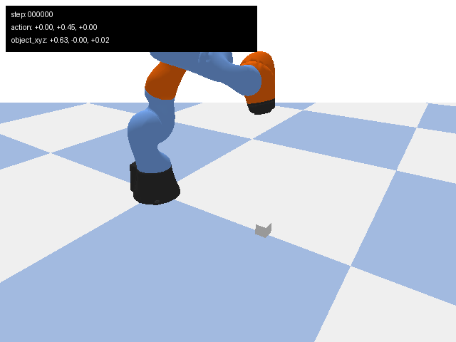
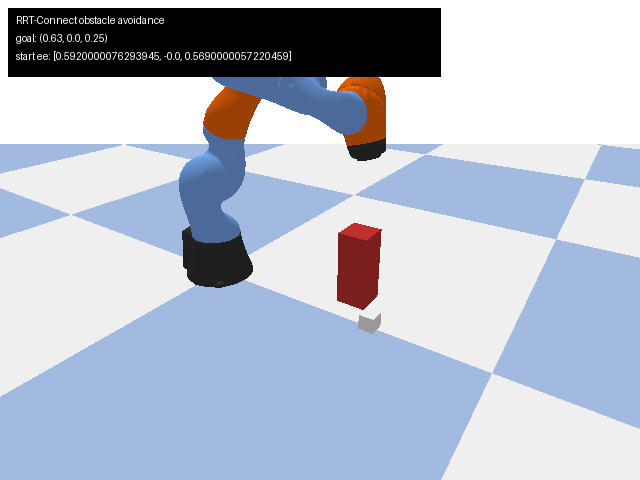
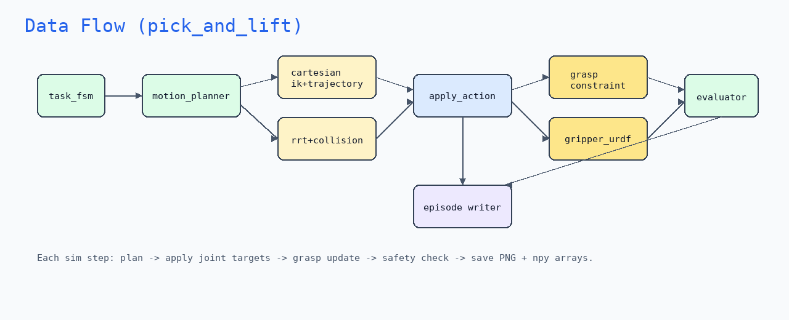
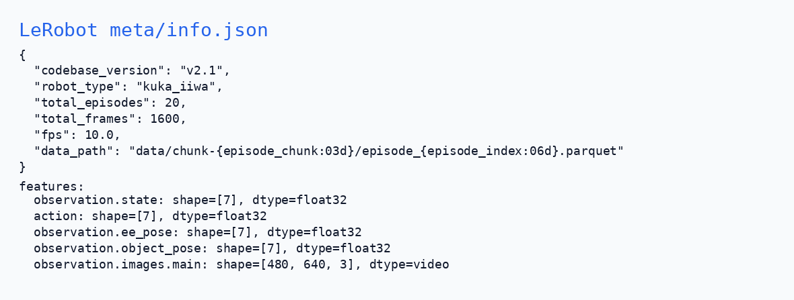

# robot-arm-episode-data-lab

<!-- README_INTRO_START -->
PyBullet 机械臂仿真数据采集平台：HAL 控制抽象、笛卡尔 IK、双向 RRT 避障、FSM pick-lift、**物理抓取**（constraint 默认 / gripper URDF 实验）、自动评测、批量采集与 LeRobot 导出。







### 一分钟概览视频

[demo_overview.mp4](assets/videos/demo_overview.mp4)

**Colab 一键复现 →** [notebooks/portfolio_demo.ipynb](notebooks/portfolio_demo.ipynb)

**文档入口 → [docs/README.md](docs/README.md)**（开发先看 [docs/dev/quickstart.md](docs/dev/quickstart.md)）

### 架构与数据流





### LeRobot 导出（v2.1）





单线进度与 **3 天冲刺清单** 见 [docs/portfolio/project_status.md](docs/portfolio/project_status.md)。
<!-- README_INTRO_END -->

<!-- README_FOOTER_START -->
## 快速开始

```bash
python -m pip install -r requirements.txt
PYTEST_DISABLE_PLUGIN_AUTOLOAD=1 pytest -q
python scripts/run_rrt_demo.py --seed 7
python scripts/collect_episode.py --task pick_and_lift --num-steps 40 \
  --output dataset_sample/episode_pick_ci --width 64 --height 48 --seed 7
python scripts/validate_dataset.py dataset_sample/episode_pick_ci
```

完整命令见 [docs/dev/quickstart.md](docs/dev/quickstart.md)。

## 文档导航

| 场景 | 文档 |
|------|------|
| 日常开发 | [docs/dev/](docs/dev/) |
| 规划 / 路线图 | [docs/planning/](docs/planning/) |
| 概念参考 | [docs/reference/](docs/reference/) |
| **能力学习与自检** | [docs/reference/learning_capability_alignment.md](docs/reference/learning_capability_alignment.md) |
| 面试材料 | [docs/portfolio/](docs/portfolio/) |
| 智能体规范 | [AGENTS.md](AGENTS.md) |

## 能力概览

| 领域 | 关键路径 |
|------|----------|
| HAL + IK + 笛卡尔 | `core/hal.py`, `core/ik.py`, `core/trajectory.py` |
| 仿真世界 + 落盘 | `core/world.py`, `core/episode_writer.py`, `core/collect_config.py` |
| RRT 避障 | `core/rrt.py`, `core/collision.py`, `scripts/run_rrt_demo.py` |
| 物理抓取 | `core/grasp.py`（constraint）、`core/gripper.py`（`--grasp-mode gripper_urdf`） |
| 任务 FSM + 评测 | `agents/task_fsm.py`, `agents/evaluator.py` |
| 采集主入口 | `scripts/collect_episode.py` |
| 数据 schema | [docs/dev/data_schema.md](docs/dev/data_schema.md) |

简历定位：**机器人数据工程 + 仿真采集管线**；剩余 2 天见 [project_status.md](docs/portfolio/project_status.md)。
<!-- README_FOOTER_END -->
