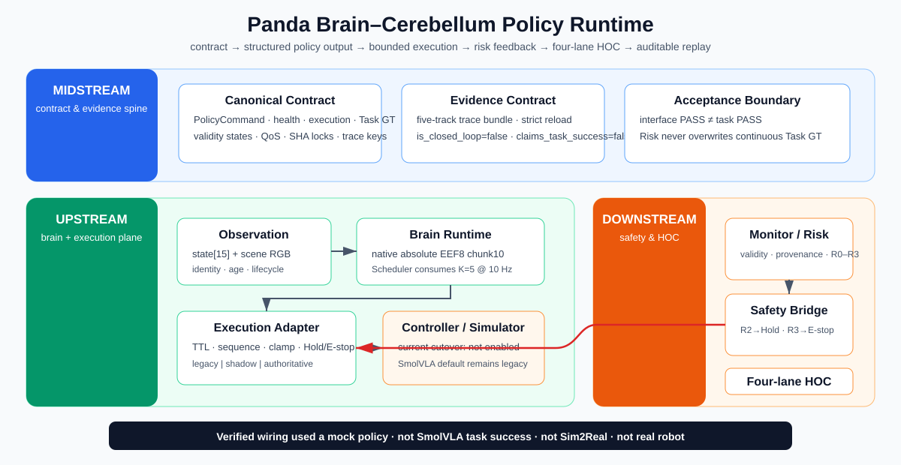

<div align="right">

[中文](#中文) | [English](#english)

</div>

# robot-arm-episode-data-lab

[](https://github.com/inayina/robot-arm-episode-data-lab/actions/workflows/ci.yml)


---

## 中文

本仓是 **Panda「脑–小脑」三仓闭环的中游**：把上游专家 episode 做成可审计的数据契约与
immutable release，完成最小训练/适配交付，再通过中立 handoff 交给下游执行验证。

> **一句话定位**：连接控制采集（小脑）与策略交付（大脑）的**数据脊梁与交接契约**；
> 同时提供分层 go/no-go，防止把联调通过包装成任务成功。

项目范围：Panda 多仓数据、训练交付、离线门禁与 Sim2Sim / Sim2Real-readiness 验证。
**Not task success / Not Sim2Real / Not real robot**：open-loop Pass、interface Pass、
`ran_isaac=true` 都不等于任务成功。

### 三仓角色

```text
上游 ros2-arm-teleoperation-suite     小脑：ROS 2 控制 / 采集 / 物理门禁 / Isaac 执行面
中游 robot-arm-episode-data-lab（本仓） 接线：schema · release · 训练交付 · 门禁 · handoff
下游 ros2-moveit-pybullet-bridge      验证：JSONL 重放 · dist_monitor · risk readiness
```

| 仓库 | 负责 | 明确不负责 |
|---|---|---|
| [上游](https://github.com/inayina/ros2-arm-teleoperation-suite) | 遥操作/批采、Servo+阻抗、MuJoCo/Isaac、上游 physical gate、continuous GT | schema/release/训练 |
| **本仓** | adapter、inspection、immutable release、训练/LoRA 交付、open-loop 门禁、统一评测信封、handoff | ROS 实时控制；从 `object_pose` 重推物理成功 |
| [下游](https://github.com/inayina/ros2-moveit-pybullet-bridge) | handoff 校验、PyBullet replay、分布监控、Risk→Safety、四泳道 HOC、offline risk readiness | 采集、清洗、训练、任务真值 go/no-go |

中游 `filter_scope=training_split_only`；下游 risk **不得**覆盖上游/Isaac 任务真值或改写
`failure_lane`（`use_as_task_go_no_go=false`）。

### 本仓交付什么

1. **数据契约**：`configs/robot_schemas/panda.yaml` 固定 state / action / 相机语义。
2. **不可变 release**：逐文件 SHA256、`splits.json` 无交集、入口校验。
3. **训练与交接**：checkpoint + audit → `predicted_actions.jsonl` / `bridge_handoff/`。
4. **分层门禁**：Data / Offline / Interface / Behavior / Task / System 分栏，禁止跨层升级结论。
5. **跨后端信封**：`unified_eval_report_v0` 把 open-loop、下游 PolicyRunner、Isaac S4 列到同一报告；
   可选挂载下游 `appendix.risk_readiness`（只作 System 层 readiness，不作任务成功）。
6. **Policy Runtime 合同脊梁**：M0 冻结跨仓消息、validity、QoS 与 trace lock；M5 冻结五轨
   replay bundle。运行时代码分别落在上游 Brain/Execution 与下游 Risk/HOC，不在中游重复实现。

### 当前状态

| 层 | 结论 |
|---|---|
| 系统闭环 | 采集 → release → 交付 → 下游重放 / risk 对照 **已贯通** |
| 验收纪律 | interface PASS ≠ task PASS；scripted oracle 已隔离物理链（lift 5/5） |
| 策略候选 | SmolVLA Recovery v3 **离线门禁 Pass**；有界 Isaac S4 **lift 0/5 → Hold**（不扩种子） |
| Policy Runtime M0–M5 | 合同、native chunk10/K5、shadow parity、validity、四泳道 HOC、Risk→Safety、trace replay **已实现** |
| M6 bounded wiring | mock PolicyBackend 下真实 ROS 2/DDS：`EXECUTED → HELD → ESTOPPED`、HOC 关联与清理 **Pass**；未切 SmolVLA authoritative |

### M0–M6 如何接成一条主线

| 系统图 | 怎么读 | 证据边界 |
|---|---|---|
|  | 从左到右看数据和命令：中游冻结合同，上游 Brain 产生 chunk、Execution Adapter 裁决，下游 Risk 经 Safety Bridge 回灌，并由四泳道 HOC 保留 Brain / Execution / Safety / Task GT 四种独立事实。 | 图表示当前实现关系；SmolVLA authoritative 仍未切流，mock wiring Pass 不等于任务成功。 |

| 阶段 | 主仓 | 接上的断点 | 当前证据边界 |
|---|---|---|---|
| M0 | 中游 | command / health / execution / Task GT、validity、QoS、trace 身份 | schema + fixture + SHA lock；无运行时声明 |
| M1–M2 | 上游 | Brain native chunk10、K5 Scheduler、absolute EEF8 / delta EEF7 shadow adapter | CPU/ROS mock + 750-step parity；不等于真实执行 |
| M3 | 下游 | monitor validity、Brain / Execution / Safety / Task GT 四泳道 | 缺源显示 `UNAVAILABLE/STALE`，不补绿色零 |
| M4 | 上游 + 下游 | R2 Hold、R3 E-stop、受门禁的单一 authoritative 路径 | 可选代码路径已实现；SmolVLA 默认仍为 `legacy` |
| M5 | 中游 + 下游 | 五轨 trace bundle、absolute EEF8 replay、严格关联与读回 | `is_closed_loop=false`，不声明任务成功 |
| M6 | 下游 wiring | 三条 mock command 经真实 ROS/DDS 贯穿 Safety 与 HOC | wiring Pass；未启动 PyBullet/Isaac、未加载模型 |

权威数字与归因不在本页展开，见：

- [docs/portfolio/FINAL_PROJECT_SUMMARY.md](docs/portfolio/FINAL_PROJECT_SUMMARY.md) — 求职/作品集总入口
- [docs/portfolio/BADCASE_ATTRIBUTION_SUMMARY.md](docs/portfolio/BADCASE_ATTRIBUTION_SUMMARY.md) — 分层归因
- [docs/portfolio/UNIFIED_EVAL_REPORT.md](docs/portfolio/UNIFIED_EVAL_REPORT.md) — 三后端信封 + risk appendix
- [docs/POLICY_RUNTIME_HOC_IMPLEMENTATION_ROADMAP.md](docs/POLICY_RUNTIME_HOC_IMPLEMENTATION_ROADMAP.md) — M0–M6 实施与边界
- [docs/portfolio/POLICY_RUNTIME_M6_WIRING_RESULTS.md](docs/portfolio/POLICY_RUNTIME_M6_WIRING_RESULTS.md) — M6 ROS/DDS 验收
- [docs/EVALUATION_REPORT.md](docs/EVALUATION_REPORT.md) — 实验审计长文
- [docs/FUTURE_WORK_ROADMAP.md](docs/FUTURE_WORK_ROADMAP.md) — P1/P2 仅登记不执行

### 下游 risk 如何接到本仓

| 步骤 | 产物 | 边界 |
|---|---|---|
| 下游 replay smoke | `benchmark_summary.json` + timeseries | interface / 时延，非抓取成功 |
| 下游 offline RiskAggregator | `smolvla_v3_ep0_risk_offline_*.json` | 六维 readiness；R-level **不是**任务 go/no-go |
| 本仓 normalize | `unified_eval_report` bundle 的 `appendix.risk_readiness` | `overrides_failure_lane=false` |

生成信封（含 risk appendix）示例：

```bash
python3 training/scripts/normalize_unified_eval_report.py \
  --open-loop runs/smolvla_s3/openloop_recovery_v3_prospective_eval10_gate_v3_20260724T065300Z/s3_open_loop_summary.json \
  --policy-runner evidence/downstream/smolvla_v3_ep0_benchmark_summary.json \
  --isaac-s4 evidence/smolvla_s4_bounded5_relight_20260724T151711Z/s4_gate.json \
  --risk-readiness evidence/downstream/smolvla_v3_ep0_risk_offline_20260724T215900Z.json \
  --out-dir evidence/smolvla_v3_eval_framework_relight_20260725 \
  --bundle-out evidence/smolvla_v3_eval_framework_relight_20260725/smolvla_v3_eval_framework_bundle.json
```

在线 ROS `risk_engine` 由下游 `--launch-stack` 拉起；与 offline readiness 对照是两条路径，
详见下游 README「Risk 对接」一节。

### 数据契约（摘要）

| 字段 | 语义 |
|---|---|
| `observation.state` | 关节 + 夹爪（VLA 路径另有 `state[15]` = joint7+ee_pose7+gripper1） |
| `observation.ee_pose[7]` | 末端位姿 |
| `observation.object_pose[7]` | 仿真特权；**禁止**进 policy state / 中游物理重判 |
| `observation.images.scene` | 320×240@10 Hz scene RGB（Recovery 冻结为 scene-only） |
| `action` | ACT：`ee_delta_gripper[7]`；VLA：`absolute_eef_gripper[8]` |
| `filter_scope` | `training_split_only` — 物理成败归上游 |

Schema：[configs/robot_schemas/panda.yaml](configs/robot_schemas/panda.yaml)

### 复核

```bash
python3 -m project_knowledge.cli query --mode auto --no-llm \
  --query "三仓闭环与当前 Pass/Hold 结论"

PYTEST_DISABLE_PLUGIN_AUTOLOAD=1 pytest -q
```

### Legacy

`agents/`、`core/`、早期 KUKA/PyBullet 与旧 MLP handoff 为历史能力，不与当前 Panda 主线混用。
索引：[archive/README.md](archive/README.md) · 规范：[AGENTS.md](AGENTS.md)

---

## English

This repository is the **midstream** of a three-repo Franka Panda loop: turn upstream expert
episodes into auditable releases and action contracts, produce training/handoff artifacts, and
expose layered go/no-go so “interface green” is never mistaken for task success.

> Positioning: the **data spine and handoff contracts** between the control/collection stack
> (“cerebellum”) and policy delivery (“brain”) — not a model-leaderboard repo.

| Repo | Role |
|---|---|
| Upstream `ros2-arm-teleoperation-suite` | Real-time control, collection, physical gate, Isaac runtime |
| **This repo** | Schema, immutable release, training delivery, gates, handoff |
| Downstream `ros2-moveit-pybullet-bridge` | JSONL replay, distribution monitor, offline risk readiness |

**Current status (short):** data/handoff plumbing works; Policy Runtime M0–M5 contracts,
native chunk scheduling, bounded execution, Risk→Safety, four-lane HOC and trace replay are
implemented. M6 passed bounded real ROS/DDS wiring with a mock PolicyBackend
(`EXECUTED → HELD → ESTOPPED`). SmolVLA authoritative cutover remains disabled. Acceptance
discipline separates interface from task GT (oracle lift 5/5); Recovery v3 open-loop **Pass**,
bounded Isaac S4 **lift 0/5 → Hold**. Details:
[FINAL_PROJECT_SUMMARY](docs/portfolio/FINAL_PROJECT_SUMMARY.md),
[UNIFIED_EVAL_REPORT](docs/portfolio/UNIFIED_EVAL_REPORT.md) (includes `appendix.risk_readiness`).

**Non-claims:** not task success, not Sim2Real, not real robot. An open-loop Pass, interface Pass,
or `ran_isaac=true` is not task success. Downstream risk R-levels never override task go/no-go.
