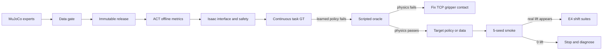

<div align="right">

[中文](#中文) | [English](#english)

</div>

# robot-arm-episode-data-lab

[](https://github.com/inayina/robot-arm-episode-data-lab/actions/workflows/ci.yml)


---

## 中文

这是一个面向 **Panda 具身操作模型评测** 的三仓闭环项目。本仓位于中游，负责把上游
MuJoCo 专家 episode 转换成可审计 release，训练 ACT，并将 learned-policy 在 Isaac 中的
interface、safety、behavior 与 task outcome 分开评估。

项目当前最重要的结果不是“模型抓取成功”，而是建立了一条能够发现错误评测器、区分物理链
故障与策略故障、并驱动定向数据生产的评测闭环：

- ACT home-start nominal：**0/20 task success，No-Go**；
- Isaac scripted oracle：修复物理链后 **lift 5/5，Pass**；
- close→lift 定向数据新模型：interface 5/5 PASS，但真实 lift **0/5**，因此停止扩大评测，
  **不进入完整 E4**。

> 项目范围：Panda 多仓数据、训练、离线评估与 Sim2Sim / Sim2Real-readiness 验证。<br>
> 不声称真实机械臂部署、completed Sim2Real、稳定在线自主抓取；offline loss 不等于任务成功率。

### 30 秒说明

| 问题 | 回答 |
|---|---|
| 做了什么？ | 数据 gate、immutable release、ACT、Isaac 有界 rollout、continuous GT、失败视频、评测器预检和 scripted oracle |
| 最关键的工程判断？ | interface PASS ≠ task PASS；oracle 5/5 证明 ACT 失败不是“Isaac 根本抓不起来” |
| 当前模型效果？ | 权威 E3 nominal 为 0/20；close→lift 新模型 5-seed 仍 lift 0/5 |
| 为什么不继续堆数据/跑 E4？ | 已出现 floor effect；问题仍是 home→对准→闭合，扩大 suite 不能改善归因 |
| 求职价值？ | 展示评测契约、失败归因、实验止损、跨仓边界、可复现报告与诚实结论 |

## 评测逻辑


```mermaid
flowchart LR
    A[MuJoCo experts] --> B[Data gate]
    B --> C[Immutable release]
    C --> D[ACT offline metrics]
    D --> E[Isaac interface and safety]
    E --> F[Continuous task GT]
    F -->|learned policy fails| G[Scripted oracle]
    G -->|physics fails| H[Fix TCP gripper contact]
    G -->|physics passes| I[Target policy or data]
    I --> J[5-seed smoke]
    J -->|real lift appears| K[E4 shift suites]
    J -->|0 lift| L[Stop and diagnose]
```

每一层只回答自己的问题：

| 层级 | 权威产物 | 能证明 | 不能证明 |
|---|---|---|---|
| Data | inspection、release manifest | schema、episode split、上游 gate 已执行 | policy 成功 |
| Offline | ACT `metrics.json` | loss、action RMSE、gripper accuracy | 抓取成功率 |
| Interface | policy `report.json` | checkpoint 加载、动作完成、护栏状态 | 物体被抓起 |
| Behavior | EE/gripper 轨迹 | 接近、降 Z、XY 对准、闭合时序 | lift/place |
| Task | continuous simulator GT | reach/grasp/lift/place | 真机或 Sim2Real |
| System | GPU/CPU、时延、QoS、cleanup | 本轮运行健康 | hard real-time |

## E0–E4 当前状态

| 阶段 | 目标 | 当前事实 | 状态 |
|---|---|---|---|
| **E0** | 评测契约 | run/episode/summary schema、fixture、聚合测试 | 已实现 |
| **E1** | Isaac action execution | 有界 action、watchdog、reset、安全与 5-repeat 证据 | 已实现；不是 learned-policy success |
| **E2** | ACT 被测基线 | 500 Hz real-rendered MuJoCo 数据、release、ACT checkpoints、A/B | 已实现 diagnostic baseline |
| **E3** | nominal learned rollout | seeds 2000–2019；reach 10/20，grasp/lift/place 0/20 | **No-Go，已关闭** |
| **E3.5** | scripted oracle | v1 lift 0/5 → 修 pick/PD gripper/摩擦/GT threshold → v2b lift 5/5 | **Pass** |
| **E3.6** | close→lift 定向模型 | 40 episodes；5-seed interface 5/5，reach/grasp/lift 0/0/0 | **No-Go** |
| **E4** | object/visual/camera/dynamics 矩阵 | 规划为 100+ bounded rollouts | **未执行，不启动** |

完整审计报告：[docs/EVALUATION_REPORT.md](docs/EVALUATION_REPORT.md)

## 三次关键实验决策

### 1. 不把错误 evaluator 的结果当真

首轮 E3 中，recorder 把 gripper command 混作 measured state。旧结果被标记为
`INVALID_EVALUATOR_V0` 并隔离；修复 command/state、接入 FT、通过两个 seed 一致性预检后，
才运行权威 nominal20。旧结果不计成功率。

### 2. 不把 interface PASS 当任务成功

E3 中 20/20 rollout 均能完成有界动作，安全链正常，但 continuous GT 显示：

- reach：10/20；
- grasp、lift、transport、place：0/20；
- overall：0/20，Wilson 95% CI `[0.000, 0.161]`。

权威运行 ID：`e3_nominal20_home_30ep_gt_v1_20260719`。模型身份、hash 和止损见
[docs/E2_E3_MODEL_CARD.md](docs/E2_E3_MODEL_CARD.md)。

### 3. 用 scripted oracle 隔离物理链

E3.5 先用固定 FSM 测试同一 Isaac 抓取链。v1 专家轨迹也无法 lift，随后修正 pick 高度、
PD gripper、方块摩擦、grasp pause 和 5 cm 方块侧夹阈值；v2b 达到 reach/grasp/lift 5/5。

这证明 Isaac 名义物理链可工作，ACT 的失败应聚焦 home→对准→闭合，而不是继续盲目堆 epoch。
完整 STAR 实验记录：
[docs/E3P5_ISAAC_SCRIPTED_ORACLE_EXPERIMENT.md](docs/E3P5_ISAAC_SCRIPTED_ORACLE_EXPERIMENT.md)。

## 最新定向模型：仍然 No-Go

E3.5 后新增 10 条 align→close→lift episode，并与 30 条 descend 数据合并：

| 项 | 事实 |
|---|---|
| Release ID | `e2_500hz_random35_closelift_20260720`（历史路径名） |
| 权威计数 | **40 episodes / 9,779 frames**，不是 35 |
| Inspection | PASS；真实 320×240@10 Hz scene；上游 physical gate |
| ACT | 5 epochs；CUDA；loss `1.7390 → 0.3276` |
| Offline | validation L1 `0.009193`；gripper accuracy `0.971790` |
| Checkpoint SHA-256 | `bc4a8fc49d24e9c22e8337ae9376fe189344235405d91e1034bcb7fe332785c3` |
| 5-seed | seeds 2200–2204；interface 5/5；**lift 0/5** |
| Behavior | 5/5 `HOME_NO_CLOSE`；`grip_min=1.0`；`z_span≈0.014 m` |

`random35` 只是未重命名的路径别名；`manifest.num_episodes=40` 才是权威 provenance。
该 checkpoint 没有替换 E3 选型，也不进入完整 E4。

## 三仓边界

| 仓库 | 职责 | 权威输出 |
|---|---|---|
| [上游 ros2-arm-teleoperation-suite](https://github.com/inayina/ros2-arm-teleoperation-suite) | MuJoCo 采集、batch gate、Isaac execution、continuous GT、scripted oracle | raw episode、runtime outcome |
| **本仓** | adapter、inspection、release、ACT training、summary、model card、SOP | release、checkpoint、evaluation report |
| [下游 ros2-moveit-pybullet-bridge](https://github.com/inayina/ros2-moveit-pybullet-bridge) | handoff loader、PyBullet replay、risk/monitoring | replay/risk benchmark |

中游不得从 `observation.object_pose` 重新推导上游 physical success；下游 risk 结果也不能覆盖
上游 runtime GT。

## 数据契约

| 字段 | 语义 |
|---|---|
| `observation.state[8]` | Panda joint positions `[7]` + normalized gripper `[1]` |
| `observation.ee_pose[7]` | end-effector pose |
| `observation.object_pose[7]` | optional privileged pose；不作为中游 success gate |
| `observation.ft[6]` | optional force/torque；当前 scene ACT 未优先使用 |
| `observation.images.scene` | 320×240@10 Hz real MuJoCo renderer |
| `action[7]` | `delta_xyz[3] + delta_rpy[3] + gripper_cmd[1]` |
| `filter_scope=training_split_only` | 中游检查 schema/success/safety flags；物理 gate 在上游 |

Schema：[configs/robot_schemas/panda.yaml](configs/robot_schemas/panda.yaml)

## 复核与复现

先查询和审计三仓事实：

```bash
python3 -m project_knowledge.cli query --mode auto --no-llm \
  --query "E3 nominal20 和 E3.5 oracle 当前结论是什么？"

python3 -m project_knowledge.cli audit \
  --json-out /tmp/project-audit.json \
  --markdown-out /tmp/project-audit.md
```

验证中游契约与训练代码：

```bash
PYTEST_DISABLE_PLUGIN_AUTOLOAD=1 pytest -q

python3 training/scripts/inspect_dataset.py \
  --dataset data/releases/e2_500hz_random35_closelift_20260720 \
  --schema configs/robot_schemas/panda.yaml
```

Isaac 有界评测、oracle 和结果报告的完整命令见
[docs/EMBODIED_POLICY_EVALUATION_SOP.md](docs/EMBODIED_POLICY_EVALUATION_SOP.md)。

## 代码与证据导航

| 入口 | 用途 |
|---|---|
| [docs/EVALUATION_REPORT.md](docs/EVALUATION_REPORT.md) | 当前审计结论与实验总报告 |
| [docs/EMBODIED_POLICY_EVALUATION_SOP.md](docs/EMBODIED_POLICY_EVALUATION_SOP.md) | 日常评测协议、gate、失败归因和报告模板 |
| [docs/E2_E3_MODEL_CARD.md](docs/E2_E3_MODEL_CARD.md) | checkpoint 身份、A/B、sha256 和 No-Go |
| [docs/E3P5_ISAAC_SCRIPTED_ORACLE_EXPERIMENT.md](docs/E3P5_ISAAC_SCRIPTED_ORACLE_EXPERIMENT.md) | oracle v1→v2b 完整实验记录与面试口述 |
| [docs/E2_SINGLE_RED_DATA_EXPANSION_RUNBOOK.md](docs/E2_SINGLE_RED_DATA_EXPANSION_RUNBOOK.md) | 数据迭代历史、止损与当前接力点 |
| [docs/EVALUATION_CONTRACT.md](docs/EVALUATION_CONTRACT.md) | run/episode/summary contract 与 ownership |
| [training/scripts/train_act_lerobot.py](training/scripts/train_act_lerobot.py) | scene ACT 训练与阶段采样 |
| [training/scripts/aggregate_evaluation_summary.py](training/scripts/aggregate_evaluation_summary.py) | runtime outcome 聚合、CI 与 Go/No-Go |
| [AGENTS.md](AGENTS.md) | 三仓职责、gate 和项目事实检索规则 |

## Legacy

`agents/`、`core/`、早期 KUKA/PyBullet GIF 和旧 MLP handoff 是历史能力，不与当前 Panda ACT
评测主线混用。历史材料索引见 [archive/README.md](archive/README.md)。

---

## English

This repository is the midstream data, training, and evaluation lab of a three-repository Panda manipulation
stack. It turns gated MuJoCo demonstrations into immutable releases and ACT checkpoints, then separates Isaac
interface execution, safety, behavior, and simulator-ground-truth task outcomes.

### Current evidence

| Stage | Result |
|---|---|
| E3 learned-policy nominal | **0/20 task success**, 10/20 reach, 0/20 grasp/lift/place; No-Go |
| E3.5 scripted oracle | v1 lift 0/5; after physics/contact fixes, **lift 5/5** |
| Targeted close→lift model | 40 episodes; offline training PASS; 5-seed interface 5/5 but **lift 0/5** |
| E4 generalization matrix | Planned, not executed; blocked by the zero-lift gate |

The central result is diagnostic: Isaac can lift the nominal cube with a scripted oracle, while both learned
policies fail before contact. The remaining bottleneck is the learned home→alignment→closure behavior, not
proof that the simulator is physically incapable of grasping.

See [the evaluation audit report](docs/EVALUATION_REPORT.md),
[the evaluation SOP](docs/EMBODIED_POLICY_EVALUATION_SOP.md), and
[the scripted-oracle experiment](docs/E3P5_ISAAC_SCRIPTED_ORACLE_EXPERIMENT.md).

This project does **not** claim real-robot deployment, completed Sim2Real, or stable autonomous grasping.
