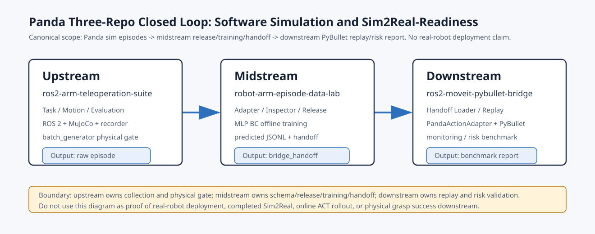

<div align="right">

[中文](#中文) | [English](#english)

</div>

# robot-arm-episode-data-lab

[](https://github.com/inayina/robot-arm-episode-data-lab/actions/workflows/ci.yml)


---

## 中文

`robot-arm-episode-data-lab` 是三仓 Panda 闭环的**中游数据与训练实验室**：消费上游 ROS 2 / MuJoCo 生成的 Panda raw episode，完成 schema 适配、数据质量检查、release、EDA、MLP BC 离线训练评估、predicted action JSONL 与下游 `bridge_handoff/` 打包。

> 当前定位：Panda 机械臂的多仓数据、训练、离线评估与 Sim2Sim / Sim2Real-readiness 验证闭环。  
> 不声称 real-robot deployment、completed Sim2Real、稳定在线自主抓取，也不把 offline loss 等同于任务成功率。

### 30 秒回答

| 问题 | 答案 |
| --- | --- |
| 这是哪个仓？ | 三仓闭环中游：data adapter / inspector / release / training / handoff |
| 输入是什么？ | 上游 `ros2-arm-teleoperation-suite` 的 Panda 仿真 raw episode |
| 输出是什么？ | `panda_30_release_v0`、MLP metrics、predicted actions、`panda_30_mlp_bridge_v0` handoff |
| 当前真正完成了什么？ | 30 episodes / 71,737 frames 的 release、MLP BC、same-split linear comparison、handoff、downstream smoke 证据 |
| 没完成什么？ | real robot、completed Sim2Real、online ACT runtime、下游物理抓取成功验证 |

## 三仓库链路



| 层级 | 仓库 | 本次 canonical experiment 中的职责 |
| --- | --- | --- |
| 上游 | `ros2-arm-teleoperation-suite` | ROS 2/MuJoCo 仿真交互、batch generation、recorder、`upstream_gate=batch_generator` |
| 中游 | `robot-arm-episode-data-lab` | adapter、inspection、release、EDA、MLP BC、predicted JSONL、bridge handoff |
| 下游 | `ros2-moveit-pybullet-bridge` | handoff loader、Panda PyBullet replay、tracking/distribution/risk benchmark |

统一事实源：[docs/portfolio/THREE_REPO_CANONICAL_FACTS.md](docs/portfolio/THREE_REPO_CANONICAL_FACTS.md)  
README 审计：[docs/portfolio/THREE_REPO_README_AUDIT.md](docs/portfolio/THREE_REPO_README_AUDIT.md)  
图片证据索引：[docs/portfolio/EVIDENCE_INDEX.md](docs/portfolio/EVIDENCE_INDEX.md)

## Current Verified Evidence

当前证据由两个独立 run 构成，不能拼接成同一次端到端性能实验：

- `panda_30_mlp_20260711`：30-episode 数据、release、MLP BC 与 handoff；
- `panda_closed_loop_20260712_214747`：独立的 1-episode 下游 replay smoke。

| Gate / Artifact | 当前事实 | 证据 |
| --- | --- | --- |
| G0 upstream dataset | 30 Panda simulation episodes, 71,737 frames, 30/30 valid | `evidence/upstream/validate_dataset.json` |
| G1 release | `panda_30_release_v0`, `state[8] -> ee_delta_gripper[7]` | `data/exports/panda_30_release/manifest.json` |
| MLP BC | 100 epochs, 24 train episodes / 6 test episodes, CUDA | `training/reports/panda_mlp_bc/mlp_metrics.json` |
| MLP loss | train `0.049142921178624864`, test `0.2350177516977917` | `training/reports/panda_mlp_bc/mlp_metrics.json` |
| Linear same-split normalized MSE | train `0.5580591706337537`, test `0.5800455135789114` | [docs/portfolio/linear_same_split_metrics.json](docs/portfolio/linear_same_split_metrics.json) |
| Handoff | `panda_30_mlp_bridge_v0`, 71,737 actions | `training/reports/panda_mlp_bc/bridge_handoff/handoff_manifest.json` |
| Handoff warning | 3,275 gripper commands outside `[0, 1]` | `training/reports/panda_mlp_bc/bridge_handoff/replay_check.json` |
| Latest downstream smoke | 1/1 completed, mean/max `9.79 / 34.218 ms`, no fault injection | `evidence/downstream/benchmark_summary.json` |

### 实验证据图解读

| 图中区域 | 证据含义 | 边界 |
| --- | --- | --- |
| G0 Upstream Dataset | 上游仿真 episode 和 physical gate 已有运行证据 | 不证明 hardware grasp |
| G1 Midstream Release | 本仓 release、MLP metrics、same-split linear comparison、handoff 已有产物 | 不证明 online rollout 或任务成功率 |
| Independent downstream smoke | 下游独立完成 1-episode PyBullet replay smoke | 尚未证明使用了上述 30-episode handoff；不证明完整 fault campaign 或 completed Sim2Real |

旧版未溯源的 latency/fault 数字已从 current canonical results 移除。`3,275` gripper warning 必须保留，因为下游 replay 前需要 clamp 或 reject。

## 实验图片

这些图可以用于 README 和作品集展示；每张图都带有“能证明什么 / 不能证明什么”的边界。

| 图 | 能证明 | 不能证明 |
| --- | --- | --- |
|  | 30 episodes target object 起始位置分布 | 泛化保证或 completed Sim2Real |
|  | Panda episode 轨迹覆盖可视化 | 任务成功率 |
|  | low-dimensional EDA 的关节反向频率分布 | 策略在线执行成功 |
|  | joint step P99 quality gate | 上游 physical gate |
|  | 同一 24/6 episode split 下 MLP normalized MSE 低于 Linear | 任务成功率；也不能与 frame-split smoke MSE 混用 |
|  | handoff bundle 文件结构 | 下游 latency 或 fault response |
|  | 终端运行证据截图 | 若无命令、日期、run ID 对齐，则不能单独作为强证据 |

## Data Contract

| 字段 | 语义 |
| --- | --- |
| `observation.state[8]` | Panda joint positions `[7]` + gripper opening `[1]` |
| `observation.ee_pose[7]` | end-effector pose |
| `observation.object_pose[7]` | optional object pose copied from upstream |
| `observation.ft[6]` | optional force/torque |
| `action[7]` | `delta_xyz[3] + delta_rpy[3] + gripper_cmd[1]` |
| `filter_scope=training_split_only` | 中游只检查 schema 与 training split；物理 gate 归上游 |

当 `filter_scope=training_split_only` 时，本仓不得从 `observation.object_pose` 重新推导 lift/place 成败。

## 快速验证

```bash
# 1. Inspect the canonical release.
python3 training/scripts/inspect_dataset.py data/exports/panda_30_release

# 2. Re-plot EDA + MLP-vs-linear figures.
python3 scripts/plot_portfolio_results.py

# 3. Re-run MLP BC when PyTorch/CUDA dependencies are available.
python3 training/scripts/train_mlp_policy.py \
  --dataset data/exports/panda_30_release \
  --output training/reports/panda_mlp_bc \
  --epochs 100

# 4. Package downstream handoff after predicted actions exist.
python3 training/scripts/prepare_bridge_handoff.py \
  --release data/exports/panda_30_release \
  --predicted-actions training/reports/panda_mlp_bc/predicted_actions.jsonl \
  --out-dir training/reports/panda_mlp_bc/bridge_handoff
```

完整 G0-G3 跑法见 [docs/CLOSED_LOOP_RUNBOOK.md](docs/CLOSED_LOOP_RUNBOOK.md)。

## 代码导航

| 路径 | 作用 |
| --- | --- |
| `configs/robot_schemas/panda.yaml` | Panda schema and action contract |
| `training/adapters/upstream_m6.py` | raw upstream episode adapter |
| `training/scripts/inspect_dataset.py` | schema and split validation |
| `training/scripts/prepare_dataset_release.py` | immutable release packaging |
| `training/scripts/train_mlp_policy.py` | low-dimensional MLP BC |
| `training/scripts/train_act_smoke.py` | historical name; current behavior is linear/ridge smoke baseline |
| `training/scripts/train_act_lerobot.py` | LeRobot ACT code path, not canonical completed run |
| `training/scripts/replay_mlp_policy.py` | predicted action JSONL export |
| `training/scripts/prepare_bridge_handoff.py` | downstream handoff packaging |
| `scripts/rag_assistant.py` | local project RAG helper |

## Legacy

`agents/`, `core/`, older PyBullet/KUKA GIFs, and historical LeRobot screenshots are legacy material. They remain useful for old local demos, but they are not part of the Panda canonical release/training/handoff mainline. See [archive/README.md](archive/README.md).

## 文档导航

| 场景 | 文档 |
| --- | --- |
| Canonical facts | [docs/portfolio/THREE_REPO_CANONICAL_FACTS.md](docs/portfolio/THREE_REPO_CANONICAL_FACTS.md) |
| README audit | [docs/portfolio/THREE_REPO_README_AUDIT.md](docs/portfolio/THREE_REPO_README_AUDIT.md) |
| Evidence index | [docs/portfolio/EVIDENCE_INDEX.md](docs/portfolio/EVIDENCE_INDEX.md) |
| Canonical experiment | [docs/portfolio/CANONICAL_EXPERIMENT.md](docs/portfolio/CANONICAL_EXPERIMENT.md) |
| Closed-loop runbook | [docs/CLOSED_LOOP_RUNBOOK.md](docs/CLOSED_LOOP_RUNBOOK.md) |
| Three-repo architecture | [docs/THREE_REPO_ARCHITECTURE.md](docs/THREE_REPO_ARCHITECTURE.md) |
| Training to handoff | [docs/TRAINING_TO_SIM2REAL.md](docs/TRAINING_TO_SIM2REAL.md) |
| Training details | [training/README_TRAINING.md](training/README_TRAINING.md) |
| Agent rules | [AGENTS.md](AGENTS.md) |

---

## English

`robot-arm-episode-data-lab` is the **midstream Panda data and training lab** in a three-repository closed loop. It consumes upstream ROS 2 / MuJoCo Panda simulation episodes, adapts them into a stable schema, validates data quality, packages releases, runs low-dimensional MLP BC training/evaluation, exports predicted action JSONL, and prepares downstream bridge handoff bundles.

> Scope: software simulation, offline training evidence, and Sim2Sim / Sim2Real-readiness validation. This repository does not claim real-robot deployment, completed Sim2Real, stable online autonomous grasping, or completed ACT runtime.

### Repository Role

| Layer | Repository | Role |
| --- | --- | --- |
| Upstream | `ros2-arm-teleoperation-suite` | ROS 2 / MuJoCo collection and upstream physical gate |
| Midstream | this repo | adapter, inspector, release, EDA, MLP BC, predicted JSONL, handoff |
| Downstream | `ros2-moveit-pybullet-bridge` | Panda PyBullet replay, monitoring, and risk benchmark |

### Current Verified Evidence

The evidence comes from two independent runs: `panda_30_mlp_20260711` covers the
30-episode training/handoff chain, while `panda_closed_loop_20260712_214747`
covers a separate one-episode downstream smoke. They must not be presented as
one verified end-to-end performance run.

| Item | Value |
| --- | --- |
| Dataset | 30 Panda simulation episodes, 71,737 frames |
| Release | `panda_30_release_v0` |
| Action contract | `state[8] -> ee_delta_gripper[7]` |
| MLP BC | 100 epochs, 24 train episodes / 6 test episodes |
| MLP normalized MSE | train `0.049142921178624864`, test `0.2350177516977917` |
| Linear same-split normalized MSE | train `0.5580591706337537`, test `0.5800455135789114` |
| Handoff | `panda_30_mlp_bridge_v0`, 71,737 actions |
| Latest downstream smoke | 1/1 completed, mean/max `9.79 / 34.218 ms` |

The MLP-vs-linear figure is valid for the same 24/6 episode split and normalized-MSE metric. It must not be mixed with `panda_linear_bc/metrics.json`, which is a different frame-split smoke artifact. Offline loss is not task success rate.

### Quick Start

```bash
python3 training/scripts/inspect_dataset.py data/exports/panda_30_release
python3 scripts/plot_portfolio_results.py
```

For the complete G0-G3 path, use [docs/CLOSED_LOOP_RUNBOOK.md](docs/CLOSED_LOOP_RUNBOOK.md).

### Key Docs

- [docs/portfolio/THREE_REPO_CANONICAL_FACTS.md](docs/portfolio/THREE_REPO_CANONICAL_FACTS.md)
- [docs/portfolio/THREE_REPO_README_AUDIT.md](docs/portfolio/THREE_REPO_README_AUDIT.md)
- [docs/portfolio/EVIDENCE_INDEX.md](docs/portfolio/EVIDENCE_INDEX.md)
- [docs/CLOSED_LOOP_RUNBOOK.md](docs/CLOSED_LOOP_RUNBOOK.md)
- [AGENTS.md](AGENTS.md)
