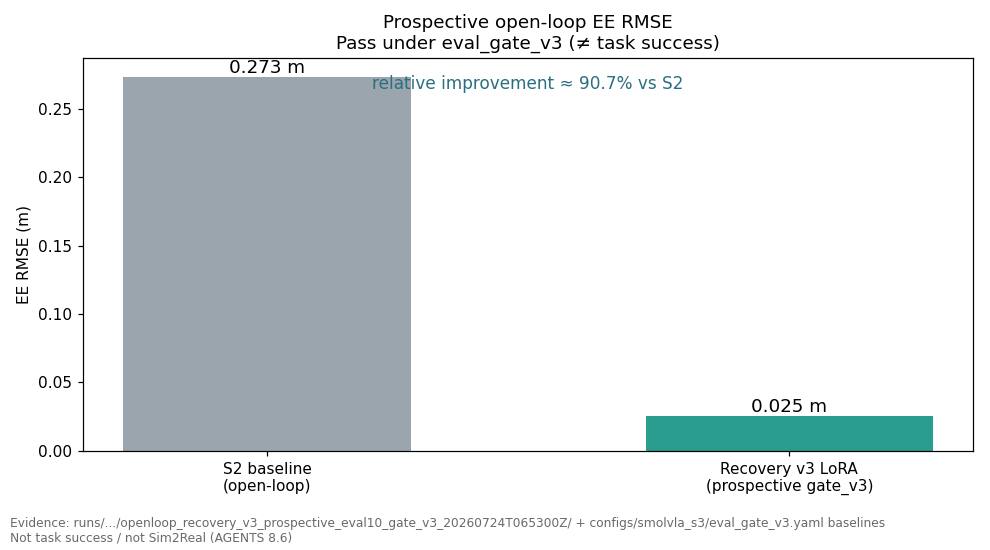

# robot-arm-episode-data-lab

[](https://github.com/inayina/robot-arm-episode-data-lab/actions/workflows/ci.yml)

**Panda Manipulation Runtime, Data & Validation System 的数据、训练与评测层**

> **Current as of 2026-08-21.** 三仓是一个仿真范围内的 Panda 系统，不是三个
> 平行项目。当前 learned-policy 结论明确为：Mixed Recovery 的 MuJoCo Task GT 为
> Reach `1/4`、Grasp `0/4`、Lift `0/4`，策略尚未学会稳定抓取；Dual-camera B 的
> Isaac 尝试被 ROS observation/control-state 前置条件阻塞，不能当作策略任务失败。
> 唯一当前事实源见
> [THREE_REPO_CANONICAL_FACTS.md](docs/portfolio/THREE_REPO_CANONICAL_FACTS.md)。

上游机械臂录下来的 episode，还不能直接拿去训练：字段语义会漂、split 会漏、loss 下降也容易被写成「已经会抓」。本仓把示教收成**有 schema、有版本、有指纹**的训练集，跑 ACT / SmolVLA，再用**分层门禁**分开回答：数据合不合格、离线动作准不准、接口能不能跑、物体有没有被抓起来。

这是三仓机械臂项目的**中游**：不跑 ROS 实时控制，也不在 PyBullet 里执行动作。

| Python | PyTorch | LeRobot | ACT | SmolVLA LoRA / PEFT | JSON Schema | SHA256 release |
| :---: | :---: | :---: | :---: | :---: | :---: | :---: |

---

## 整个项目做了什么

一套 **Franka Panda 从示教到评测的软件闭环**。三个仓故意分开，因为实时控制、深度学习、回放监控的环境和职责都不同：

1. [上游 teleop suite](https://github.com/inayina/ros2-arm-teleoperation-suite) — ROS 2 + MuJoCo，让手臂动并录 episode  
2. **本仓** — 数据契约、训练、离线评测、handoff  
3. [下游 bridge](https://github.com/inayina/ros2-moveit-pybullet-bridge) — PyBullet 回放、风险监控、HOC 控制台  

本仓读完，应能回答：**数据怎么清洗和锁定、模型怎么训、评测为什么没有把「加载成功」写成「抓取成功」。** 控制频率、CAN、相机标定请看上游；回放仪表盘请看下游。

---

## 本仓解决什么问题

模仿学习项目常见的失败不是「没训起来」，而是结论越级：

- 上游改了 `action` 维度，下游还按旧合同吃；
- 训练集和评测集其实见过同一条 episode；
- 离线 RMSE 好看，就被写成任务成功率；
- 接口 5/5 能下发动作，就被写成已经会抓。

本仓把流水线做成可重复的交付，而不是一次 notebook：

```text
上游 episode_*/train/ + meta.json
        ↓
schema / 动作语义适配（不重判抓没抓住）
        ↓
质检 + train/val/benchmark split
        ↓
non-overwrite 或 SHA 锁定的 immutable release
        ↓
训练（MLP BC / ACT / SmolVLA LoRA）+ checkpoint 审计
        ↓
离线 open-loop 门禁
        ↓
bridge_handoff/（JSONL 动作包，不捆绑 PyTorch）
```

物理上抓没抓住，只认上游 / Isaac 的连续任务真值。本仓 **`filter_scope=training_split_only`** 时，不会从 `object_pose` 再推一遍 lift/place。

---

## 我在本仓具体做了什么

**数据契约。** `configs/robot_schemas/panda.yaml` 固定观测和动作语义。上游关节是 `state[7]` + 单独夹爪；训练常用 `state[8]`（关节+夹爪）或 SmolVLA 的 `state[15]`（关节 + 末端位姿 + 夹爪）。ACT 动作是 `ee_delta_gripper[7]`；VLA 路线用 `absolute_eef_gripper[8]`。`object_pose` 是仿真特权信息，禁止进 policy state。

**不可变交付。** `prepare_dataset_release.py` 拒绝覆盖非空目录（non-overwrite）。immutable release 另有逐文件 SHA256、`release_content_sha256`、无交集的 `splits.json`。对外说「SHA 锁定」必须指向后者，不能把普通 release 说成不可变。

**训练当验证负载，不是作品集主语。** 这里训过 MLP BC、LeRobot ACT、SmolVLA LoRA。当前活动预训练候选是 **SmolVLA Recovery v3**；ACT 已冻成诊断基线，不再盲训。训练用来压测契约（state 维、相机 key、chunk、PEFT），不把 loss 当成功率。

**分层评测。** Data / Offline / Interface / Behavior / Task / System 六层各答各的题。`unified_eval_report_v0` 把开环、PyBullet 回放、Isaac 有界 rollout 映射到同一信封；`claims_task_success` 等字段恒为 false。

**Handoff 与训练框架解耦。** `prepare_bridge_handoff.py` 导出 `predicted_actions.jsonl` + manifest，下游回放不必捆绑 LeRobot。

| 模块 | 路径 | 职责 |
| --- | --- | --- |
| Adapter | `training/adapters/upstream_m6.py` | 上游字段 → 固定 Panda state/action |
| Inspector | `training/scripts/inspect_dataset.py` | schema、图像完整性、轨迹健康、split |
| Release | `training/scripts/prepare_dataset_release.py` | non-overwrite |
| Immutable release | `training/scripts/prepare_smolvla_s3_release.py` | SHA / fingerprint / splits |
| 训练 | `training/scripts/train_act_lerobot.py`、`training/smolvla_s3/` | ACT 诊断；SmolVLA LoRA |
| Checkpoint 审计 | `training/smolvla_s3/` | 核对 state / camera / action / chunk / PEFT |
| 评测 | `evaluation/`、`docs/EVALUATION_CONTRACT.md` | 六层门禁 + 统一信封 |
| Handoff | `training/scripts/prepare_bridge_handoff.py` | 给下游的 JSONL 动作包 |
| 合同 CI | `scripts/run_three_repo_contract_ci.py` | 跨仓 schema / 语义 / S4 合同哈希 |

---

## 2026-07 历史基线（不作为当前结论）

下列 Recovery v3 / S4 数字保留为历史 evidence。最新 Route A / Route B 见本页顶部、
[Current Case Studies](docs/portfolio/CURRENT_CASE_STUDIES.md) 与唯一 current authority。

这些数字都有机器可读 JSON，不是口头估计。

| 候选 | 离线 / 接口 | 任务真值 | 怎么说 |
| --- | --- | --- | --- |
| **SmolVLA Recovery v3** | 独立 10 条 / 2,593 帧 open-loop：**Pass**（EE RMSE 0.0253 m，夹爪 balanced accuracy 0.9943） | 有界 Isaac seeds 1–5：interface 5/5，lift **0/5** → **Hold** | 专家轨迹上拟合过了；仿真里还没抓起来 |
| **ACT** | 诊断训练完成 | E3 nominal20 overall **0/20** | 冻结基线，不再盲训 |
| **Scripted oracle** | — | 修物理链后 lift **5/5** | 说明仿真链能完成任务，不能算策略成功 |
| **LingBot-VLA** | 兼容性审计 | 未训练 | 路线已归档 |



<p align="center"><sub>Recovery v3 相对 S2 的末端位置误差下降。这只证明离线拟合，不证明闭环抓取。</sub></p>

面试里最重要的一次判断：Isaac 首轮看似 reach 3/5、grasp 1/5，补相机遥测发现策略输入近黑；修光后同种子变成 reach 1/5、grasp 0/5。**看起来更差，但更真实**，首轮已标成历史结果。权威 S4：[`s4_gate.json`](https://github.com/inayina/robot-arm-episode-data-lab/blob/main/docs/portfolio/public_evidence/canonical_v3/s4_gate.json)。

没有真机，没有完成 Sim2Real。open-loop Pass、interface Pass、`ran_isaac=true` 都不是任务成功。

---

## 快速开始

理解项目（招聘经理 / 面试官）：

- [作品集入口](docs/portfolio/README.md) · [一页母版](docs/portfolio/PORTFOLIO_REFERENCE.md) · [简历话术](docs/portfolio/resume_description.md)

开发与合同检查：

```bash
python3 scripts/run_three_repo_contract_ci.py --require-cross-repo

PYTEST_DISABLE_PLUGIN_AUTOLOAD=1 pytest -q \
  --ignore=tests/test_collect_integration.py \
  --ignore=tests/test_grasp.py \
  --ignore=tests/test_gripper.py \
  --ignore=tests/test_validate_dataset.py
```

已有上游 episode 时的主线脚本：

```text
training/scripts/adapt_upstream_panda_dataset.py
training/scripts/inspect_dataset.py
training/scripts/prepare_dataset_release.py      # non-overwrite
training/scripts/prepare_smolvla_s3_release.py   # immutable
training/scripts/prepare_bridge_handoff.py
```

一键离线闭环（adapt → release → smoke train → handoff）：`./scripts/run_three_repo_closed_loop.sh`

公开最小证据包：[public_evidence/canonical_v3](docs/portfolio/public_evidence/canonical_v3/README.md)

---

## English Brief

Midstream **dataset contracts, versioned releases, imitation-learning / VLA training, and layered evaluation** for a simulated Franka Panda. Upstream episodes are adapted, inspected, SHA-locked, trained (ACT diagnostic; SmolVLA Recovery v3 LoRA), and exported as framework-neutral JSONL handoffs.

SmolVLA Recovery v3 open-loop Gate is **Pass** (EE RMSE 0.0253 m on 2,593 held-out frames). Bounded Isaac S4 is **Hold** (lift 0/5). Not task success, not Sim2Real, not a real robot. This repo does not run ROS 2 realtime control. Sister repos: [teleop/control](https://github.com/inayina/ros2-arm-teleoperation-suite), [replay/risk](https://github.com/inayina/ros2-moveit-pybullet-bridge).
