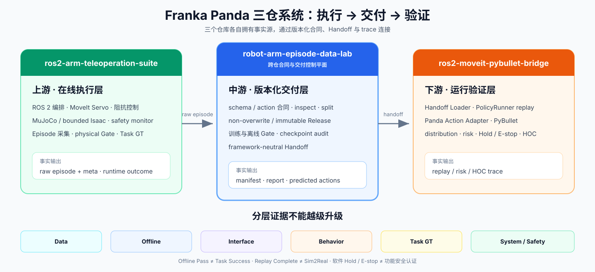
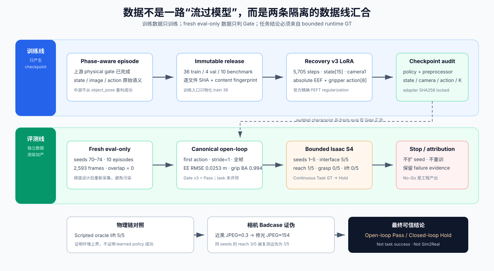

# robot-arm-episode-data-lab

[](https://github.com/inayina/robot-arm-episode-data-lab/actions/workflows/ci.yml)


**跨仓接口合同、版本化交付与分层验证控制平面**

把上游 episode 的状态与动作语义固定下来，做 schema/质量/split 检查，生成 non-overwrite 或 immutable Release，组织训练与离线评测作为**接口与执行链的验证负载**，再导出版本化 Handoff。目标是防止接口漂移、结论越级和不可复现——不是在线控制机械臂。

面向：**机器人系统软件工程师｜ROS 2、C++、Linux、设备通信、执行监督与系统验证**（本仓侧重合同、交付物与分层验收）。

<div align="right">

[中文](#中文) | [English](#english-brief)

</div>

## 中文

### 解决什么系统问题

执行链能跑，不代表交付物可信。常见失败是：

- 上游字段语义悄悄变化，下游仍按旧合同消费；
- Release 可被覆盖，实验结果无法复现；
- 把 offline loss、open-loop Pass 或 interface Pass 写成任务成功；
- 训练框架绑定的产物无法交给独立的 replay / risk 栈验证。

本仓把“合同 → 检查 → 版本化交付 → 分层 Gate → Handoff”做成可重复的控制平面。

### 在三仓架构中的位置

```text
ros2-arm-teleoperation-suite（上游）
  在线执行 · 控制 · 设备接口 · 采集 · Task GT
                     │ raw episode
                     ▼
robot-arm-episode-data-lab（本仓 · 中游）
  合同 · Release · 训练 · 离线评测 · Handoff
                     │ actions / reports
                     ▼
ros2-moveit-pybullet-bridge（下游）
  Replay · Monitor · Risk · Safety · HOC
```

<p align="center">
  
</p>

上游拥有在线执行与物理 Task GT；本仓拥有数据/离线合同与交付；下游拥有 replay harness 与风险观测。完整边界：[BOUNDARY_FREEZE.md](docs/portfolio/BOUNDARY_FREEZE.md)。

### 输入 · 处理 · 输出

| 方向 | 内容 |
| --- | --- |
| **输入** | 上游 `episode_*/train/` + `meta.json`（含 `upstream_gate`、`success` 等） |
| **处理** | 语义适配 → inspect → Release →（可选）训练/checkpoint 审计/离线评测 → Handoff 打包 |
| **输出** | adapted frames、`manifest.json` / immutable fingerprint、checkpoint 审计、分层评测报告、`bridge_handoff/` |

```text
状态、Episode 与任务真值
        ↓
数据和动作接口合同
        ↓
版本化 Release 与 Handoff
```

### 核心模块

| 模块 | 路径 | 职责 |
| --- | --- | --- |
| Data Adapter | `training/adapters/upstream_m6.py` | 上游字段 → 固定 Panda state/action 语义；**不**重判物理 lift/place |
| Dataset Inspector | `training/scripts/inspect_dataset.py` | schema、图像、轨迹健康度、训练 split |
| Non-overwrite Release | `training/scripts/prepare_dataset_release.py` | 拒绝覆盖非空目录；写入 manifest + inspection |
| Immutable Release | `training/scripts/prepare_smolvla_s3_release.py` | split + 逐文件 SHA + content fingerprint |
| Checkpoint 审计 | `training/smolvla_s3/`、相关 audit 脚本 | 核对 state/camera/action/chunk/PEFT 实际配置 |
| 分层评测 | `docs/EVALUATION_CONTRACT.md`、`evaluation/` | Data / Offline / Interface / Behavior / Task / System 分层 |
| Handoff | `training/scripts/prepare_bridge_handoff.py` | 框架中立 JSONL + manifest，供下游 replay |
| 合同 CI | `scripts/run_three_repo_contract_ci.py` | 跨仓 schema/语义/S4 合同哈希/handoff loader smoke |
| 事实检索 | `project_knowledge/` | 三仓只读 RAG、审计与 Git 影响分析 |

训练（MLP BC、ACT smoke、SmolVLA LoRA 等）在本仓存在，定位为**验证接口与执行链合同的工作负载**，不是本 README 的主叙事。

### 正常交付链

```text
Raw Episode
  → Schema 与动作语义适配（upstream_m6）
  → 数据与 split 检查（inspect；不重复推导上游物理成败）
  → 版本化 Release（non-overwrite 或 immutable）
  → 训练与离线评测（验证负载）
  → Handoff（predicted_actions.jsonl + manifest）
```

### 异常 / 故障链

```text
Schema 或动作语义不兼容 / split 泄漏 / release 目录非空
  → 合同或 inspect 检查失败
  → 阻止 Release 或 Handoff
  → 不进入下游验证
```

分层 Gate 规则：某一层 Pass **不得**自动升级为更高层结论。例如 Offline open-loop Pass ≠ Task Success；Interface Pass ≠ Reach/Grasp/Lift。

<p align="center">
  
</p>

<p align="center"><sub>训练线与评测线隔离：open-loop 只回答专家状态上的 first-action 拟合；bounded runtime 的连续 Task GT 才能裁决任务结果。</sub></p>

### 当前已验证状态

- 三仓数据合同、handoff 静态校验与纯 CPU 合同 CI 已贯通。
- Release 术语已冻结：**non-overwrite** ≠ **immutable**（后者必须有 SHA / fingerprint）。
- SmolVLA Recovery v3：独立 prospective 数据上 canonical first-action open-loop Gate **Pass**（10 episodes / 2,593 frames）。
- 同一策略有界 Isaac S4（修光权威证据）：interface 5/5，reach 1/5，grasp 0/5，lift **0/5** → **Hold**（`gate_pass=false`）。
- Scripted oracle 同物理链 lift 5/5：证明物理链能力，**不能**替代 learned policy。
- ACT 为冻结诊断基线，不继续盲目训练。
- Policy Runtime / Risk / HOC 是验证配套；SmolVLA authoritative 在线切流**未启用**。
- **Not task success / Not Sim2Real / Not real robot。**

权威总结与证据路径：[FINAL_PROJECT_SUMMARY.md](docs/portfolio/FINAL_PROJECT_SUMMARY.md) · [THREE_REPO_CANONICAL_FACTS.md](docs/portfolio/THREE_REPO_CANONICAL_FACTS.md) · 公开最小包 [public_evidence/canonical_v3](docs/portfolio/public_evidence/canonical_v3/README.md)。

### 快速开始

理解项目：

- [作品集母版](docs/portfolio/PORTFOLIO_REFERENCE.md)
- [架构图](docs/portfolio/portfolio_system_overview.svg)
- [作品集入口](docs/portfolio/README.md)

开发与合同检查：

```bash
python3 training/scripts/inspect_dataset.py --help

python3 scripts/run_three_repo_contract_ci.py --require-cross-repo

PYTEST_DISABLE_PLUGIN_AUTOLOAD=1 pytest -q \
  --ignore=tests/test_collect_integration.py \
  --ignore=tests/test_grasp.py \
  --ignore=tests/test_gripper.py \
  --ignore=tests/test_validate_dataset.py
```

已有上游 episode 时的主线入口：

```text
training/scripts/adapt_upstream_panda_dataset.py
training/scripts/inspect_dataset.py
training/scripts/prepare_dataset_release.py      # non-overwrite
training/scripts/prepare_smolvla_s3_release.py   # immutable
training/scripts/prepare_bridge_handoff.py
```

一键离线闭环（adapt → release → smoke train → handoff）：`./scripts/run_three_repo_closed_loop.sh`

### 目录导航

| 目录 | 主要内容 |
| --- | --- |
| `configs/` | Panda schema、Gate、runtime 合同 |
| `training/adapters/` | 上游语义转换 |
| `training/scripts/` | inspect / release / train / handoff |
| `training/smolvla_s3/` | SmolVLA 控制面与离线评测（验证负载） |
| `evaluation/` | 统一报告 schema、适配器合同、fixture |
| `project_knowledge/` | 三仓事实检索 |
| `scripts/` | 合同 CI 与闭环入口 |
| `docs/portfolio/` | 对外总结、边界冻结、证据索引 |
| `agents/`、`core/` | **Legacy** KUKA/PyBullet，不与 Panda 主线混用 |

### 跨仓接口

| 交接 | 内容 |
| --- | --- |
| ← 上游 | raw episode + `meta.json`；物理 Gate 结论由上游给出 |
| → 下游 | `bridge_handoff/`（manifest + `predicted_actions.jsonl` + replay_check） |
| ↔ 上游 | S4 runtime 合同 JSON 字节级对齐（合同 CI 断言） |

下游 `PolicyRunner` 是 **replay harness**，不是在线策略大脑。任务真值仍以上游/Isaac 连续 GT 为准；本仓离线报告不得覆盖 `failure_lane`。

### 边界与未完成事项

**本仓不负责：** ROS 2 实时控制、设备驱动、在线 Servo、PyBullet 执行、风险到硬件 E-stop 的生产接入。

**真实性边界：**

- 无真实 Panda；无完成 Sim2Real；MuJoCo/Isaac/PyBullet 均非实机证据。
- Open-loop Pass ≠ 闭环任务成功；Interface Pass ≠ Reach/Grasp/Lift；`ran_isaac=true` ≠ 任务成功。
- Replay 完成、Risk readiness、HOC 状态 ≠ 任务成功或功能安全认证。
- 不得因 Hold 自动扩种子、重训或新增 Gate（见 [FUTURE_WORK_ROADMAP.md](docs/FUTURE_WORK_ROADMAP.md)：P1/P2 仅登记）。
- 香橙派、`robot-control-runtime`、真实 Modbus 等**尚未接入**，不在本仓声称。

进一步阅读：[BOUNDARY_FREEZE](docs/portfolio/BOUNDARY_FREEZE.md) · [BADCASE 归因](docs/portfolio/BADCASE_ATTRIBUTION_SUMMARY.md) · [EVALUATION_CONTRACT](docs/EVALUATION_CONTRACT.md) · [AGENTS.md](AGENTS.md) · [文档索引](docs/README.md)

### 面向招聘者的 30 秒摘要

这是三仓系统的**中游控制平面**：把上游 episode 收成可复现的数据合同与版本化 Release，用分层 Gate 区分 Data / Offline / Interface / Behavior / Task / System，再导出 handoff 给下游 replay 与风险观测。训练与 SmolVLA 评测用来压测接口，不把 offline Pass 写成抓取成功。当前 open-loop Pass、Isaac lift 0/5 Hold；无实机、无 Sim2Real。

---

## English Brief

**Midstream interface-contract, versioned delivery, and layered-evaluation control plane** for a three-repo Franka Panda stack. It adapts upstream episode semantics, inspects schema/quality/splits, produces non-overwrite or SHA-locked immutable releases, runs training and offline evaluation as **verification workloads**, and exports framework-neutral handoffs.

It does not run ROS 2 realtime control or re-judge physical lift/place. Offline or interface Pass is not task success. Recovery v3 open-loop Gate is Pass; bounded Isaac S4 remains Hold (lift 0/5). Not real robot, not completed Sim2Real. Downstream `PolicyRunner` is a replay harness, not an online policy brain.

Start with [BOUNDARY_FREEZE.md](docs/portfolio/BOUNDARY_FREEZE.md), [FINAL_PROJECT_SUMMARY.md](docs/portfolio/FINAL_PROJECT_SUMMARY.md), or [portfolio README](docs/portfolio/README.md).
