<div align="right">

[中文](#中文) | [English](#english)

</div>

# robot-arm-episode-data-lab

[](https://github.com/inayina/robot-arm-episode-data-lab/actions/workflows/ci.yml)


---

## 中文

本仓库是机械臂具身数据闭环的**中游数据实验室**：把上游 MuJoCo / ROS 2 遥操作与仿真交互产生的 raw episode，整理为 simulator-independent episode schema，并完成数据校验、release、回放、最小 baseline training、offline evaluation 与下游 PyBullet bridge handoff。

> 当前定位：作品集级 software simulation / data pipeline，不是成熟商业系统；训练模块用于证明 dataset → training → evaluation 的最小工程闭环，不宣称复杂模型效果或实机 Sim2Real 已完成。

## 三仓库链路

| 层级 | 仓库 | 职责 |
|---|---|---|
| 上游 | `ros2-arm-teleoperation-suite` | MuJoCo / ROS 2 teleop、控制栈、多模态 recorder，产生 raw episode |
| 中游 | `robot-arm-episode-data-lab` | 统一 schema、validation、release、replay、baseline training、handoff |
| 下游 | `ros2-moveit-pybullet-bridge` | PyBullet / MoveIt 执行验证、接触参数排查、Sim2Real-readiness 风险分析 |

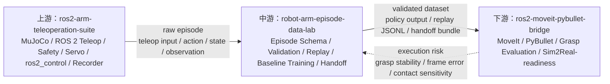
```mermaid
flowchart LR
    A["上游：ros2-arm-teleoperation-suite<br/>MuJoCo / ROS 2 Teleop / Safety / Servo / ros2_control / Recorder"]
    B["中游：robot-arm-episode-data-lab<br/>Episode Schema / Validation / Replay / Baseline Training / Handoff"]
    C["下游：ros2-moveit-pybullet-bridge<br/>MoveIt / PyBullet / Grasp Evaluation / Sim2Real-readiness"]

    A -->|"raw episode<br/>teleop input / action / state / observation"| B
    B -->|"validated dataset<br/>policy output / replay JSONL / handoff bundle"| C
    C -.->|"execution risk<br/>grasp stability / frame error / contact sensitivity"| B
```

本仓库仍保留 legacy PyBullet pick-lift 采集、HAL 控制抽象、笛卡尔 IK、双向 RRT、FSM 评测、物理抓取与 LeRobot 导出样例，用于本地可复现 episode 数据闭环；Panda 主线以 `configs/robot_schemas/panda.yaml` 和 `training/` 下的最小训练链路为主。

三仓库总体架构见 [docs/THREE_REPO_ARCHITECTURE.md](docs/THREE_REPO_ARCHITECTURE.md)；跨仿真后端边界见 [docs/SIM_BACKENDS_AND_TRANSFER.md](docs/SIM_BACKENDS_AND_TRANSFER.md)，训练到下游评估的 handoff 见 [docs/TRAINING_TO_SIM2REAL.md](docs/TRAINING_TO_SIM2REAL.md)。

### 当前唯一主实验（2026-07-11）

作品集结果统一引用 [Panda 30-Episode Canonical Experiment](docs/portfolio/CANONICAL_EXPERIMENT.md)：
30/30 episodes、71,737 frames、MLP BC、`panda_30_mlp_bridge_v0` handoff、下游
`panda_jsonl_replay + pybullet_ik` 正常与故障注入 benchmark。历史 smoke 和旧 E2E 数字不与本次结论混用。

### Panda P0 主线媒体证据

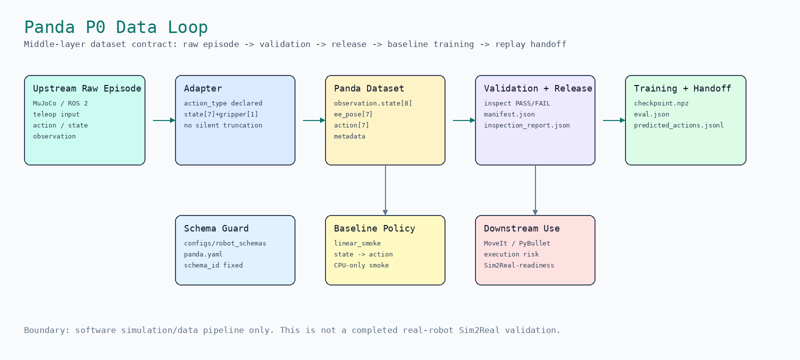

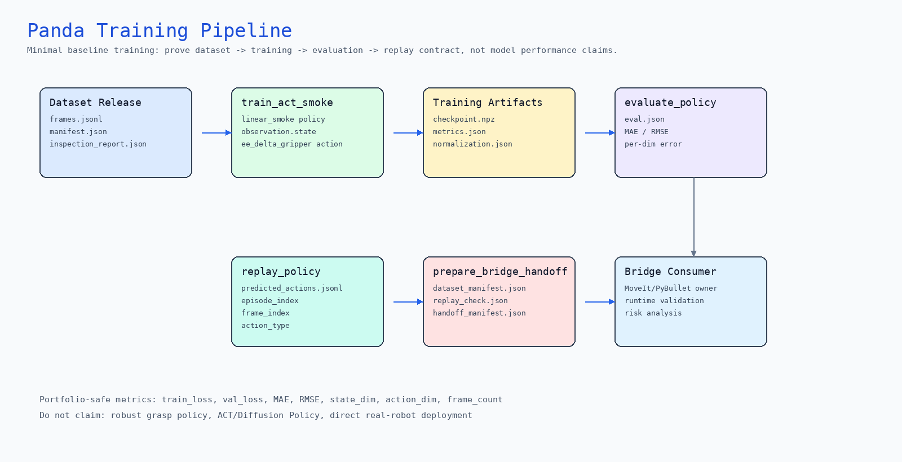

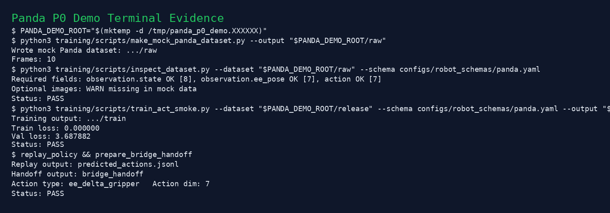

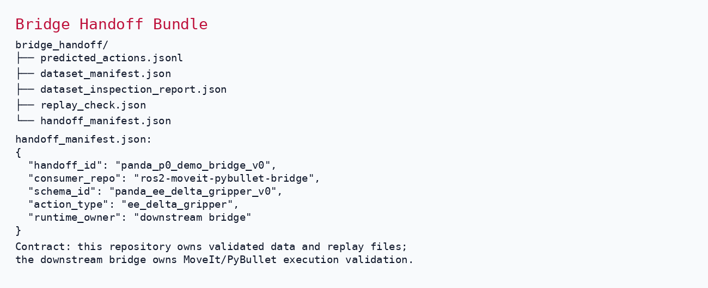

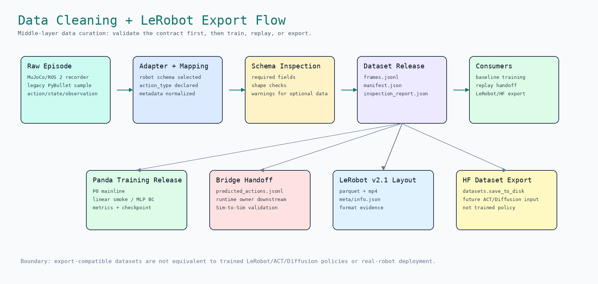

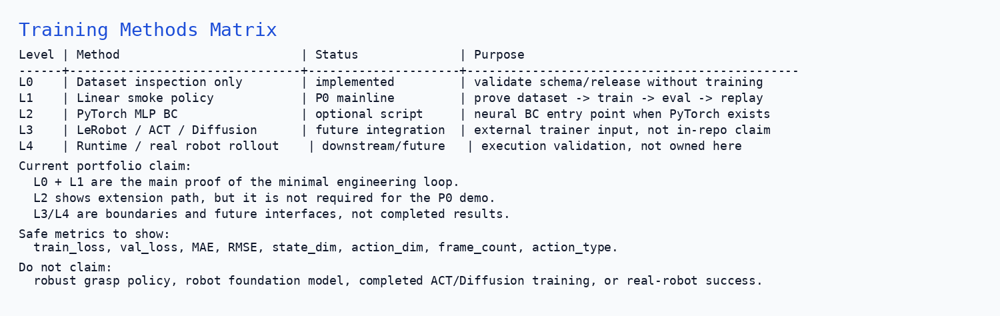

### Panda MLP BC 真实实验数据实证 (30 Episodes)

为了实证中游具身数据实验室的完整闭环，我们在 NVIDIA RTX PRO 500 GPU 上利用 30 条真实 Panda 抓取轨迹运行了数据质量分析与模仿学习训练对比：

1. **上游遥操作轨迹分布 (3D)**：
   
2. **中游数据探索性分析 (EDA Quality Gate)**：
   * **关节反向分布**：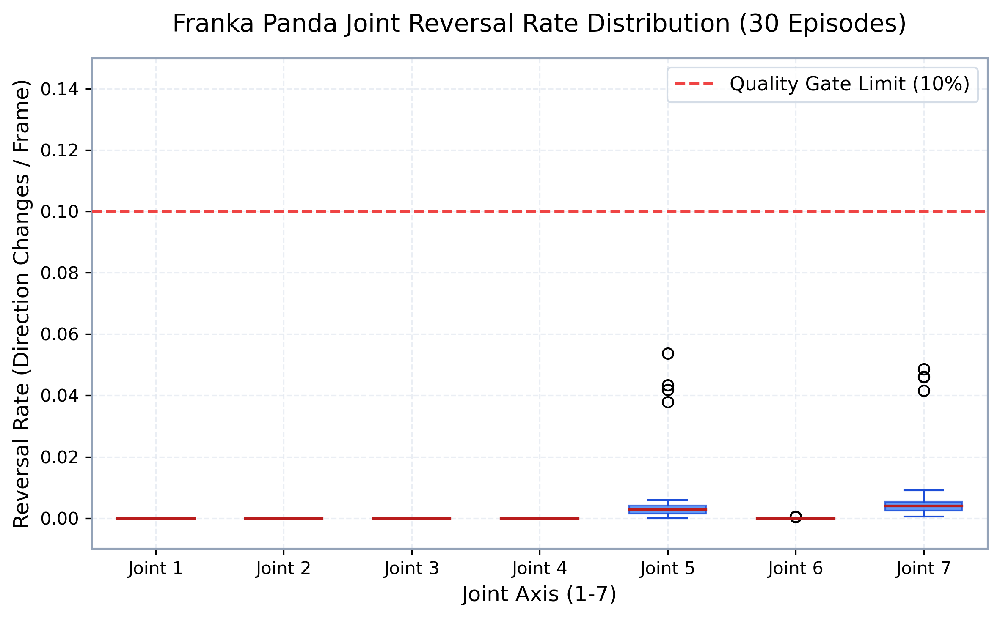
   * **关节步长 P99 抖动限值**：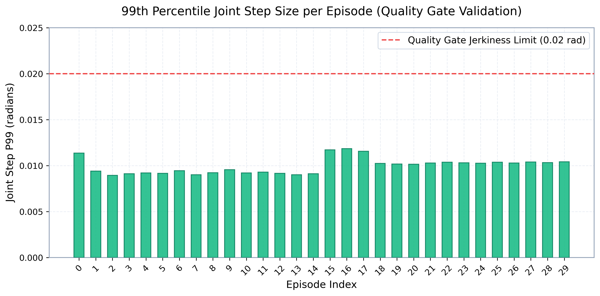
3. **MLP 模仿学习对比基准 (Linear Regression vs. MLP Policy)**：
   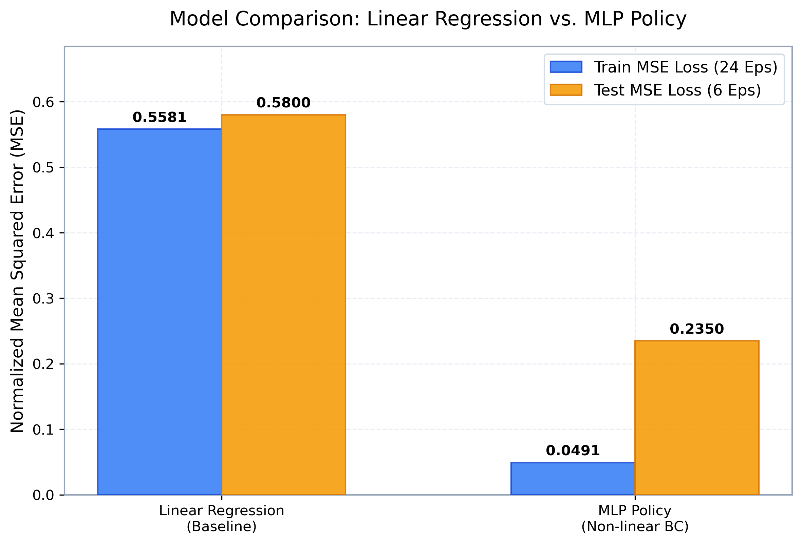

### Legacy PyBullet / KUKA visual evidence

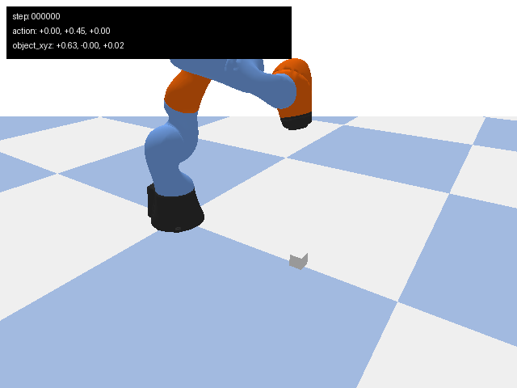


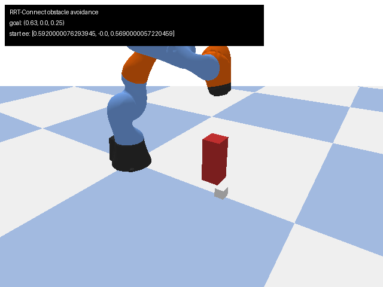


### 一分钟概览视频

[demo_overview.mp4](assets/videos/demo_overview.mp4)

**Colab 一键复现 →** [notebooks/portfolio_demo.ipynb](notebooks/portfolio_demo.ipynb)

**文档入口 → [docs/README.md](docs/README.md)**（开发先看 [docs/dev/quickstart.md](docs/dev/quickstart.md)）

### Legacy PyBullet / KUKA diagrams

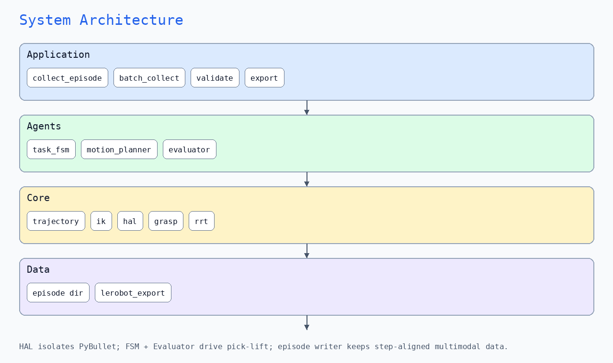

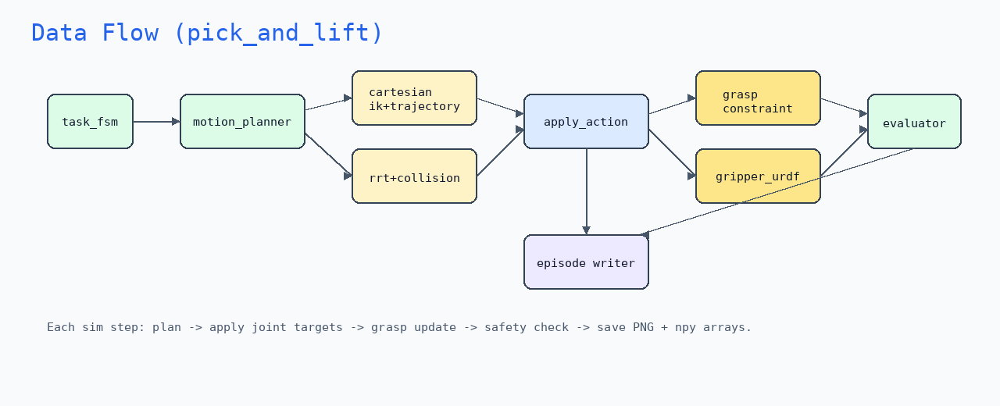

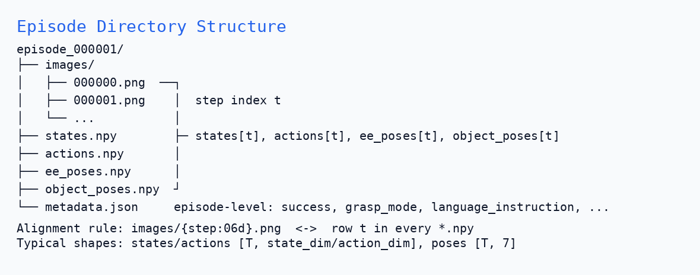

### Legacy LeRobot export evidence

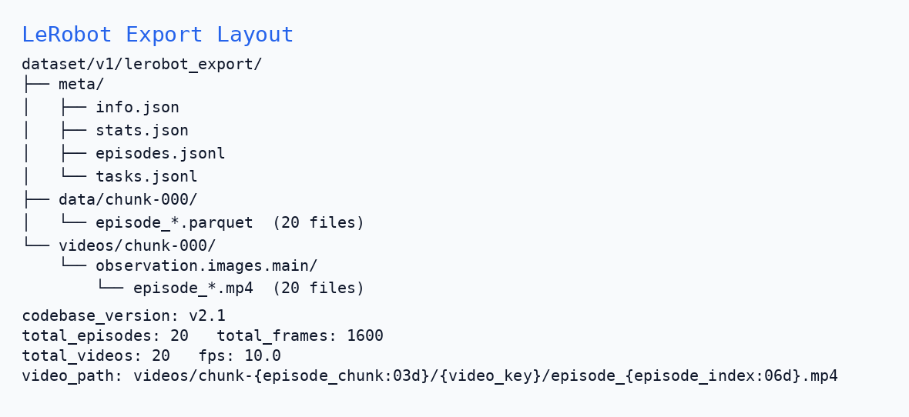

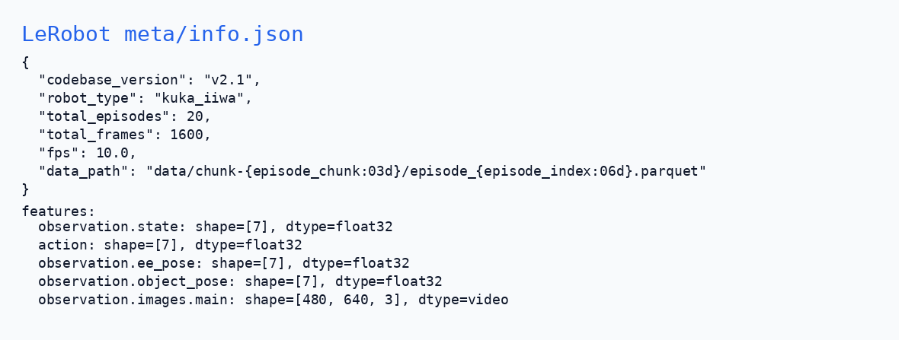

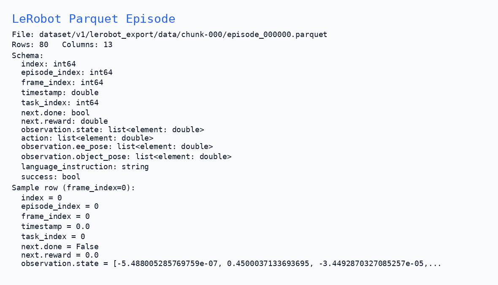

项目状态与收口清单见 [docs/portfolio/project_status.md](docs/portfolio/project_status.md)，个人简历描述与面试话术见 [docs/portfolio/resume_description.md](docs/portfolio/resume_description.md)。

## 快速开始：Panda P0 data loop

```bash
PANDA_DEMO_ROOT="$(mktemp -d /tmp/panda_p0_demo.XXXXXX)"
python3 training/scripts/make_mock_panda_dataset.py --output "$PANDA_DEMO_ROOT/raw"
python3 training/scripts/inspect_dataset.py --dataset "$PANDA_DEMO_ROOT/raw" \
  --schema configs/robot_schemas/panda.yaml
python3 training/scripts/prepare_dataset_release.py \
  --input "$PANDA_DEMO_ROOT/raw" \
  --output "$PANDA_DEMO_ROOT/release" \
  --schema configs/robot_schemas/panda.yaml \
  --release-id panda_p0_demo_v0
python3 training/scripts/train_act_smoke.py \
  --dataset "$PANDA_DEMO_ROOT/release" \
  --schema configs/robot_schemas/panda.yaml \
  --output "$PANDA_DEMO_ROOT/train"
python3 training/scripts/evaluate_policy.py \
  --dataset "$PANDA_DEMO_ROOT/release" \
  --checkpoint "$PANDA_DEMO_ROOT/train/checkpoint.npz" \
  --schema configs/robot_schemas/panda.yaml \
  --output "$PANDA_DEMO_ROOT/train/eval.json"
python3 training/scripts/replay_policy.py \
  --dataset "$PANDA_DEMO_ROOT/release" \
  --checkpoint "$PANDA_DEMO_ROOT/train/checkpoint.npz" \
  --schema configs/robot_schemas/panda.yaml \
  --output "$PANDA_DEMO_ROOT/train/predicted_actions.jsonl"
python3 training/scripts/prepare_bridge_handoff.py \
  --dataset "$PANDA_DEMO_ROOT/release" \
  --replay "$PANDA_DEMO_ROOT/train/predicted_actions.jsonl" \
  --schema configs/robot_schemas/panda.yaml \
  --output "$PANDA_DEMO_ROOT/train/bridge_handoff" \
  --handoff-id panda_p0_demo_bridge_v0
```

完整说明见 [docs/DEMO_GUIDE.md](docs/DEMO_GUIDE.md) 和 [training/README_TRAINING.md](training/README_TRAINING.md)。

## 🤖 智能问答：三仓数据流与闭环调试 RAG 助手

为了便于开发者快速理清三仓之间复杂的控制语义转换（位姿->关节角）、数据清洗门禁和多仓库协议对接，我们在项目中集成了一个本地离线 RAG 问答助手。

脚本文件：[scripts/rag_assistant.py](scripts/rag_assistant.py)

运行交互式问答（支持本地 Ollama / OpenAI / Gemini，默认离线检索）：
```bash
python3 scripts/rag_assistant.py
```
该助手会自动对项目里的所有设计和协议文档（如 `AGENTS.md`、`docs/portfolio/PROJECT_SCALING_ROADMAP.md` 等）进行分块索引，并输出带有行号的可点击参考文档链接，帮助您极速排查上下游数据冲突和联调故障。

## Legacy PyBullet episode sample

```bash
python -m pip install -r requirements.txt
PYTEST_DISABLE_PLUGIN_AUTOLOAD=1 pytest -q
python scripts/run_rrt_demo.py --seed 7
python scripts/collect_episode.py --task pick_and_lift --num-steps 40 \
  --output dataset_sample/episode_pick_ci --width 64 --height 48 --seed 7
python scripts/validate_dataset.py dataset_sample/episode_pick_ci
```

这部分是旧 KUKA / PyBullet 本地采集样例，用作历史演示和可复现 episode 证据；当前主线是 Panda schema / training / handoff。完整命令见 [docs/dev/quickstart.md](docs/dev/quickstart.md)。

## 文档导航

| 场景 | 文档 |
|------|------|
| 日常开发 | [docs/dev/](docs/dev/) |
| P0 项目总览 | [docs/PROJECT_OVERVIEW.md](docs/PROJECT_OVERVIEW.md) |
| P0 数据流 | [docs/DATA_FLOW.md](docs/DATA_FLOW.md) |
| P0 训练闭环 | [docs/TRAINING_PIPELINE.md](docs/TRAINING_PIPELINE.md) |
| 数据清洗 / LeRobot | [docs/DATA_CLEANING_AND_LEROBOT.md](docs/DATA_CLEANING_AND_LEROBOT.md) |
| 训练方式分层 | [docs/TRAINING_METHODS.md](docs/TRAINING_METHODS.md) |
| P0 最小演示 | [docs/DEMO_GUIDE.md](docs/DEMO_GUIDE.md) |
| P0 排障表 | [docs/TROUBLESHOOTING.md](docs/TROUBLESHOOTING.md) |
| 历史规划归档 | [docs/archive/README.md](docs/archive/README.md) |
| 概念参考 | [docs/reference/](docs/reference/) |
| **能力学习与自检** | [docs/reference/learning_capability_alignment.md](docs/reference/learning_capability_alignment.md) |
| 面试材料 | [docs/portfolio/](docs/portfolio/) |
| 当前主实验 | [docs/portfolio/CANONICAL_EXPERIMENT.md](docs/portfolio/CANONICAL_EXPERIMENT.md) |
| 项目演进路线图 | [docs/portfolio/PROJECT_SCALING_ROADMAP.md](docs/portfolio/PROJECT_SCALING_ROADMAP.md) |
| 三仓库总体架构 | [docs/THREE_REPO_ARCHITECTURE.md](docs/THREE_REPO_ARCHITECTURE.md) |
| 跨仿真后端边界 | [docs/SIM_BACKENDS_AND_TRANSFER.md](docs/SIM_BACKENDS_AND_TRANSFER.md) |
| 训练与下游 handoff | [training/README_TRAINING.md](training/README_TRAINING.md), [docs/TRAINING_TO_SIM2REAL.md](docs/TRAINING_TO_SIM2REAL.md) |
| 历史规划归档 | [docs/archive/README.md](docs/archive/README.md) |
| 智能体规范 | [AGENTS.md](AGENTS.md) |

## 能力概览

| 领域 | 关键路径 |
|------|----------|
| HAL + IK + 笛卡尔 | `core/hal.py`, `core/ik.py`, `core/trajectory.py` |
| 仿真世界 + 落盘 | `core/world.py`, `core/episode_writer.py`, `core/collect_config.py` |
| RRT 避障 | `core/rrt.py`, `core/collision.py`, `scripts/run_rrt_demo.py` |
| 物理抓取 | `core/grasp.py`（constraint）、`core/gripper.py`（`--grasp-mode gripper_urdf`） |
| 任务 FSM + 评测 | `agents/task_fsm.py`, `agents/evaluator.py` |
| legacy 采集主入口 | `scripts/collect_episode.py`, `scripts/validate_dataset.py` |
| episode schema | [docs/dev/data_schema.md](docs/dev/data_schema.md), `configs/robot_schemas/panda.yaml` |
| dataset inspection / release | `training/scripts/inspect_dataset.py`, `training/scripts/prepare_dataset_release.py` |
| baseline training / evaluation | `training/scripts/train_act_smoke.py`, `training/scripts/evaluate_policy.py`, `training/scripts/replay_policy.py` |
| bridge handoff | `training/scripts/prepare_bridge_handoff.py`, [docs/TRAINING_TO_SIM2REAL.md](docs/TRAINING_TO_SIM2REAL.md) |

简历定位：**机械臂具身数据闭环中游：episode schema / validation / replay / baseline training / Sim2Real-readiness handoff**；收口优先级见 [project_status.md](docs/portfolio/project_status.md)。

---

## English

This repository is the **midstream data lab** in a robot-arm embodied data loop: it normalizes raw episodes from upstream MuJoCo / ROS 2 teleoperation into a simulator-independent schema, then runs validation, release, replay, minimal baseline training, offline evaluation, and downstream PyBullet bridge handoff.

> **Scope**: portfolio-grade software simulation / data pipeline — not a production system. Training proves the minimal dataset → train → eval engineering loop; it does not claim complex model performance or completed real-robot Sim2Real.

### Three-Repository Pipeline

| Layer | Repository | Role |
|---|---|---|
| Upstream | `ros2-arm-teleoperation-suite` | MuJoCo / ROS 2 teleop, control stack, multimodal recorder → raw episodes |
| Midstream | `robot-arm-episode-data-lab` | Schema, validation, release, replay, baseline training, handoff |
| Downstream | `ros2-moveit-pybullet-bridge` | PyBullet / MoveIt execution checks, contact tuning, Sim2Real-readiness risk analysis |

See [docs/THREE_REPO_ARCHITECTURE.md](docs/THREE_REPO_ARCHITECTURE.md), [docs/SIM_BACKENDS_AND_TRANSFER.md](docs/SIM_BACKENDS_AND_TRANSFER.md), [docs/TRAINING_TO_SIM2REAL.md](docs/TRAINING_TO_SIM2REAL.md).

Legacy PyBullet / KUKA pick-lift collection remains as local reproducible samples. The **Panda mainline** uses `configs/robot_schemas/panda.yaml` and `training/`.

### Quick Start: Panda P0 Data Loop

```bash
PANDA_DEMO_ROOT="$(mktemp -d /tmp/panda_p0_demo.XXXXXX)"
python3 training/scripts/make_mock_panda_dataset.py --output "$PANDA_DEMO_ROOT/raw"
python3 training/scripts/inspect_dataset.py --dataset "$PANDA_DEMO_ROOT/raw" \
  --schema configs/robot_schemas/panda.yaml
python3 training/scripts/prepare_dataset_release.py \
  --input "$PANDA_DEMO_ROOT/raw" \
  --output "$PANDA_DEMO_ROOT/release" \
  --schema configs/robot_schemas/panda.yaml \
  --release-id panda_p0_demo_v0
python3 training/scripts/train_act_smoke.py \
  --dataset "$PANDA_DEMO_ROOT/release" \
  --schema configs/robot_schemas/panda.yaml \
  --output "$PANDA_DEMO_ROOT/train"
python3 training/scripts/evaluate_policy.py \
  --dataset "$PANDA_DEMO_ROOT/release" \
  --checkpoint "$PANDA_DEMO_ROOT/train/checkpoint.npz" \
  --schema configs/robot_schemas/panda.yaml \
  --output "$PANDA_DEMO_ROOT/train/eval.json"
python3 training/scripts/replay_policy.py \
  --dataset "$PANDA_DEMO_ROOT/release" \
  --checkpoint "$PANDA_DEMO_ROOT/train/checkpoint.npz" \
  --schema configs/robot_schemas/panda.yaml \
  --output "$PANDA_DEMO_ROOT/train/predicted_actions.jsonl"
python3 training/scripts/prepare_bridge_handoff.py \
  --dataset "$PANDA_DEMO_ROOT/release" \
  --replay "$PANDA_DEMO_ROOT/train/predicted_actions.jsonl" \
  --schema configs/robot_schemas/panda.yaml \
  --output "$PANDA_DEMO_ROOT/train/bridge_handoff" \
  --handoff-id panda_p0_demo_bridge_v0
```

Full guide: [docs/DEMO_GUIDE.md](docs/DEMO_GUIDE.md), [training/README_TRAINING.md](training/README_TRAINING.md).

### RAG Assistant (Optional)

Local offline Q&A over project docs (`AGENTS.md`, architecture, handoff contracts):

```bash
python3 scripts/rag_assistant.py
```

### Legacy PyBullet Episode Sample

```bash
python -m pip install -r requirements.txt
PYTEST_DISABLE_PLUGIN_AUTOLOAD=1 pytest -q
python scripts/collect_episode.py --task pick_and_lift --num-steps 40 \
  --output dataset_sample/episode_pick_ci --width 64 --height 48 --seed 7
python scripts/validate_dataset.py dataset_sample/episode_pick_ci
```

### Documentation

| Topic | Doc |
|---|---|
| Overview | [docs/PROJECT_OVERVIEW.md](docs/PROJECT_OVERVIEW.md) |
| Data flow | [docs/DATA_FLOW.md](docs/DATA_FLOW.md) |
| Training pipeline | [docs/TRAINING_PIPELINE.md](docs/TRAINING_PIPELINE.md) |
| Demo / troubleshooting | [docs/DEMO_GUIDE.md](docs/DEMO_GUIDE.md), [docs/TROUBLESHOOTING.md](docs/TROUBLESHOOTING.md) |
| Agent spec | [AGENTS.md](AGENTS.md) |

**Resume positioning**: midstream embodied data loop — episode schema / validation / replay / baseline training / Sim2Real-readiness handoff.
