# Data Flow

状态：P0 数据流文档。本文档说明 raw episode 如何进入中游，如何被检查、发布、训练，并导出给下游 bridge 做 Sim-to-Sim / Sim2Real-readiness 评估。

## 1. End-to-End Flow

```mermaid
flowchart LR
    RAW["MuJoCo / ROS 2 raw episode<br/>teleop input / action / state / observation"]
    ADAPT["adapter<br/>raw fields -> canonical schema"]
    SCHEMA["canonical Panda schema<br/>configs/robot_schemas/panda.yaml"]
    INSPECT["inspect dataset<br/>required fields / shape / warnings"]
    RELEASE["dataset release<br/>manifest + inspection report"]
    TRAIN["linear smoke training<br/>observation.state -> action"]
    EVAL["offline evaluation<br/>MAE / RMSE / per-dim error"]
    REPLAY["predicted_actions.jsonl<br/>neutral action stream"]
    HANDOFF["bridge_handoff<br/>manifest + replay + reports"]
    DOWN["downstream bridge<br/>MoveIt / PyBullet validation"]

    RAW --> ADAPT --> SCHEMA --> INSPECT --> RELEASE --> TRAIN --> EVAL --> REPLAY --> HANDOFF --> DOWN
```



## 2. Raw Fields

上游 `ros2-arm-teleoperation-suite` 的 raw episode 可以来自 MuJoCo / ROS 2 teleop recorder。当前期望字段如下：

| Raw field | 常见形态 | 中游处理 |
|---|---|---|
| `observation.state` | `[7]` Panda joint positions | 与 `observation.gripper[1]` 合并为 canonical `observation.state[8]` |
| `observation.gripper` | `[1]` gripper opening | 合并进 state |
| `observation.ee_pose` | `[7]` position + quaternion | 保留为 required field |
| `observation.ft` | `[6]` force + torque | optional，缺失时 warning |
| `observation.images.scene` | RGB image | optional，缺失时 warning |
| `observation.images.wrist` | RGB image | optional，缺失时 warning |
| `observation.images.tactile_*` | RGB image | optional，缺失时 warning |
| `action` | `[8]` often `ee_pose_gripper` | 保留或显式转换，禁止静默截断 |
| `timestamp` | scalar | 保留并检查 |
| `frame_index` | scalar | 保留并检查 |
| `episode_index` | scalar | 保留并检查 |
| `task` | string | 保留为任务标签 |

## 3. Adapted Fields

Canonical Panda dataset 的最小结构：

```text
panda_dataset/
├── frames.jsonl
└── manifest.json
```

每一帧至少包含：

```json
{
  "observation.state": [0.0, 0.0, 0.0, 0.0, 0.0, 0.0, 0.0, 1.0],
  "observation.ee_pose": [0.4, 0.0, 0.3, 0.0, 0.0, 0.0, 1.0],
  "action": [0.001, 0.0, -0.002, 0.0, 0.0, 0.01, 0.0],
  "timestamp": 0.033,
  "frame_index": 1,
  "episode_index": 0,
  "task": "pick_lift"
}
```

`manifest.json` 至少应说明：

- `dataset_format`
- `schema_id`
- `robot`
- `action_type`
- `num_episodes`
- `num_frames`
- `source`
- `training_contract`

## 4. Action Type Conversion

当前 Panda schema 支持三类 action：

| action type | 维度 | 用途 |
|---|---:|---|
| `ee_delta_gripper` | 7 | 默认训练 action，delta xyz + delta rpy + gripper command |
| `joint_delta_gripper` | 8 | 关节增量 + gripper command |
| `ee_pose_gripper` | 8 | 上游 M6 recorder import 兼容形态 |

关键规则：

- 上游 `action[8]` 如果是 pose + gripper，应标记为 `ee_pose_gripper`。
- 训练脚本默认要求 `ee_delta_gripper[7]`。
- 只有明确启用 adapter 的 delta action 推导时，才允许从 pose action 转为 delta action。
- 不允许为了让 shape 通过而丢弃 quaternion 或 gripper 维度。

## 5. Validation Gates

`training/scripts/inspect_dataset.py` 检查：

| Gate | PASS 条件 | FAIL / WARN |
|---|---|---|
| required fields | 每帧都有 required fields | 缺失即 FAIL |
| shape | 与 `panda.yaml` 一致 | 不一致即 FAIL |
| action type | manifest 和 schema 可解释 | 不可解释即 FAIL |
| frame count | rows 可读取且 episode/frame 可统计 | 不可读取即 FAIL |
| optional modalities | 缺失可接受 | 记录 WARN |

`training/scripts/prepare_dataset_release.py` 检查：

- inspection 必须 PASS。
- release 输出目录不能已有内容。
- 复制 `frames.jsonl` 或 `frames.npz`。
- 生成 `manifest.json` 和 `inspection_report.json`。

## 6. Training / Evaluation Outputs

训练输出目录：

```text
training/reports/panda_act_smoke/
├── checkpoint.npz
├── config_resolved.yaml
├── metrics.json
└── normalization.json
```

离线评估输出：

```text
training/reports/panda_act_smoke/eval.json
```

Replay 输出：

```text
training/reports/panda_act_smoke/predicted_actions.jsonl
```

Bridge handoff 输出：

```text
training/reports/panda_act_smoke/bridge_handoff/
├── predicted_actions.jsonl
├── dataset_manifest.json
├── dataset_inspection_report.json
├── replay_check.json
└── handoff_manifest.json
```

## 7. Failure Policy

中游遇到以下情况应 fail fast：

- required observation / action / timestamp 字段缺失。
- `observation.state` 不是 `[8]`。
- 默认训练 action 不是 `ee_delta_gripper[7]`。
- `schema_id` 与 `configs/robot_schemas/panda.yaml` 不一致。
- dataset inspection 未 PASS 却尝试 release 或 training。
- replay JSONL 缺少 `episode_index`、`frame_index`、`schema_id`、`action_type`。

Optional image / tactile / ft 缺失时应保留 warning，避免把早期 mock dataset 错判为不可用。

