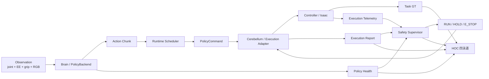

# Policy Runtime × HOC 一体化实施路线图

**版本**：v0.1  
**状态**：M0–M6 implementation complete（2026-07-26）；M6 为 mock-policy 真实 ROS wiring；authoritative SmolVLA cutover 未启用  
**日期**：2026-07-26  
**Canonical owner**：`robot-arm-episode-data-lab`（跨仓合同、阶段门禁、证据口径）

关联文档：

- [Policy Runtime Integration SPEC](POLICY_RUNTIME_INTEGRATION_SPEC.md)
- [Policy Adapter Contract](POLICY_ADAPTER_CONTRACT.md)
- [Future Work Roadmap](FUTURE_WORK_ROADMAP.md)
- [SmolVLA v3 Evaluation SOP](SMOLVLA_V3_EVAL_SOP.md)

本文把两个表面问题合并成一条实施路线：

1. SmolVLA 大脑在线链与下游旧 replay / risk 框架尚未接成统一 runtime。
2. HOC 虽能展示旧下游风险，但不能区分 Brain、Execution、Safety 和 Task GT，也不能可靠表达指标是否有效。

项目边界保持不变：不授权训练、重训、扩 Isaac seed、真机、修改 `eval_gate_v3` 或改写历史 Pass/Hold。

---

## 0. 最终目标

> **让每个动作都能从 observation 一路追踪到策略输出、执行裁决、安全决策和任务真值，并让 HOC 一眼回答“现在是否执行、为什么、问题在哪一层、证据是否有效”。**

目标链：



设计上只有一个最终安全裁决，不建立互相竞争的“大脑风险总分”和“小脑风险总分”：

- Brain 和 Execution 输出具名、可验证的 health signals。
- Safety Supervisor 聚合有效信号，产生唯一 R0–R3 与 Run/Hold/E-stop。
- Task GT 独立判定 reach/grasp/lift/place，不参与 risk 加权。

---

## 1. 当前事实与断点总表

### 1.1 已实现

| 能力 | 仓库 | 当前实现 | 证据充分度 |
|---|---|---|---|
| SmolVLA 在线读取 `state[15] + scene RGB` | 上游 | `smolvla_policy_inference_node.py` | 代码与 S4 产物充分 |
| absolute EEF + gripper 动作限幅并发布 teleop 命令 | 上游 | `/teleop/cmd_pose`、`/teleop/gripper_cmd` | 代码充分 |
| sync / async chunk 调度器离线 benchmark | 中游 | `async_queue_runtime.py` + benchmark evidence | 仅离线充分；在线未接线 |
| `ee_delta_gripper[7]` handoff replay | 下游 | `PolicyRunner` + `PandaActionAdapter` | 代码与 smoke 充分 |
| KL/W1/MMD、tracking、risk R0–R3 | 下游 | `dist_monitor` + `risk_engine` | 旧下游场景充分 |
| HOC risk/distribution/tracking/resource/grasp 展示 | 下游 | `hoc_console` | 旧 replay HOC 充分 |
| Recovery v3 task GT | 上游/中游证据 | S4 authoritative relight：lift 0/5 → Hold | 任务结论充分 |

### 1.2 九个待闭合断点

| ID | 断点 | 当前表现 | 直接后果 | 关闭阶段 |
|---|---|---|---|---|
| B1 | Observation 身份 | SmolVLA 使用 `state[15]+RGB`，旧下游以 joint stream 为主 | 不能从下游直接托管当前 VLA | M0–M1 |
| B2 | Action semantics | absolute EEF8 与 delta EEF7 并存 | 离线 absolute→delta 不能证明在线等价 | M0–M2 |
| B3 | Chunk lifecycle | async queue 仅离线 benchmark | reset/Hold/E-stop 对 queue 的行为未在线验证 | M1–M2 |
| B4 | 执行权威 | SmolVLA 直发 teleop；PolicyRunner 发 bridge command | 两套执行状态机并行 | M2–M4B |
| B5 | Safety feedback | 下游 `/risk/status` 未反馈 SmolVLA 实际执行路径 | risk 无法真正 Hold/E-stop 当前大脑链 | M3A–M4A |
| B6 | 指标有效性 | baseline/样本未就绪也可能发布默认零值 | HOC/报告把“不可用”误画成“正常” | M0、M3A |
| B7 | Task GT 接口 | ✅ canonical continuous evaluator 已发布结构化 live mirror | HOC 可独立显示任务 GT；无 evaluator 时仍 fail-closed | M0、M3B |
| B8 | HOC provenance | 当前只看旧 RiskStatus/DistributionMetrics 等 | 不能定位 Brain、Scheduler、Execution 或 GT | M3B–M3C |
| B9 | Trace 关联 | policy、risk、GT 产物主要事后聚合 | 无法从一条告警回溯到原始动作 | M0–M5 |

---

## 2. 先冻结“看什么”，再修改“怎么跑”

### 2.1 公共关联键

以下字段必须贯穿 command、execution、risk、GT、HOC 和导出报告：

```yaml
contract_version: panda_policy_runtime_v1
contract_sha256: string
trace_run_id: string
episode_id: string
observation_sequence: uint64
command_sequence: uint64
source_stamp: ROS time
received_stamp: ROS time
validity: VALID | WARMING_UP | STALE | UNAVAILABLE | ERROR
reason_code: string
```

不是每条消息都必须拥有全部业务字段，但关联键不得被 HOC 丢弃。

### 2.2 四类数据合同

| 合同 | 最小字段 | 生产者 | 主要消费者 |
|---|---|---|---|
| `PolicyRuntimeHealth`（逻辑合同；v1 可由 `DiagnosticArray` 承载） | policy/checkpoint、observation age、inference latency、deadline miss、queue depth/underrun、last command age、validity | 上游 Policy Runtime | Risk adapter、HOC、recorder |
| `PolicyExecutionReport` | accepted/decision/reason、raw/bounded action、clip axes、TTL、adapter、hold/estop | 上游 Execution Adapter | Risk、HOC、evidence |
| `DistributionMetrics vNext` | KL/W1/MMD、sample count、`baseline_ready`、`metric_valid`、`calibration_id` | 下游 dist_monitor | Risk、HOC、report |
| `TaskEvaluationStatus` | phase、reach/grasp/lift/place、object delta、status、GT source、validity | 上游 evaluator mirror | HOC、evidence；**不进入 risk 权重** |

### 2.3 信号到动作的唯一映射

| 来源 | 信号 | Safety 默认动作 | HOC 展示 |
|---|---|---|---|
| Brain | observation stale、policy timeout、queue underrun、action invalid | HOLD；清 queue；fresh observation 后重推理 | Brain `ERROR/STALE` + 原因链 |
| Execution | TTL 过期、sequence 回退、schema mismatch | HOLD + reject | `HELD/REJECTED` |
| Execution | workspace/gripper clip | 执行 bounded action并记录；高比例才升级 | raw→bounded + clip axes |
| Execution | hard limit / safety E-stop | E_STOP，人工 reset | `ESTOPPED` + latched |
| Monitor | 有效 KL/W1/MMD 或 tracking/dynamics 超限 | 交由 RiskAggregator 产生 R-level | Safety lane + validity |
| Monitor | baseline 未 ready / 样本不足 | `UNAVAILABLE`，不得按 0 聚合 | 灰色 warming-up/unavailable |
| Task GT | reach/grasp/lift/place fail | 只记录 task FAIL | Task lane；不得触发 risk 归因 |

### 2.4 外部成熟方法审查与采用决策

本路线图参考以下一手设计，但只吸收适合当前三仓规模的机制：

| 外部方法 | 可复用原则 | 本项目采用方式 | 当前不采用 |
|---|---|---|---|
| [ISA-101 HMI](https://www.isa.org/standards-and-publications/isa-standards/isa-101-standards) | 人因中心设计、显示层级、导航、颜色与报警的一致约定，目标是减少操作错误 | 固定 `Runtime Overview → Diagnostics → Historical / Evidence` 三级；一级画面在 1920×1080 内无需页面滚动即可完成状态判断 | 不声称本界面已经过正式 ISA-101 合规认证或操作员人因验证 |
| [Ignition High Performance HMI](https://docs.inductiveautomation.com/docs/7.9/visualization-and-dashboards/understanding-components/high-performance-hmi-techniques) | 正常态降低视觉显著性，颜色主要留给问题；文字/形状与颜色共同表达，避免仅凭颜色识别 | 石墨灰作为常态，VALID 使用中性灰蓝；HOLD/E-stop 才使用琥珀/红色，并始终附带状态词和 reason code | 不把绿色铺满页面，也不只靠色相表达 validity |
| [Siemens HMI Template Suite](https://support.industry.siemens.com/cs/attachments/91174767/91174767_HMITemplateSuiteUnified_V5.0_DOC_en.pdf) | 居中的主要内容区、稳定的导航位置、统一配色和高对比分区 | 主态势固定在居中宽屏内容区，三类视图共用 token 化石墨灰调色板与一致面板边界 | 不复制 Siemens 组件、商标或专有模板 |
| [Rockwell High Performance HMI](https://literature.rockwellautomation.com/idc/groups/literature/documents/wp/ssb-wp009_-en-p.pdf) | Level 1–4 显示层级逐步从总览进入单元、设备和诊断细节 | 本项目采用最小三级映射，一级保留裁决与关键运行指标，连续趋势/相机/证据下沉 | 当前不实现完整工厂级 Level 1–4 资产模型 |
| [ROS 2 Managed Nodes](https://design.ros2.org/articles/node_lifecycle.html) | `Unconfigured → Inactive → Active → Finalized`；错误进入 `ErrorProcessing`；外部 supervisor 管理转换 | Policy Runtime / Execution Adapter 使用 LifecycleNode 或等价状态机；只有 contract、checkpoint、observation 与 safety precondition 就绪才 Active | 不把任务 Hover/Grasp/Lift FSM 塞进 ROS lifecycle |
| [ROS 2 QoS](https://docs.ros.org/en/humble/Concepts/Intermediate/About-Quality-of-Service-Settings.html) | Deadline 检测发布间隔违约；Lifespan 丢弃过期样本；Liveliness 检测 publisher 失活；Transient Local 服务晚加入者 | command 使用 volatile + deadline/lifespan；状态使用 transient-local；DDS event 转 health signal | 不用 QoS 替代应用层 TTL、sequence 和 safety checks |
| [DiagnosticStatus](https://docs.ros.org/indigo/api/diagnostic_msgs/html/msg/DiagnosticStatus.html) / [diagnostic_aggregator](https://docs.ros.org/en/ros2_packages/kilted/api/diagnostic_aggregator/index.html) | 标准 `OK/WARN/ERROR/STALE`；诊断项可聚合并在超时后 stale | ROS health level 与标准枚举对齐；业务层另保留 `WARMING_UP/UNAVAILABLE` reason | 不把 STALE 自动当 task FAIL |
| [Autoware Diagnostic Graph](https://autowarefoundation.github.io/autoware_universe/pr-10077/system/autoware_diagnostic_graph_aggregator/) | 用 DAG / AND / OR / link 表达功能依赖与故障传播，支持中间功能单元和 operation availability | 新增最小 `runtime_diagnostic_graph.yaml`，生成 `source → dependent unit → final decision` 原因链供 Risk/HOC 使用 | 当前不引入整套 Autoware 依赖；不复制其自动驾驶 operation modes |
| [Foxglove State Transitions](https://docs.foxglove.dev/docs/visualization/panels/state-transitions) | 把离散状态按共同时间轴分行展示，并与 plot 同步定位同一时刻 | HOC 新增 command-correlated Brain / Execution / Safety / Task GT 状态时间线；当前 command 与原因链固定在时间线上方 | 不引入 Foxglove runtime；不让原始 topic 面板取代本项目合同与裁决语义 |
| [OpenTelemetry context propagation](https://opentelemetry.io/docs/concepts/context-propagation/) | trace ID / parent span 让跨进程 metrics、logs、events 可关联 | `trace_run_id + command_sequence + parent_event_id` 贯穿 ROS/WS/JSONL；离线可导出 trace | 不把 OTel Collector/SDK 放进硬实时 command path |
| [ros2_tracing](https://docs.ros.org/en/lyrical/Tutorials/Advanced/ROS2-Tracing-Trace-and-Analyze.html) | 旁路捕获 callback/transport 时序，避免只靠应用日志估算 | M5/M6 可选采集 scheduler→executor→controller callback latency，作为性能证据 | 不用 tracing 结果实时驱动 Hold/E-stop |
| [Grafana No Data / Error](https://grafana.com/docs/grafana/latest/alerting/fundamentals/alert-rule-evaluation/nodata-and-error-states/) | No Data 与 Error 是独立状态，不能隐式等于 Normal | HOC 对每个 source 显式显示 No Data/STALE/ERROR，并保留 state reason | 不用 Grafana 替代当前 HOC，也不接入外部告警基础设施 |
| [Grafana Status History](https://grafana.com/docs/grafana/latest/visualizations/panels-visualizations/visualizations/status-history/) | 每个实体一行，用颜色块展示离散状态随时间变化；空值保留为缺口 | HOC runtime history 保留 60 秒并压缩为四条颜色状态带，缺源使用灰色 `UNAVAILABLE/STALE`，不沿用最后绿值 | 不把连续 EE/KL 数值离散化后冒充状态结论 |
| [ros2_control Controller Manager activity](https://control.ros.org/kilted/doc/ros2_control/controller_manager/doc/userdoc.html) | controller/hardware lifecycle 变化通过 transient-local activity topic 暴露 | HOC Execution lane 接入 controller activity 或等价镜像，让晚加入 UI 看到当前 controller 状态 | 不让 HOC 直接切 controller；控制权限仍走既有安全服务 |

### 2.5 Runtime lifecycle

| Lifecycle state | Policy Runtime | Execution Adapter | Safety 默认状态 |
|---|---|---|---|
| `Unconfigured` | 未载入 schema/checkpoint | 未载入 adapter/limits | HOLD |
| `Inactive` | 已配置但不推理/不发 command | 只接受自检，不下发控制 | HOLD |
| `Active` | observation preconditions 满足，允许 infer/schedule | 接受有效 command 并执行 | 由 Risk 决定 RUN/HOLD |
| `ErrorProcessing` | 清空 chunk/history，发布 ERROR | 清 queue、保持 measured state | HOLD；硬安全错误 E-stop |
| `Finalized` | 保留最终 status 供审计 | 不接受 command | HOLD/E-stop latch 不自动清除 |

启动顺序固定为：contract lock → controller/hardware ready → Execution Adapter Inactive → Policy Runtime Inactive → observation valid → activate Execution → activate Policy。停机顺序反向执行，先停大脑产出，再停小脑。

### 2.6 QoS 与应用层时效双保险

| Topic 类别 | Durability | Deadline / lifespan | Liveliness | 应用层检查 |
|---|---|---|---|---|
| `PolicyCommand` | volatile | deadline 由 control period 推导；lifespan 不大于 command TTL | 可选 manual-by-topic | contract、TTL、sequence、observation sequence |
| Execution report / health | volatile | deadline 由状态更新周期推导 | automatic | source age、validity、trace |
| Hold / E-stop / lifecycle / controller state | transient-local | 不用旧 sample 作为 motion command | automatic | latch、ack、人工 reset |
| Camera / joint sensor | volatile | sensor profile；consumer 自查 stamp | automatic | observation age / sync |

推荐初值只写成公式，不在 M0 前硬编码：`deadline = 1.5 × expected_period`，`lifespan ≤ command_ttl`，`liveliness_lease ≥ 2 × expected_period`。具体数值进入 runtime lock，并由 mock deadline/liveliness event 测试冻结。

### 2.7 最小诊断因果图

```yaml
units:
  brain_ready:
    type: and
    inputs: [observation_valid, policy_loaded, inference_deadline_ok, queue_ready]
  execution_ready:
    type: and
    inputs: [controller_active, command_valid, ttl_ok, limits_ok]
  runtime_safe:
    type: and
    inputs: [brain_ready, execution_ready, monitor_sources_valid]
  final_decision:
    type: decision
    inputs: [runtime_safe, risk_level, estop_latched]
```

Risk score 负责“严重程度”，诊断图负责“依赖和原因传播”。HOC 顶部原因链来自诊断图，不从一串分数中临时猜测。

---

## 3. 实施依赖顺序


任何阶段失败都停在该阶段，不跳过验收向后推进。

---

## 4. 分阶段路线

### M0 — 合同、有效性和 HOC 数据字典冻结

**实施状态**：✅ canonical 中游实现完成；未产生任何 ROS runtime、仿真、训练或任务成功声明。  
**行为变化**：无。  
**主仓库**：中游；上游/下游只审阅接口落点。

交付：

- `policy_runtime_contract.schema.json`、fixture、SHA lock。
- 冻结 `PolicyCommand`、`PolicyExecutionReport`、`PolicyRuntimeHealth`、`TaskEvaluationStatus` 字段。
- 冻结 `VALID/WARMING_UP/STALE/UNAVAILABLE/ERROR` 语义。
- 冻结 HOC WebSocket 四类 payload 与原因码表。
- 冻结 runtime lifecycle、QoS 公式与 DDS deadline/liveliness event 到 health signal 的映射。
- 新增 `runtime_diagnostic_graph.yaml` fixture，冻结 AND/OR/link、latch 与 cause-path 语义。
- 定义 `claims_task_success=false`、risk 不覆盖 task GT 的 schema 约束。

测试：schema 正/反 fixture、未知 action schema、缺关联键、非法 task claim、无效指标不得默认零、非法 lifecycle transition、QoS event 和诊断 DAG 循环依赖。

退出门：✅ schema、6 个 JSON fixture 与 diagnostic graph fixture 全部通过；canonical lock 已固定 8 个工件及聚合 SHA。上游/下游在 M1 接入时必须消费该 lock，不得复制后漂移。  
回滚：仅删除未引用的新 schema；不影响运行时。

### M1 — Brain Runtime 结构化输出，不改变执行

**实施状态**：✅ 上游 shadow 实现完成；默认 `policy_runtime_shadow_enabled:=false`，未启动 Isaac、未改变执行权威。  
**行为变化**：只增加 shadow telemetry。  
**主仓库**：上游。

交付：

- 在 `teleop_interfaces` 新增 command/report/task status 消息；health 使用冻结的结构化合同。
- 从现有 SmolVLA node 提取 `PolicyBackend` 和 Scheduler。
- 继续由 legacy 代码发布 teleop 命令；新路径只发布 shadow `PolicyCommand` 和 health。
- health 必须暴露 observation age、inference latency、queue、deadline、action validation 和 contract hash。
- Runtime/Execution 使用 ROS LifecycleNode 或符合相同合同的可测试状态机；Inactive 时禁止发布可执行 command。
- command QoS 启用 deadline/lifespan，DDS missed-deadline/liveliness event 旁路写入 health；应用层 TTL 仍是最终执行检查。
- M1 历史实现只通过 LeRobot `select_action()` 暴露单步，因此如实生成 singleton envelope；M2 已改用 `predict_action_chunk()`，此限制不再代表当前 shadow runtime。

测试：CPU 单测 + ROS mock；reset 清 queue；stale observation 不生成可执行 command；不启动 Isaac。

退出门：✅ 消息 rosidl 生成与两包编译通过；固定 fixture 的 sequence、reset、stale、inactive、QoS/DDS health 与 mock ROS round-trip 通过；shadow 默认关闭，legacy teleop publisher 仍为唯一执行路径。  
回滚：关闭 runtime shadow launch。

### M2 — Cerebellum / Execution Adapter shadow parity

**实施状态**：✅ 上游 shadow 实现完成；仅允许 `dry_run=true`，未启动 Isaac、未取得执行权威。  
**行为变化**：新 adapter 计算但不执行。  
**主仓库**：上游。

交付：

- `PandaPolicyExecutionAdapter` 支持 native absolute EEF8 与 delta EEF7。
- 统一 contract/dim/finite/sequence/TTL/schema conversion/clamp/hold/estop 顺序。
- 每步发布 `PolicyExecutionReport`，包含 raw 与 bounded action。
- legacy 与 new path 针对同一 observation 做 shadow parity。
- Brain wrapper 直接发布 native chunk10，Scheduler 以 10 Hz 消费 K=5；未把 singleton 伪装成 chunk。

验收阈值：position ≤ `1e-6 m`、quaternion angular error ≤ `1e-6 rad`、gripper ≤ `1e-6`、clip decision 全一致、sequence 无重复。

退出门：✅ canonical S4 已有 telemetry 的 750 个动作逐步 bounded/clip parity 全一致；absolute EEF8 的 position/quaternion/gripper 数值误差在 `1e-12` 测试精度内；delta EEF7、合同/维度/finite/sequence/TTL、Hold/E-stop、reason code、JSON schema 与 ROS report round-trip 均通过。新增的 `/policy/execution_report` 是 shadow 审计发布者，不发布 teleop command。  
回滚：关闭 adapter shadow。

### M3A — Monitor / Risk 有效性修复

**实施状态**：✅ 下游实现完成；保持只读，不向上游发送 Hold/E-stop。  
**行为变化**：无效指标从假零改为 unavailable；暂不驱动上游。  
**主仓库**：下游。

交付：

- `DistributionMetrics` 增加 `baseline_ready`、`metric_valid`、`calibration_id`、reason。
- dist_monitor 在 min samples、时间对齐、baseline 或 calibration 不满足时显式 invalid。
- Risk Engine 只聚合 valid dimensions，同时输出每个 source validity/provenance。
- 增加最小 Runtime Diagnostic Graph：Risk 继续输出严重程度，graph 单独输出依赖状态与 cause path。
- benchmark CSV、offline readiness、HOC report 不再把缺失 KL/W1/MMD 塓成 0。
- legacy/synthetic 阈值只保留为 fixture；Panda runtime KL 在同场景校准前不驱动 R-level。

测试：baseline warming、样本不足、stale、calibration mismatch、部分维度可用、全维度不可用。

退出门：✅ invalid/warming/stale/calibration 缺失均不再产生“绿色 0 / no shift”；RiskStatus 记录 active/invalid dimensions 与逐源 provenance。  
回滚：保留旧字段兼容一个发布周期，但 validity 优先。

### M3B — HOC backend 接入四条数据流

**实施状态**：✅ 四流只读接入完成；canonical Isaac/MuJoCo continuous evaluator 已补 live publisher，无 evaluator 或 privileged pose 时仍如实显示 `UNAVAILABLE`。  
**行为变化**：只读展示与报告增强。  
**主仓库**：下游。

交付：

- `hoc_server` 订阅 policy health、execution report、risk status、task GT。
- WebSocket 分别推送 `policy_health`、`execution_report`、`risk_status`、`task_gt`。
- Session history/export 保留四条独立时间线与公共 trace key。
- 后端计算 source age；超时后主动转 `STALE`，不永久保留最后绿值。
- 接入 lifecycle/controller activity；保存 `No Data / Error / Stale` 的 state reason。
- 传播 `parent_event_id`，建立 observation→command→execution→risk/GT 的因果链接。

测试：ROS message→dict、WebSocket schema、断流 stale、乱序 command sequence、trace correlation、report export。

退出门：✅ RuntimeLaneStore、ROS→dict 与 session tests 覆盖完整四流、断流 stale、乱序 sequence 和 trace mismatch；缺流不伪造状态。  
回滚：新订阅可配置关闭，旧 HOC payload 保持兼容。

### M3C — HOC 四泳道前端

**实施状态**：✅ 下游只读 UI 完成；旧 canonical run 已移入 Historical Evidence。  
**行为变化**：只读 UI 改版。  
**主仓库**：下游。

页面固定结构：

```text
┌─────────────────────────────────────────────────────────────┐
│ Final Decision: HOLD ← policy.queue_underrun ← timeout      │
├─────────────┬──────────────┬──────────────┬─────────────────┤
│ Brain       │ Execution    │ Safety       │ Task GT         │
│ ERROR       │ HELD         │ R2 / HOLD    │ RUNNING         │
│ obs age     │ seq / TTL    │ primary cause│ reach/grasp/... │
│ infer / queue│ raw→bounded │ source valid │ GT source       │
├─────────────┴──────────────┴──────────────┴─────────────────┤
│ Timeline / Distribution diagnostics / Camera / Resources    │
└─────────────────────────────────────────────────────────────┘
```

交付：

- `SafetyDecisionBanner`：唯一 final decision + 原因链。
- `BrainPanel`、`ExecutionPanel`、`TaskGtPanel`。
- 旧 RiskRadar 保留在 Safety detail；补齐第六维 resource 或明确外链资源面板。
- `DistributionPanel` 下沉 Execution diagnostics，并显示 validity/calibration。
- 静态 `CanonicalRunPanel` 移入 Historical Evidence 区，不和 live run 混排。
- Lifecycle/controller activity 放入 Execution lane；Inactive/Finalized 不显示为运行正常。
- 对 No Data、Error、Stale 分别使用不同图标和 reason，不采用“keep last green”。

测试：fixture component tests + Playwright；valid/warming/stale/unavailable/error 五态；窄屏；数据洪峰下布局稳定。

退出门：✅ 首页固定显示唯一 Final Decision 与 Brain / Execution / Safety / Task GT；五态 fixture 和布局稳定性由 Playwright 覆盖。  
回滚：feature flag 切回 legacy dashboard。

### M4A — Risk → Hold / E-stop dry-run

**状态**：✅ 已实现并以 `dry_run=true` 默认接入 monitoring launch。纯状态机、ROS mock（含 R3 单次请求）与 HOC proposed/actual 展示测试通过；未对机器人施加控制。

**行为变化**：默认只记录“本应采取的动作”，不控制机器人。  
**主仓库**：下游 bridge + 上游只读 consumer。

交付：

- `RiskToSafetyBridge` 将 R2 映射 Hold、R3 映射 TriggerEstop。
- `dry_run=true` 默认；发布 proposed decision 与原因，但不调用控制接口。
- HOC 同时显示 proposed 与 actual decision，二者不一致时告警。
- mock integration 覆盖恢复、debounce、latch、重复 E-stop 抑制。

退出门：R0/R1/R2/R3 fixture 映射完全确定；R3 不自动 clear；任务 FAIL 不触发 risk。  
回滚：保持 dry-run 或关闭 bridge。

### M4B — 唯一执行源切换

**状态**：✅ authoritative 代码路径与 mock contract 已实现；默认仍为 `legacy`，本次未启动仿真、未执行在线切流。只有显式设置 `execution_adapter_mode=authoritative` 且 `dry_run=false` 才可取得命令权威。

**行为变化**：高风险，必须显式人工批准。  
**主仓库**：上游；下游提供 safety feedback。

前置：M0–M4A 全部 Pass。

交付：

- `PandaPolicyExecutionAdapter` 成为 teleop command 唯一 policy publisher。
- legacy direct publish 关闭；启动时检查 publisher identity/count。
- R2 实际 Hold，R3 调用现有 E-stop；Hold 清 active/prefetch queue。
- `execution_adapter_mode=legacy|shadow|authoritative` 保留一个发布周期。

退出门：mock/recorded telemetry 下单一发布源、TTL/queue/hold/estop 全部通过；HOC actual decision 与执行报告一致。  
回滚：切回 `legacy`，保留失败 evidence。

### M5 — 下游 replay 与证据闭环

**实施状态**：✅ 纯离线实现完成；未启动 ROS graph、PyBullet、Isaac 或训练，未改变执行权威。  
**行为变化**：扩展离线 replay，不改变 task GT。  
**主仓库**：中游合同 + 下游 replay/HOC report。

交付：

- versioned `policy_commands.jsonl`、execution reports、risk timeline、task GT timeline。
- 下游 `PolicyCommandReplayPolicy` 与独立 absolute EEF replay adapter。
- HOC 导出一份可按 command sequence 回溯的四泳道报告。
- 可选用 `ros2_tracing` 捕获 callback/transport 时序；应用 trace 与 ROS trace 通过 trace marker 对齐。
- replay 明确 `is_closed_loop=false`、`claims_task_success=false`。

退出门：✅ `panda_policy_trace_bundle_v1` 的五个带 SHA-256 JSONL 轨道可由 HOC fail-closed 导出；下游严格 loader、`PolicyCommandReplayPolicy` 与独立 absolute EEF8 adapter 可按 command sequence 回溯 command、execution、risk 与 GT；hash、schema、关联缺失和非法 task-success claim 均拒绝。  
回滚：继续使用旧 `predicted_actions.jsonl`。

### M6 — 可选 wiring smoke

**实施状态**：✅ 已获人工批准并完成；真实 ROS 2/DDS 多进程 wiring，PolicyBackend 为 mock，未启动仿真。  
**行为变化**：可能启动 ROS/仿真；必须另行显式批准。

只验证：

- topic / QoS / contract hash；
- latency / queue / TTL；
- R2 Hold、R3 E-stop；
- HOC 四泳道刷新和 trace；
- 进程物理清理。

明确不验证：策略任务成功，不扩大 seed，不改 S4 Gate，不重训。

退出门：✅ command QoS/contract/latency/queue/TTL 元数据通过；R2 实际发布 Hold，R3 实际调用 TriggerEstop 并观察 E_STOP；HOC 对 3 个 command 完成四泳道关联和五轨 bundle 导出；严格 loader 读回；全部进程在 timeout 内退出。证据见 [M6 Wiring Results](portfolio/POLICY_RUNTIME_M6_WIRING_RESULTS.md)。

---

## 5. 三仓文件落点

### 中游：合同、fixture、验收

| 路径 | 动作 |
|---|---|
| `docs/POLICY_RUNTIME_INTEGRATION_SPEC.md` | 设计权威 |
| `docs/POLICY_RUNTIME_HOC_IMPLEMENTATION_ROADMAP.md` | 实施顺序权威 |
| `evaluation/schemas/policy_runtime_contract.schema.json` | M0 新增 |
| `evaluation/examples/{policy_runtime_contract,policy_command,policy_execution_report,policy_runtime_health,task_evaluation_status,hoc_runtime_frame}_fixture.json` | 合同与四流正 fixture；反例由测试从正 fixture 变异生成 |
| `configs/policy_runtime/panda_policy_runtime_v1.lock.json` | contract SHA lock |
| `configs/policy_runtime/runtime_diagnostic_graph.yaml` | 最小依赖 DAG 与 cause-path 配置 |
| `tests/test_policy_runtime_contract.py` | schema / claims / trace tests |

### 上游：Brain、Execution、Task GT

| 路径 | 动作 |
|---|---|
| `src/teleop_interfaces/msg/PolicyCommand.msg` | M1 新增 |
| `src/teleop_interfaces/msg/PolicyExecutionReport.msg` | M1 新增 |
| `src/teleop_interfaces/msg/TaskEvaluationStatus.msg` | M1 新增结构化 GT mirror |
| `src/synth_data_gen/synth_data_gen/task_gt_live.py` | ContinuousTaskEvaluator → live contract 的纯映射 |
| `scripts/isaac_continuous_gt_recorder.py` | canonical Isaac/MuJoCo `/task/evaluation_status` publisher |
| `src/isaac_sim_adapter/.../policy_runtime.py` | backend/scheduler/health |
| `src/isaac_sim_adapter/.../policy_execution_adapter.py` | M2/M4 唯一执行入口 |
| `src/isaac_sim_adapter/.../smolvla_policy_inference_node.py` | compatibility → runtime publisher |
| `src/isaac_sim_adapter/launch/policy_runtime.launch.py` | mode + topic wiring |
| `tests/test_policy_execution_adapter.py` | parity / TTL / Hold / schema |

### 下游：Validity、Risk、HOC、Replay

| 路径 | 动作 |
|---|---|
| `bridge_monitor_msgs/msg/DistributionMetrics.msg` | M3A validity/calibration |
| `bridge_monitor_msgs/msg/RiskStatus.msg` | source validity/reason provenance（如 fixture 证明现字段不足） |
| `dist_monitor/dist_monitor/monitor_node.py` | validity-first publish |
| `risk_engine/risk_engine/risk_node.py` | valid-dimension aggregation |
| `risk_engine/risk_engine/risk_to_safety_bridge.py` | M4A 新增 |
| `hoc_console/hoc_console/hoc_server.py` | M3B 四流订阅/历史 |
| `hoc_console/hoc_console/ros_bridge.py` | 四流 JSON conversion |
| `hoc_console/frontend/src/types/messages.ts` | 四流 WebSocket types |
| `hoc_console/frontend/src/components/*Panel.tsx` | M3C 四泳道 |
| `pybullet_bridge/.../policy_command_replay_policy.py` | M5 replay |

---

## 6. 测试矩阵

| 层级 | 必测内容 | 是否需要仿真 |
|---|---|---|
| Contract | schema、hash、trace、claims、validity | 否 |
| Brain | observation stale、latency、queue、reset | 否；mock |
| Execution | action dispatch、TTL、sequence、clamp、parity | 否；fixture/telemetry replay |
| Monitor | baseline/min samples/calibration/stale | 否 |
| Risk | 部分维度可用、R-level、latch、task GT 隔离 | 否 |
| HOC backend | ROS→WS、断流 stale、history/export | 否；mock |
| HOC frontend | 五态、原因链、四泳道、布局稳定 | 否；fixture/e2e |
| Integrated dry-run | proposed vs actual decision | 否；ROS mock |
| Lifecycle/QoS | 非法 transition、deadline、lifespan、liveliness、late joiner | 否；ROS mock |
| Diagnostic graph | DAG 校验、AND/OR、dependent/latch、root cause path | 否 |
| Authoritative wiring | 单一 publisher、真实 Hold/E-stop | M6 前先 mock；真实运行另批 |

默认先完成全部不需要仿真的测试，再讨论 M6。

---

## 7. 推荐提交切片

1. `docs(contract): freeze policy runtime hoc roadmap`
2. `feat(contract): add runtime validity and trace schemas`
3. `feat(upstream): publish policy command health and task gt in shadow mode`
4. `feat(upstream): add execution adapter and prove shadow parity`
5. `fix(downstream): make distribution and risk metrics validity-aware`
6. `feat(hoc): ingest four runtime lanes with stale detection`
7. `feat(hoc): render brain execution safety and task gt lanes`
8. `feat(safety): add dry-run risk-to-safety bridge`
9. `feat(upstream): switch to authoritative execution adapter`
10. `feat(downstream): replay and export traced policy commands`

每个提交只跨必要仓库；schema 提交先于 consumer，consumer 保持向后兼容一个发布周期。

---

## 8. 三个可交付终点

### 终点 A：Observable（完成 M0–M3C）

可以说：

> 已用统一 trace 把 Brain、Execution、Safety 和 Task GT 接入 HOC，并能区分 unavailable/stale；执行仍处于 shadow/legacy 模式。

不能说：统一小脑已经接管控制、risk 已实际 Hold 当前 SmolVLA。

### 终点 B：Safety-connected（完成 M4A）

可以说：

> Risk→Hold/E-stop 映射已通过 dry-run/mock integration，HOC 可对照 proposed 与 actual decision。

不能说：已完成 authoritative 在线切流。

### 终点 C：Runtime-connected（完成 M4B–M5）

可以说：

> 模型无关 Policy Runtime、唯一 Execution Adapter、Safety feedback 与四泳道 HOC 已接通，同一 command trace 可下游复放审计。

仍不能说：任务成功、Sim2Real、真机或稳定自主抓取。

---

## 9. Definition of Done

- [x] Canonical M0 contract hash 已冻结，unknown schema / 非法维度 / 非法 task claim fail closed。
- [x] M1/M2 上游运行时固定引用中游同一 M0 contract version 与 SHA lock，并由跨仓测试核验。
- [x] SmolVLA 已通过 `PolicyBackend` 输出 native absolute EEF8 chunk10，Scheduler shadow 消费 K=5；M1 singleton 仅为历史兼容阶段。
- [x] Brain health 对 observation/inference/queue/DDS event 的 validity 可测。
- [x] Shadow Execution Report 能解释 raw→bounded、TTL、sequence、clip reason 与最终 would-execute decision；不代表已取得执行权威。
- [x] KL/W1/MMD 未就绪时显式 unavailable，不再默认绿色零值。
- [x] RiskStatus 只聚合 valid sources，并保存 provenance。
- [x] HOC 首页固定展示 Brain、Execution、Safety、Task GT 四泳道。
- [x] HOC 顶部只有一个 Run/Hold/E-stop，并保留 source reason、age 与 trace correlation。
- [x] Task GT 不参与 risk 权重，也不被 risk 改写。
- [x] R2 Hold、R3 E-stop mock integration 通过；R3 不自动 clear。
- [x] Authoritative 模式在取得命令权前检查 pose/gripper publisher count 均为 1；实现与 CPU contract 已通过，尚未执行在线 cutover。
- [x] 相同 trace 可在下游 replay/report 中回溯，且保持 `is_closed_loop=false`、`claims_task_success=false`。
- [x] M6 wiring smoke 已另获批准、受 55 秒 timeout 限制并完成进程清理；使用 mock PolicyBackend，未启动仿真。

在全部完成前，统一口径是：

> **M0–M6 已实现并完成有界 ROS wiring：mock PolicyBackend 下 Risk→Hold/E-stop、HOC 四泳道与 trace bundle 均实测通过。SmolVLA authoritative adapter 默认仍为 legacy，未运行 PyBullet/Isaac 或策略任务，因此不能声称任务成功、仿真策略闭环、Sim2Real 或真机。**
