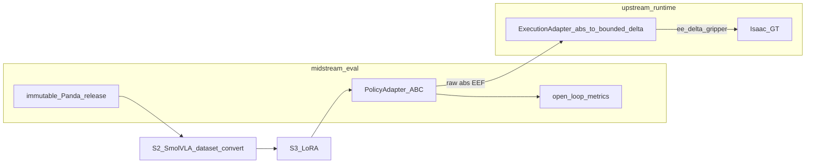

# SmolVLA Gate S0：只读兼容性审计与后续门禁

**日期**：2026-07-22  
**状态**：Gate S0 **已完成（文档）**。Gate **S1 pass**；Gate **S2 接口 pass / H-3 no_go**（见 [`SMOLVLA_GATE_S2_OPEN_LOOP.md`](SMOLVLA_GATE_S2_OPEN_LOOP.md)）。**未**训练、**未**跑 Isaac、**未**进入 S3+。  
**候选策略**：Hugging Face LeRobot **SmolVLA**（官方预训练 + 受控 LoRA/PEFT + 模型无关评测框架）。  
**关联**：

- [`EVALUATION_REPORT.md`](EVALUATION_REPORT.md)
- [`VLA_GATE_V0_COMPATIBILITY_AUDIT.md`](VLA_GATE_V0_COMPATIBILITY_AUDIT.md)（LingBot；本机 V1 No-Go）
- [`VLA_GATE_V05_PANDA_ACTION_CONTRACT.md`](VLA_GATE_V05_PANDA_ACTION_CONTRACT.md)（absolute EEF 方案 B）
- [`VLA_GATE_V1_PREFLIGHT.md`](VLA_GATE_V1_PREFLIGHT.md)（LingBot 6GB No-Go）
- [`POLICY_ADAPTER_CONTRACT.md`](POLICY_ADAPTER_CONTRACT.md)
- [`ACT_HOME_NO_CLOSE_HYPOTHESIS_MATRIX.md`](ACT_HOME_NO_CLOSE_HYPOTHESIS_MATRIX.md)
- [`portfolio/THREE_REPO_CANONICAL_FACTS.md`](portfolio/THREE_REPO_CANONICAL_FACTS.md)

凡未由本仓代码/evidence 或官方文档直接支持的内容标为 **未验证**。禁止用「450M」推断本机 6GB 必能推理。

---

## 1. 当前项目与策略状态摘要

### 1.1 不可改变的事实

| 事实 | 证据 | 分类 |
|---|---|---|
| ACT E3 nominal **task success 0/20**，diagnostic baseline | [`EVALUATION_REPORT.md`](EVALUATION_REPORT.md)；[`evidence/e3_nominal20_home_30ep_gt_v1_20260719/summary.json`](../evidence/e3_nominal20_home_30ep_gt_v1_20260719/summary.json) | **已实现** |
| scripted oracle 修链后 **lift 5/5**，`task_success_claimed=false` | [`evidence/e3p5_isaac_scripted_oracle_5x_lift_v2b_20260720/oracle_gate.json`](../evidence/e3p5_isaac_scripted_oracle_5x_lift_v2b_20260720/oracle_gate.json) | **已实现** |
| close→lift ACT smoke **lift 0/5**，5/5 `HOME_NO_CLOSE` | [`evidence/e3p6_closelift40_5seed_home_20260720/smoke5_gate.json`](../evidence/e3p6_closelift40_5seed_home_20260720/smoke5_gate.json) | **已实现** |
| 不再以「把 ACT 训成功」为主目标；禁止盲训/同类扩采/盲扫 weight/完整 E4 | [`ACT_HOME_NO_CLOSE_HYPOTHESIS_MATRIX.md`](ACT_HOME_NO_CLOSE_HYPOTHESIS_MATRIX.md)；EVALUATION_REPORT §7 | **已实现（决策）** |
| LingBot-VLA 2.0 本机 Gate V1 **No-Go**（RTX PRO 500 / **6113 MiB**） | [`VLA_GATE_V1_PREFLIGHT.md`](VLA_GATE_V1_PREFLIGHT.md) §0 | **已实现（预检）** |
| Panda VLA 默认动作语义：**absolute EEF + gripper_cmd**（方案 B） | [`VLA_GATE_V05_PANDA_ACTION_CONTRACT.md`](VLA_GATE_V05_PANDA_ACTION_CONTRACT.md) | **已实现（契约）** |
| `ee_delta_gripper[7]` 仅属 ACT/执行侧，≠ VLA 原生语义 | V05 §0；下游 `panda_action_adapter.py` | **已实现** |
| 必须区分 channel selection / policy semantics / execution conversion | V05 §0 | **已实现（契约）** |
| 三仓边界保留、不合仓 | 各仓 `AGENTS.md` | **已实现** |

### 1.2 策略转向

- **当前活动候选**：SmolVLA（非 LingBot 6B 本机路径）；**Hold at S2**。
- LingBot 执行路线：**Closed / Archived**（审计文档保留）。
- ACT / oracle 保留为 diagnostic / 物理对照基线，**不删除 evidence**。
- 评测主线：模型无关 Policy Adapter + Benchmark；SmolVLA 仅作为新 `policy_id` 候选（未挂 Isaac）。



---

## 2. SmolVLA 官方来源与版本

| 项 | 官方来源 | 本仓验证状态 |
|---|---|---|
| 文档 | https://huggingface.co/docs/lerobot/main/en/smolvla | 已读 |
| 代码 | https://github.com/huggingface/lerobot （`policies/smolvla/`） | 已读 config/modeling |
| 基座权重卡 | https://huggingface.co/lerobot/smolvla_base | 已读 README；**未下载** |
| 论文 | https://arxiv.org/abs/2506.01844 | 引用级；未逐页核对实验表 |
| PEFT/LoRA | https://huggingface.co/docs/lerobot/en/peft_training | 已读；官方 `--peft.method_type=LORA` |
| 硬件指南 | https://github.com/huggingface/lerobot/blob/main/docs/source/hardware_guide.mdx | 已读：SmolVLA 训练峰值 **~10–16GB** |
| 博客 | https://huggingface.co/blog/smolvla | 已读：450M、consumer hardware、需自有数据微调 |

### 2.1 已验证（官方文档/代码）

- 参数规模：约 **450M**（文档/博客）；HF 卡约 0.5B params；dtype **F32 / BF16**。
- 默认：`n_obs_steps=1`，`chunk_size=50`，`n_action_steps=50`，`max_state_dim=32`，`max_action_dim=32`，`resize_imgs_with_padding=(512,512)`，VLM `HuggingFaceTB/SmolVLM2-500M-Video-Instruct`（[configuration_smolvla.py](https://raw.githubusercontent.com/huggingface/lerobot/main/src/lerobot/policies/smolvla/configuration_smolvla.py)）。
- 入口：`lerobot-train`、`SmolVLAPolicy.from_pretrained` + `select_action`、`lerobot-rollout` / `lerobot-record`。
- PEFT：默认 target `q_proj`/`v_proj` + state/action projection。
- 代码许可证：源文件头 **Apache-2.0**。

### 2.2 未验证

- `lerobot/smolvla_base` 权重包内嵌 LICENSE 全文（README front-matter 无显式 `license:` 字段）。
- 精确 PyTorch / Transformers / LeRobot 钉死版本（文档为 `pip install "lerobot[smolvla]"`）。
- 本机 6GB 真实推理峰值显存（官方无固定 MiB；第三方数字 **不算**本仓验证）。
- 本仓 `panda_release_v0` / 上游 LeRobot **v2.1** 与当前 `LeRobotDataset` 逐字段互通。

---

## 3. Observation 兼容性矩阵

| 项 | 本仓 Panda | SmolVLA 官方 | 判定 |
|---|---|---|---|
| scene RGB 数量 | 主相机 1× scene（portfolio）；腕部可选 | 多视角；可 `empty_cameras` pad | **可通过数据转换兼容**；多腕是否必需 **未验证** |
| 分辨率 / resize / crop | 采集常 320×240；ACT 训 224 crop | `resize_with_pad` → **512×512** | **可通过数据转换兼容** |
| 图像归一化 | ACT 有 mean/std | `VISUAL: IDENTITY`（config） | **未验证** |
| robot state | `observation.state[8]` | pad 到 `max_state_dim=32` | **可通过数据转换兼容** |
| language | `language_instruction` 已有 | 需要自然语言 | **直接兼容**（字段）；SmolVLA **必须用** |
| obs history | 默认 `n_obs_steps=1` | 同默认 1 | **直接兼容** |
| 时间戳 | 单帧 `timestamp` | 帧/episode 索引 | **帧级可兼容**；分模态 stamp：**当前不可获得** |
| 缺失模态 | 部分 release **无 RGB** | 图像为核心输入 | **无 RGB：当前不可兼容** |
| train/infer 一致 | 本仓要求对齐 | 同 task / 相机配置 | **原则兼容**；Panda Isaac 路径 **未验证** |

---

## 4. Action 兼容性矩阵

| 项 | SmolVLA 官方 | 本仓方案 B | 判定 |
|---|---|---|---|
| 自定义 action 维 | pad 到 `max_action_dim=32` | abs EEF 8 或执行侧 delta 7 | **可通过转换兼容**（≤32） |
| 固定 max dim / padding | **是**（32） | active-channel + unpad | **需 Adapter** |
| action mask | `action_is_pad`；向量 pad | active dims | **部分兼容**；Panda mask **需自建** |
| absolute EEF | **未规定**为唯一语义 | 推荐 abs xyz+xyzw+cmd | **未验证**预训练先验；后训练必须用本仓绝对 EE 标签 |
| chunk / horizon | `chunk_size=50` | 有界逐步命令 | **可通过 Adapter 队列兼容** |
| gripper | config **未固定**；Aloha 有专用开关 | `[0,1]`，0=闭 1=开 | **需 features 显式绑定**；与 SO100 先验冲突 **未验证** |
| norm | `ACTION: MEAN_STD` | 需 Panda stats | **可通过转换兼容** |
| 直接喂 `ee_delta_gripper` | **禁止假定** | 执行栈吃 delta | **当前不可直接兼容** |

### 4.1 强制三层流水线（设计；S0 不实现）

```text
SmolVLA raw (padded ≤32, possibly normalized)
→ active Panda channel selection (e.g. 8-D abs EEF)
→ denormalize → absolute EEF target + quat validate
→ semantic validation
→ Execution Adapter (abs − measured → clip → ee_delta_gripper[7])
→ watchdog / E-stop
→ Isaac continuous GT
```

---

## 5. 数据 release 兼容性矩阵

| 项 | 本仓现状 | 对 SmolVLA | 缺口分级 |
|---|---|---|---|
| 数据集形态 | 上游 LeRobot **v2.1**；中游 ACT release = `panda_release_v0` + 常为 `ee_delta_gripper` | 期望 LeRobot dataset | **S2 前必须转换**：选 RGB+绝对 EE+language 源；**禁止**纯 delta 冒充 VLA 标签 |
| episode 索引 | `episode_index` / `frame_index` | episode 切片 | **可转换** |
| 图像 | MP4 scene @ ~10 Hz（有视频的 release） | 相机键映射 | **可转换**；无图：**S2 No-Go** |
| state / action | state[8]；上游 action[8] abs | 连续 action + MEAN_STD | **S2 前必须**导出 `absolute_eef_gripper_v0`（[`absolute_eef.py`](../evaluation/vla_contract/absolute_eef.py)） |
| language | 有 | 必需 | OK |
| fps / timestamps | video_fps=10；单 `timestamp` | 帧序列可起步 | 分模态 stamp：**可延后到 open-loop 前**（非 S0 No-Go） |
| stats | ACT 内有；VLA 需重算 | MEAN_STD | **S2 必须生成** |
| split | 有 training split 惯例 | 需冻结 | **S2/S3 配置冻结** |
| action chunk | episode 无 chunk 列 | `action_delta_indices` | **S2 转换层构造**（非 S0 No-Go） |
| robot features | `panda.yaml` | LeRobot features | **S2 必须薄 YAML 映射** |

---

## 6. 本机 6GB 资源 Go / No-Go

宿主机实测（用户 2026-07-22）：`NVIDIA RTX PRO 500 Blackwell Generation Laptop GPU, 6113 MiB`。

| 阶段 | 判定 | 依据 |
|---|---|---|
| **S1 官方推理冒烟** | **Hold → 可尝试但未验证** | 官方称 consumer/CPU 可部署，**无**钉死 MiB |
| **S3 LoRA 训练** | **本机 No-Go** | 官方 hardware_guide ~**10–16GB** |
| **S4 Isaac+策略同卡** | **本机高风险 No-Go** | 同卡渲染+策略 **未验证** |

**建议最低远程 GPU（S3）**：**16GB+**（更稳妥 **24GB**）。  
S1 可先在本机实测；失败则上远程卡。

---

## 7. LoRA 后训练可行性

**官方路径存在**（[PEFT 文档](https://huggingface.co/docs/lerobot/en/peft_training)）：

```bash
# 示例形状（本仓未执行）
lerobot-train \
  --policy.path=lerobot/smolvla_base \
  --peft.method_type=LORA \
  --peft.r=64 \
  ...
```

**允许的最小闭环**

```text
immutable Panda release (RGB + abs EEF + language)
→ official smolvla_base
→ one-shot LoRA/PEFT (fixed config)
→ checkpoint + metadata (base rev, LoRA rev, dataset, norm sha)
→ open-loop vs expert (claims_task_success=false)
→ bounded Isaac smoke 1–5 seeds
→ Badcase → one data iteration → regression
```

**禁止**：改结构、发明 loss、盲搜超参、追求 SOTA、失败后回退盲训 ACT。

---

## 8. Policy Adapter 差距（最薄扩展；S0 不改代码）

骨架已足够：[`POLICY_ADAPTER_CONTRACT.md`](POLICY_ADAPTER_CONTRACT.md)；[`policy_adapter_metadata.schema.json`](../evaluation/schemas/policy_adapter_metadata.schema.json)。

| 需求 | 现状 | 薄扩展（规划） |
|---|---|---|
| 执行出口 | `export_action` → `ee_delta_gripper[7]` | **保留**；Adapter 内 abs→bounded delta，或拆 semantic export + Execution Adapter |
| revision | `checkpoint_hash` | 可选：`base_checkpoint_rev`、`lora_rev`、`norm_stats_sha256`、`policy_action_semantics` |
| 轨迹字段 | `raw_action` / `postprocessed_action` | 可选：`active_channels`、`denormalized_target` |
| 注册 | ACT/oracle/moveit 卡 | 新增 `smolvla_*`；**不改**现有路径 |

上游 ACT/oracle 薄包装：[`policy_adapters.py`](file:///home/ina/dev/ros2-arm-teleoperation-suite/src/isaac_sim_adapter/isaac_sim_adapter/policy_adapters.py)；SmolVLA Isaac 挂载仍延后（S3/S4 须另批）。

---

## 9. Gate S1–S4（设计冻结；本轮不执行）

| Gate | 允许 | 禁止 | 通过标准 | 本轮状态 |
|---|---|---|---|---|
| **S1** 官方环境与资源 | 装 `lerobot[smolvla]`；加载 `smolvla_base`；官方样例推理；记 VRAM/延迟/revision/LICENSE | Panda 数据；训练；Isaac；改 evidence | 可复现日志 + 显存数字 | **Done (pass)** |
| **S2** Panda 转换 + open-loop | 特征转换；norm；fixture；expert open-loop | 控 Isaac；训练 | open-loop report；禁止混 ACT delta 表 | **Done (interface pass / H-3 no_go)** |
| **S3** 一次 LoRA | 冻结 release + 固定配置 + 一记 LoRA（建议远程 ≥16GB） | 结构改动、新 loss、超参扫 | checkpoint + provenance | **Later / 本机 No-Go** |
| **S4** 有界 Isaac smoke | S2+S3 过门；1–5 seed；bounded；watchdog/E-stop/GT | E4/OOD；改旧 ACT 数字 | 接口失败即停 | **Later** |

---

## 10. No-Go / Hold

| ID | 项 | 结论 |
|---|---|---|
| NG-A | 本机 6GB SmolVLA **LoRA 训练** | **No-Go** |
| NG-B | SmolVLA 输出直接当 `ee_delta_gripper` | **No-Go** |
| NG-C | 无 RGB / 纯 delta release 做 VLA 后训练 | **No-Go** |
| NG-D | 盲训 ACT / 完整 E4 / 改写 E3 evidence | **No-Go** |
| H-1 | 本机 6GB **仅推理** | **Go**（S1 实测） |
| H-2 | 权重包内嵌许可 | **Go**（LeRobot Apache-2.0 LICENSE） |
| H-3 | 预训练先验 vs Panda absolute EEF | **No-Go**（S2 open-loop；EE RMSE≈0.27 m） |
| H-4 | 上游 v2.1 ↔ 当前加载器 | **Go**（S2 parquet+mp4） |

---

## 11. 推荐下一步（S0 之后）

1. **已完成（本文件）**：S0 审计成文。  
2. **Gate S1**：已完成（`pass`）。见 [`SMOLVLA_GATE_S1_OFFICIAL_REPRO.md`](SMOLVLA_GATE_S1_OFFICIAL_REPRO.md)。  
3. **Gate S2**：已完成（接口 `pass` / H-3 `no_go`）。见 [`SMOLVLA_GATE_S2_OPEN_LOOP.md`](SMOLVLA_GATE_S2_OPEN_LOOP.md)。  
4. 若可 ≥16GB 卡：另批 **S3 LoRA**；本机 6GB 仍 No-Go。

---

## 12. 涉及文件

**只读权威**：本文件关联列表；[`configs/robot_schemas/panda.yaml`](../configs/robot_schemas/panda.yaml)；[`evaluation/vla_contract/absolute_eef.py`](../evaluation/vla_contract/absolute_eef.py)；上游 `lerobot_recorder/*`；下游 `panda_action_adapter.py` / `panda_handoff.py`。

**本轮写入**：本文件；[`THREE_REPO_CANONICAL_FACTS.md`](portfolio/THREE_REPO_CANONICAL_FACTS.md)；[`EVALUATION_REPORT.md`](EVALUATION_REPORT.md)；[`POLICY_ADAPTER_QUICKSTART.md`](POLICY_ADAPTER_QUICKSTART.md)；[`docs/README.md`](README.md)。

---

## 13. Gate S0 验收

- [x] 冻结事实与官方链接矩阵成文，无猜测补全  
- [x] 本机训练 No-Go、推理 Hold、远程 ≥16GB 建议明确  
- [x] 三层动作流水线与 Adapter 薄扩展成文，未执行  
- [x] S0 当时：未下载权重、未装环境、未训练、未跑 Isaac、未改 evidence（S1/S2 权重下载与推理属后续另批门禁，见 S1/S2 文档）

回归：本轮仅文档；既有 `tests/test_policy_adapter.py` / `tests/test_absolute_eef_export.py` 无需因 S0 变更。

---

## 14. 是否建议采用 SmolVLA

**建议（历史 S0 结论，仍有效）：采纳为预训练策略候选（conditional Go）。**  
**当前状态（2026-07-21）：Active / Hold at S2** — 接口 Pass；base zero-shot absolute-EEF open-loop No-Go；S3 须人工批准。

- 与本仓 LeRobot 生态对齐；官方 PEFT/LoRA；远小于 LingBot 6B。  
- 本机 **不能**完成 S3；须远程 GPU 或缩小到「仅 S1」。  
- **不保证** Panda absolute EEF 少样本成功；S2 open-loop 为硬门禁。  
- **不替代** ACT diagnostic 与 oracle 物理对照。

若无法获得 ≥16GB 训练卡：后训练路径 **暂停**。
