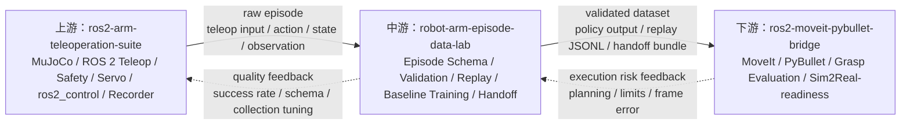

# Three-Repo Overall Architecture

状态：作品集级总体架构图。本文档用于说明三个机械臂仓库如何组成一条跨仿真后端的数据闭环。它不是商业系统架构承诺，也不表示已经完成真实机械臂 Sim2Real 验证。

## 1. 总体定位

三个仓库共同表达的是一条机械臂具身数据闭环：

- 上游 `ros2-arm-teleoperation-suite` 负责 MuJoCo / ROS 2 遥操作、控制栈仿真、传感器观测和 raw episode 产生。
- 中游 `robot-arm-episode-data-lab` 负责 simulator-independent episode schema、数据校验、release、回放、最小 baseline training、offline evaluation 和 bridge handoff。
- 下游 `ros2-moveit-pybullet-bridge` 负责 MoveIt / PyBullet 执行验证、抓取稳定性排查、轨迹误差评估和 Sim2Real-readiness 风险分析。

当前阶段应称为 **Sim-to-Sim / Sim2Real-readiness evaluation**。真实机械臂接入、安全认证、硬件标定和长稳验证仍属于未来工作。

## 2. 三仓库总图

这张图的重点不是“统一成一个大系统”，而是明确三个仓库的职责边界：上游产生交互数据，中游把数据变成可验证、可训练、可交付的标准格式，下游检查训练或控制结果进入执行环境后的风险。

## 3. 工程链路图

```mermaid
flowchart LR
    subgraph UP["上游：ros2-arm-teleoperation-suite"]
        U0["teleop input<br/>keyboard / gamepad / scripted"]
        U1["safety monitor<br/>limit / stop / filter"]
        U2["MoveIt Servo<br/>online Cartesian control"]
        U3["ros2_control<br/>controller interface"]
        U4["MuJoCo simulation<br/>dynamics / contacts / sensors"]
        U5["recorder<br/>action / state / observation"]
        U0 --> U1 --> U2 --> U3 --> U4 --> U5
    end

    subgraph MID["中游：robot-arm-episode-data-lab"]
        M0["adapter<br/>raw episode to canonical schema"]
        M1["episode dataset<br/>observation / action / state / metadata"]
        M2["dataset validation<br/>shape / timestamp / frame / schema"]
        M3["replay / visualization<br/>trajectory and action sanity check"]
        M4["baseline training<br/>minimal policy smoke"]
        M5["training metrics<br/>loss / MAE / replay result"]
        M6["handoff bundle<br/>predicted_actions.jsonl / metadata"]
        M0 --> M1 --> M2 --> M3 --> M4 --> M5 --> M6
    end

    subgraph DOWN["下游：ros2-moveit-pybullet-bridge"]
        D0["MoveIt planning<br/>trajectory and frame contract"]
        D1["PyBullet execution<br/>lightweight contact validation"]
        D2["grasp evaluation<br/>slip / lift / contact / success rate"]
        D3["Sim2Real-readiness<br/>risk and sensitivity report"]
        D4["real robot replacement points<br/>hardware driver / gripper / sensors / calibration / safety"]
        D0 --> D1 --> D2 --> D3 --> D4
    end

    U5 -->|"raw episode / LeRobot-style records"| M0
    M6 -->|"policy output / replay actions"| D0
    D3 -.->|"failure cases and risk notes"| M2
    D4 -.->|"future hardware requirements"| U1
```

## 4. 数据契约

中游是三个仓库之间的稳定数据层。它不把 MuJoCo 或 PyBullet 的 API 泄漏给训练模块，而是通过统一 episode schema 固定字段语义。

| 数据类型 | 上游来源 | 中游标准化 | 下游使用方式 |
|---|---|---|---|
| `observation` | 相机、末端位姿、力/触觉、物体状态 | required / optional 字段、shape 检查、缺失报告 | 判断 policy 输入是否足够、回放时对齐场景状态 |
| `action` | teleop command、servo command、trajectory command | 明确 `action_type`，禁止静默截断维度 | 转成 replay JSONL 或执行命令 |
| `state` | joint state、gripper state、ee pose | 统一维度和单位 | 检查执行误差和分布偏移 |
| `metadata` | simulator、robot、task、频率、episode id | release / schema / split / provenance | 复现实验、定位后端差异 |
| `training output` | 不由上游直接产生 | checkpoint、metrics、predicted actions | 下游验证执行稳定性和迁移风险 |

## 5. 仿真后端边界

MuJoCo 和 PyBullet 在这里不是互相替代关系，而是分工关系：

| 后端 | 所在仓库 | 当前职责 | 不承担什么 |
|---|---|---|---|
| MuJoCo | 上游 | 遥操作交互、控制栈仿真、动力学和观测数据来源 | 不负责最终抓取稳定性评估，不负责训练结果验收 |
| Simulator-independent schema | 中游 | 屏蔽仿真器差异，固定 observation / action / state / metadata 契约 | 不绑定某一个仿真器，不做真实硬件控制 |
| PyBullet | 下游 | 轻量执行验证、接触参数排查、轨迹误差和 Sim2Real-readiness 分析 | 不替代上游 recorder，不宣称等价真实机械臂 |

详细说明见 [SIM_BACKENDS_AND_TRANSFER.md](SIM_BACKENDS_AND_TRANSFER.md)。

## 6. 面试讲解顺序

推荐按 4 步讲：

1. 我把项目拆成上游、中游、下游，是为了让机械臂数据链路职责清楚，而不是把所有东西堆进一个仓库。
2. 上游用 MuJoCo 承担 ROS 2 teleop、safety、Servo、`ros2_control`、传感器观测和 raw episode 产生。
3. 中游用统一 schema 做 validation、release、replay、最小 baseline training 和 handoff，重点展示我理解 dataset -> training -> evaluation 的工程闭环。
4. 下游用 PyBullet / MoveIt 做执行验证、抓取稳定性排查和 Sim2Real-readiness 风险分析；中游/下游只把轻量报告、配置建议、接口契约和 tiny fixtures 回流给上游，不把完整 dataset、checkpoint 或大 replay 日志搬回采集仓。当前没有真实机械臂验证，所以我会坦诚说这是 Sim-to-Sim / readiness，而不是 completed Sim2Real。

详细交接 gate、handoff manifest 和 feedback 模板见 [INTER_REPO_CONTRACTS.md](INTER_REPO_CONTRACTS.md)。

## 7. 当前不夸大的部分

- 不说这是成熟商业系统。
- 不说已经完成真实机械臂 Sim2Real。
- 不说 baseline training 已经得到高质量抓取策略。
- 不说 MuJoCo 和 PyBullet 的物理结果可以直接等价。
- 不建议现在继续扩灵巧手、复杂模型或前端界面。
