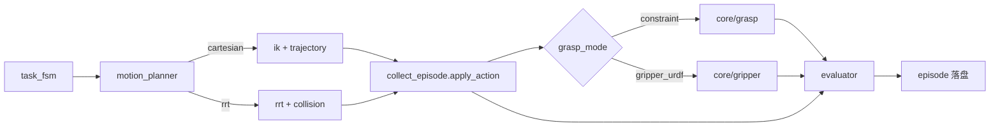

# 架构与模块地图

## 分层结构

```text
scripts/          应用入口（采集、批量、校验、Demo）
agents/           Task FSM、Motion Planner、Evaluator
core/             HAL、IK、轨迹、RRT、碰撞检测、物理抓取、仿真世界、episode 落盘
configs/          YAML 默认参数
assets/urdf/      实验性夹爪 URDF（gripper_urdf 模式）
dataset_sample/   本地样例数据（gitignore，本机生成）
dataset/v1/       批量数据集（gitignore，本机生成）
```

## 模块职责

| 路径 | 职责 |
|------|------|
| `core/hal.py` | `RobotControl` 抽象接口 |
| `core/pybullet_robot.py` | PyBullet HAL 实现 |
| `core/ik.py` | IK 封装 |
| `core/trajectory.py` | 笛卡尔直线插补 |
| `core/rrt.py` | 双向 RRT-Connect |
| `core/collision.py` | PyBullet 配置空间碰撞检测 |
| `core/joint_limits.py` | URDF 关节限位 |
| `core/grasp.py` | `ConstraintGraspController`（fixed constraint 抓取，默认） |
| `core/gripper.py` | `attach_gripper`、`GripperGraspController`（URDF 指关节 + contact 力阈值） |
| `assets/urdf/simple_gripper.urdf` | 平行夹爪资产（`--grasp-mode gripper_urdf`） |
| `core/world.py` | PyBullet 世界搭建、渲染、低层控制 |
| `core/episode_writer.py` | Episode 目录、数组落盘、metadata |
| `core/collect_config.py` | 采集配置类型与 YAML 加载 |
| `agents/task_fsm.py` | pick-lift 阶段目标 |
| `agents/motion_planner.py` | `plan_cartesian_segment` / `plan_rrt_segment` |
| `agents/evaluator.py` | 步进安全 + success 标签 |
| `scripts/collect_episode.py` | 采集编排（V0 / reach / pick_and_lift） |

## 数据流（pick_and_lift）



## 抓取模式（`--grasp-mode`）

| 值 | 模块 | 说明 |
|----|------|------|
| `constraint`（默认） | `core/grasp.py` | EE–cube fixed constraint；`state_dim=action_dim=7` |
| `gripper_urdf` | `core/gripper.py` | 挂载 `simple_gripper.urdf`，contact 力 latch；`state_dim=action_dim=9` |

CI 与 `batch_collect.py` 默认 `constraint`；`gripper_urdf` 见 `tests/test_gripper.py`。

## 规划器选择

| `--planner` | 场景 | 入口 |
|-------------|------|------|
| `cartesian`（默认） | 无障碍、直线可达 | `plan_cartesian_segment` |
| `rrt` | 有障碍物，关节空间绕障 | `plan_rrt_segment` + `CollisionChecker` |

独立验证 RRT：`scripts/run_rrt_demo.py`。

## Phase 命名对照

仓库里存在两套 Phase 编号，开发时以 **文档路径** 区分，不要混用编号：

| 名称 | 文档 | 当前状态 |
|------|------|----------|
| 基线 V0/V1/V2 | [baseline_plan.md](../planning/baseline_plan.md) | 已完成 |
| roadmap Phase 1 | [hal_ik_roadmap.md](../planning/hal_ik_roadmap.md) | 已完成 |
| design 10-day Phase 2 | [rrt_roadmap.md](../planning/rrt_roadmap.md) | 已完成 |
| 三天冲刺 Day 1 | [day1_grasp_spec.md](../planning/day1_grasp_spec.md) | constraint 抓取已完成；`gripper_urdf` 实验分支已有 |
| portfolio Phase 2 | [portfolio_roadmap.md](../planning/portfolio_roadmap.md) | 批量 + LeRobot 脚本已有 |

智能体协作约定见根目录 [AGENTS.md](../../AGENTS.md)。
