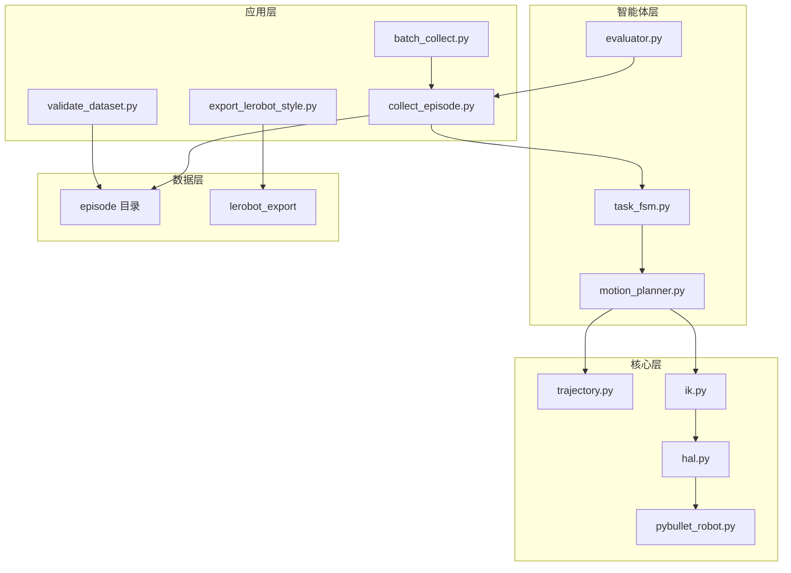

# 面试讲稿：机械臂 Episode 数据采集平台

> 预计讲解时长：3–5 分钟。面向机器人软件 / 具身智能 / 数据工程岗位。

---

## 1. 30 秒电梯陈述（给 HR 或非技术面）

我做了一个 **PyBullet 机械臂仿真数据采集平台**：能自动执行 pick-lift 任务，同步保存图像、关节状态、动作和位姿，并自动打上成功/失败标签。项目带 **pytest + CI 数据门禁**，已批量采集 20+ 条 episode，并导出 **LeRobot 兼容格式**，适合作为求职作品集中的「仿真 + 数据闭环」样例。

---

## 2. 要解决什么问题？（1 分钟）

真实机器人数据采集成本高、迭代慢。求职作品需要先证明三件事：

1. **能搭仿真环境**，快速产生可复现的演示数据；
2. **数据结构规范**，图像、状态、动作、位姿按 step 严格对齐；
3. **能说明扩展路径**，从仿真 demo 迁移到真机 / ROS / 模仿学习框架。

本项目刻意把范围控制在「**最小但完整的数据闭环**」，而不是堆满 RRT、真机或训练代码。

---

## 3. 系统架构（1 分钟）



**分层原则**：

| 层级 | 模块 | 职责 |
|------|------|------|
| HAL | `RobotControl` / `PyBulletRobot` | 隔离 PyBullet 细节，预留真机实现 |
| 核心 | `trajectory` + `ik` | 笛卡尔插补与 IK，生成关节 action |
| 智能体 | FSM + Evaluator | 编排 pick-lift 阶段，自动打 success 标签 |
| 数据 | episode + LeRobot 导出 | 多模态对齐落盘，对接下游训练框架 |

---

## 4. 关键设计决策（1 分钟）

### 4.1 为什么先做 HAL，而不是直接写 PyBullet 调用？

`collect_episode.py` 里原本散落着 `getJointState`、`setJointMotorControlArray` 等调用。抽成 `RobotControl` 后，上层只关心「读关节 / 读末端 / 下发目标 / 解 IK」，未来换 `RealRobot` 或 ROS2 驱动时不必改 FSM 和采集逻辑。

### 4.2 为什么用 FSM + Evaluator，而不是一条硬编码轨迹？

硬编码关节轨迹无法表达「任务是否成功」。`PickLiftTaskFSM` 把任务拆成 reach → approach → close_gripper → lift；`EvaluatorAgent` 根据物体 Z 轴抬升量写 `metadata.success`，让数据集自带监督信号，适合具身 AI / 数据工程叙事。

### 4.3 数据如何保证对齐？

每个仿真 step 固定顺序：**下发 action → 推进仿真 → 写 states/actions/poses → 存 PNG**。`validate_dataset.py` 检查帧数、数组维度、metadata 一致性，CI 中对样例 episode 自动跑门禁。

---

## 5. 一键复现命令（30 秒）

```bash
python -m pip install -r requirements.txt
python scripts/validate_dataset.py dataset/v1
python scripts/visualize_episode.py dataset_sample/episode_pick_001
```

批量采集与 LeRobot 导出：

```bash
python scripts/batch_collect.py --output dataset/v1 --num-episodes 20 --seed 42
python scripts/export_lerobot_style.py dataset/v1 --output dataset/v1/lerobot_export
```

---

## 6. 数据集与字段（30 秒）

每个 episode 目录结构见 `docs/data_schema.md`。Phase 1.5 之后 metadata 额外包含：

- `success` / `failure_reason` / `object_z_lift`
- `language_instruction`（如 `"pick up the cube"`）
- `gripper_states` / `task_phases`

当前 `dataset/v1`：**20 条 episode，成功率 100%**（仿真 kinematic grasp，见局限说明）。

---

## 7. 已知局限（30 秒，主动说加分）

| 局限 | 说明 | 后续改进 |
|------|------|----------|
| 无真实夹爪 | close_gripper 阶段用运动学同步抬起 cube | 接入 gripper URDF + 力闭合判定 |
| 无避障规划 | 笛卡尔直线 + IK，无 RRT | 见 `roadmap.md` 可选 RRT 阶段 |
| 仿真成功率偏高 | 当前 grasp 为工程 demo 方案 | 加 cube 位姿扰动、物理抓取评测 |
| 未接真机 / ROS | 仅有 HAL 抽象与迁移设计文档 | 见 `docs/migration_ros2_moveit.md` |

**面试话术**：「我清楚这是仿真 demo 级抓取，价值在于数据链路、评测标签和可扩展架构，而不是宣称 100% 物理抓取成功率。」

---

## 8. 按岗位强调的重点

### 控制 / 运动规划

- `RobotControl` HAL、`PyBulletRobot` 封装
- 笛卡尔直线插补 + `calculateInverseKinematics`
- FSM 分阶段目标位姿

### 具身 AI / 数据工程

- image-state-action episode 对齐
- `success` 标签 + `language_instruction`
- 批量采集 `batch_collect.py`
- LeRobot v2.1 parquet 导出

### 软件工程

- pytest 单元测试 + GitHub Actions CI
- `configs/default.yaml` 配置驱动
- `validate_dataset.py` 数据门禁
- 模块分层：`core/` / `agents/` / `scripts/`

### ROS / 真机

- HAL 与 `ros2_control` / MoveIt 映射设计（文档级）
- 上层 FSM / 采集逻辑可复用，仅替换 HAL 实现

---

## 9. 简历一句话（可直接粘贴）

> 基于 PyBullet 实现 HAL 解耦的机械臂仿真采集平台：笛卡尔插补 + IK 生成 action，FSM 驱动 pick-lift 任务与自动 success 评测，批量采集 20+ 多模态 episode 并导出 LeRobot 格式；含 pytest/CI 与数据校验门禁。

---

## 10. 常见追问与参考答案

**Q：为什么不用 ROS2？**  
A：作品集第一阶段优先 10 秒内跑通数据闭环；HAL 已预留接口，迁移路径写在 `migration_ros2_moveit.md`。

**Q：success 怎么判定？**  
A：`EvaluatorAgent` 比较物体初始 Z 与结束 Z，抬升超过 3cm 且未触发安全拦截则 `success=true`。

**Q：LeRobot 导出能直接训练吗？**  
A：导出为 v2.1 布局（parquet + meta/info.json），含 state/action/ee_pose/language_instruction；视频流未导出，可按需补 MP4。

**Q：和真实 LeRobot 数据集差在哪？**  
A：差在真实硬件噪声、多相机视频、更复杂任务分布；本项目重点是**格式兼容 + 采集管线可解释**。
