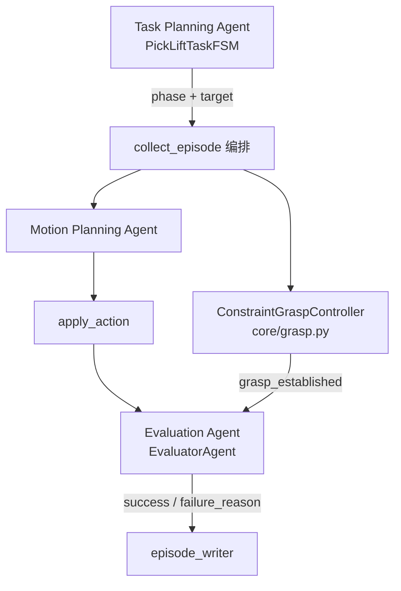

# Day 1 开发 Spec：抓取可信度（物理抓取 + 评测升级）

本文档是 **三天冲刺 · Day 1** 的可执行开发规格，对齐：

- [project_status.md](../portfolio/project_status.md) — 「Day 1 · 抓取可信度」
- [design_10day.md](design_10day.md) — Phase 3（Day 5–6）夹爪控制与物理抓取验证
- [AGENTS.md](../../AGENTS.md) — Task / Motion / Evaluator 智能体职责边界

**前提**：HAL/IK、FSM 评测、RRT、数据落盘与 CI 均已就绪；**Day 1 物理 constraint 抓取已完成**；**方案 B（`gripper_urdf`）已作为实验分支落地**（见附录 A）。

---

## 1. 背景与问题陈述

> **历史说明**：§1.1 描述的是 Day 1 **改造前** 的 kinematic sync 路径，已于 2026-06-18 从生产路径移除。

### 1.1 改造前实现（已替换）

`close_gripper` 阶段在 EE 接近 cube 后，通过 `sync_object_to_grasp_offset()` 每帧将 cube 位姿 **运动学同步** 到 EE 偏移位置，而非物理接触/夹持：

```222:238:core/world.py
def sync_object_to_grasp_offset(
    world: World,
    grasp_offset: np.ndarray,
) -> None:
    ee_state = p.getLinkState(
        world.robot_id,
        world.ee_link_index,
        computeForwardKinematics=True,
    )
    ee_position = np.asarray(ee_state[4], dtype=np.float32)
    _, cube_orientation = p.getBasePositionAndOrientation(world.cube_id)
    target_position = (ee_position + grasp_offset).tolist()
    p.resetBasePositionAndOrientation(
        world.cube_id,
        target_position,
        cube_orientation,
    )
```

调用链位于 `scripts/collect_episode.py` 的 `pick_and_lift` 主循环：`CLOSE_GRIPPER` / `LIFT` 阶段每步调用上述函数。

### 1.2 现有评测缺口

`EvaluatorAgent` 当前仅依据 **物体 Z 轴抬升量** 判定 success，未验证是否发生真实接触、夹持或约束建立：

```89:105:agents/evaluator.py
    def evaluate_success(self, object_positions: np.ndarray) -> EvaluationResult:
        ...
        final_z = float(object_positions[-1, 2])
        object_z_lift = final_z - self._initial_object_z
        success = (not self._aborted) and object_z_lift >= self._lift_threshold
        ...
```

在 kinematic sync 下，成功率接近 100%，**不能**作为物理抓取能力的可信证据。

### 1.3 Day 1 要达成的用户可见变化

| 维度 | 当前 | Day 1 目标 |
|------|------|------------|
| 抓取机制 | `resetBasePositionAndOrientation` 每帧同步 | 物理约束或夹爪闭合驱动 cube |
| success 语义 | 「cube 被抬高了」 | 「cube 被 **物理夹持/约束** 后抬高了」 |
| 失败模式 | 几乎只有 `insufficient_lift` | 新增 `grasp_failed` / `object_slipped` 等 |
| 测试 | 无 grasp 专项集成测试 | headless pytest 覆盖抓取链路 |
| 文档/进度 | interview 中标注 kinematic 局限 | 讲稿可诚实描述物理抓取方案 |

---

## 2. 阶段目标

### 2.1 本日必须完成（P0）

1. **移除 kinematic sync 主路径**：`collect_episode.py` 不再在正常运行中调用 `sync_object_to_grasp_offset`。
2. **实现物理抓取机制**（二选一，见 §3 方案选型；推荐 A）。
3. **扩展 Evaluator**：success 判定需包含 grasp 建立证据（接触/约束/夹爪闭合）。
4. **新增集成测试**：`tests/test_grasp.py` 或 `tests/test_gripper.py`，headless 可跑、CI 可过。
5. **保持兼容**：`--task reach`、默认 joint 轨迹、V0/V1 episode 格式、`--planner rrt` 行为不得破坏。

### 2.2 本日明确不做（Out of Scope）

- 不接入完整 parallel-jaw URDF 资产管线（除非 Day 1 下午有余力；见方案 B）。
- 不做 cube 位姿域随机化（留给 Day 2 批量数据阶段）。
- 不修改 LeRobot 导出格式（Day 3）。
- 不追求工业级力控或 slip 补偿算法。
- 不替换 KUKA iiwa 为带夹爪的完整 cell 模型。

---

## 3. 技术方案选型

### 3.1 推荐方案 A：Fixed Constraint Grasp（Day 1 默认）

**思路**：在 `CLOSE_GRIPPER` 阶段，当 EE 与 cube 满足接触/距离条件时，调用 PyBullet `createConstraint` 建立 **fixed joint**，将 cube 绑定到 EE link；`LIFT` 阶段通过约束随 EE 运动；episode 结束或 abort 时 `removeConstraint`。

**优点**：

- 改动面小，不依赖新 URDF 资产。
- 仍走物理引擎（重力、碰撞），lift 阶段 cube 不会「飘」在 EE 外。
- 与现有 7-DOF action 维度兼容，无需扩展 `state_dim` / `action_dim`。
- 1 天内可闭环。

**缺点**：

- 非真实夹爪几何；面试时需说明是「物理约束抓取 MVP」，真机迁移走 gripper action + 力阈值（见 [migration_ros2_moveit.md](../reference/migration_ros2_moveit.md)）。

**核心 API 草案**（新文件 `core/grasp.py`）：

```python
@dataclass
class GraspState:
    active: bool
    constraint_id: int | None
    grasp_offset: np.ndarray | None

class ConstraintGraspController:
    def __init__(
        self,
        world: World,
        *,
        max_grasp_distance: float = 0.04,
        min_contact_points: int = 1,
    ) -> None: ...

    def try_grasp(self) -> bool:
        """检测 EE-cube 距离/接触，成功则 createConstraint，返回 True。"""

    def release(self) -> None:
        """removeConstraint，重置 GraspState。"""

    def step(self, phase: TaskPhase) -> GraspState:
        """按 FSM 阶段维护约束生命周期。"""
```

**接触检测**：优先 `p.getContactPoints(bodyA=robot_id, bodyB=cube_id)`；若无接触点则回退到 EE-cube 中心距离 `< max_grasp_distance`。

### 3.2 备选方案 B：简化夹爪 URDF（Day 1 加时或 Day 1.5）

**思路**：在 EE 上挂载 pybullet_data 或自写 `two_finger_gripper.urdf`，`CLOSE_GRIPPER` 阶段下发 finger joint target，靠摩擦/contact 抬起 cube。

**优点**：视觉与语义更接近真实抓取；`gripper_states` 与真实夹爪一致。

**缺点**：资产、IK 末端 link、碰撞对、action 维度扩展；**不建议作为 Day 1 阻塞路径**。

若采用 B，需额外任务：

- `core/gripper.py` — 开合控制与状态读取
- `World` 扩展 `gripper_joint_indices`
- `metadata.grasp_mode: "gripper_urdf"`
- 更新 `data_schema.md` 中 action 维度说明

### 3.3 决策记录

| 条件 | 选择 |
|------|------|
| Day 1 上午 4h 内要出可跑 demo | **方案 A** |
| 已有 gripper URDF 且 IK 末端已对齐 | 方案 B |
| CI 必须绿 + 最小 diff | **方案 A** |

**本文档后续任务拆解默认按方案 A 编写**；方案 B 任务以附录列出。

---

## 4. 推荐目录结构

```text
robot-arm-episode-data-lab/
├── core/
│   ├── grasp.py              # 新增：ConstraintGraspController
│   └── world.py              # 修改：移除/废弃 sync_object_to_grasp_offset 主路径
├── agents/
│   └── evaluator.py          # 修改：grasp 相关 failure_reason + inspect 逻辑
├── scripts/
│   └── collect_episode.py    # 修改：接入 GraspController，删除 kinematic sync 循环
├── tests/
│   └── test_grasp.py         # 新增：headless 抓取集成测试
└── docs/
    ├── planning/day1_grasp_spec.md   # 本文档
    └── dev/data_schema.md            # 可选：grasp_mode 字段
```

---

## 5. 任务拆解与验收标准

### 5.1 任务 1：审计并标记 kinematic 抓取路径

**输入**：

- `scripts/collect_episode.py`（`run_pick_and_lift` 主循环）
- `core/world.py`（`sync_object_to_grasp_offset`）

**工作**：

- 列出所有 `sync_object_to_grasp_offset` 调用点（当前约 3 处：CLOSE/LIFT 步进 + padding 循环）。
- 确认 `grasp_offset` 计算逻辑（EE-cube 相对偏移）可复用到 constraint 父-child 偏移。
- 在 `sync_object_to_grasp_offset` 上添加 `@deprecated` 注释或 docstring，说明 Day 1 后仅测试/对比保留。

**验收**：

- [x] 调用点清单写入本文档附录 C（任务 1 审计）。
- [x] 现有 CI pick_and_lift 在改动前仍绿（基线快照，见附录 C）。

---

### 5.2 任务 2：实现 `core/grasp.py`

**工作内容**：

1. `ConstraintGraspController` 持有 `World`、约束 id、是否已 grasp。
2. `try_grasp()`：
   - 读取 EE world pose（`getLinkState` link 4/5）。
   - 检测 contact 或距离阈值。
   - `p.createConstraint(..., jointType=p.JOINT_FIXED, ...)` 绑定 cube base ↔ EE link。
   - 记录 `grasp_established_at_step`（供 metadata）。
3. `release()`：`p.removeConstraint` + 状态复位。
4. 异常安全：重复 `try_grasp` 幂等；abort 时 `release()` 避免泄漏 constraint。

**建议参数**（可进 `configs/default.yaml` 或常量）：

| 参数 | 默认值 | 说明 |
|------|--------|------|
| `max_grasp_distance` | 0.04 m | EE-cube 中心最大距离 |
| `min_contact_points` | 1 | `getContactPoints` 最少点数 |
| `grasp_force_threshold` | — | 方案 A 可选；方案 B 必填 |

**验收**：

- [x] headless 脚本可 import `ConstraintGraspController`。
- [x] 手动 demo：approach cube → `try_grasp()` → lift → cube 随 EE 上升（无 sync）。
- [x] `release()` 后 cube 受重力下落。

**单元测试**（可合入 `test_grasp.py`）：

- mock `p.createConstraint` 的路径：距离内返回 True，距离外返回 False。
- 已 grasp 时再次 `try_grasp` 不创建第二个 constraint。

**完成记录**：`core/grasp.py`；`tests/test_grasp.py` 覆盖 succeed/fail/idempotent。

---

### 5.3 任务 3：接入 `collect_episode.py` pick_and_lift 主循环

**修改要点**：

替换现有逻辑块：

```python
# 旧：计算 grasp_offset + 每帧 sync_object_to_grasp_offset
if grasp_offset is None and segment.phase == TaskPhase.CLOSE_GRIPPER:
    ...
if grasp_offset is not None and segment.phase in (...):
    sync_object_to_grasp_offset(world, grasp_offset)
gripper_open = grasp_offset is None
```

为新逻辑：

```python
grasp_controller = ConstraintGraspController(world)

# CLOSE_GRIPPER 阶段每步：
if segment.phase == TaskPhase.CLOSE_GRIPPER:
    grasp_controller.try_grasp()

# LIFT 阶段：若未 grasp，可选 abort 或记 grasp_failed
if segment.phase == TaskPhase.LIFT and not grasp_controller.is_grasped:
    evaluator.abort_with_reason("grasp_failed")

gripper_open = not grasp_controller.is_grasped
```

**metadata 扩展**（写入 `episode_writer` / `metadata.json`）：

```json
{
  "grasp_mode": "constraint",
  "grasp_established": true,
  "grasp_established_at_step": 28
}
```

**验收命令**：

```bash
python scripts/collect_episode.py \
  --task pick_and_lift \
  --output dataset_sample/episode_pick_phys \
  --num-steps 40 \
  --seed 7

python scripts/validate_dataset.py dataset_sample/episode_pick_phys
python scripts/visualize_episode.py dataset_sample/episode_pick_phys
```

**验收标准**：

- [x] `metadata.grasp_mode == "constraint"`（或 `"gripper_urdf"`）。
- [x] `metadata.grasp_established == true` 且 `success == true` 同时成立（seed=7）。
- [x] 代码库中 **无** 对 `sync_object_to_grasp_offset` 的生产路径调用（`update_project_docs.py` 检测通过）。
- [x] `gripper_states` 在 grasp 后变为 0（与 FSM 语义一致）。
- [x] `--planner rrt` pick_and_lift 仍可跑完（grasp 与规划器解耦；seed=7 落盘 40 步，`planning_success=true`，物理抓取可能 `object_slipped`）。

---

### 5.4 任务 4：升级 `EvaluatorAgent` 物理向判定

**新增 inspect 逻辑**（`inspect_step` 或 episode 末 `evaluate_success` 前）：

| 检查项 | 触发阶段 | failure_reason |
|--------|----------|----------------|
| LIFT 开始时仍未 grasp | `TaskPhase.LIFT` 第一步 | `grasp_failed` |
| grasp 后 cube-EE 距离突增 | `LIFT` 全程 | `object_slipped` |
| 夹爪应闭合但未建立 grasp | `CLOSE_GRIPPER` 末 | `grasp_failed` |

**success 必要条件（AND）**：

```text
success =
  not aborted
  AND grasp_established
  AND object_z_lift >= lift_threshold
```

**实现注意**：

- `StepObservation` 可扩展 `grasp_active: bool` 字段（可选，避免 evaluator 直接依赖 PyBullet）。
- `evaluate_success` 签名可增 `grasp_established: bool` 参数，保持向后兼容默认值 `False` 时行为与旧版一致（便于单测）。

**验收**：

- [x] `agents/evaluator.py` 含 `grasp` / `contact` / `force` 相关逻辑（满足 `update_project_docs.py` 检测）。
- [x] 故意在 grasp 前进入 LIFT（单测 mock）→ `failure_reason == "grasp_failed"`。
- [x] 正常 seed=7 episode → `success == True`。

---

### 5.5 任务 5：新增 `tests/test_grasp.py`

**测试场景**（headless PyBullet，`pytest` 标记 `@pytest.mark.integration` 可选）：

1. **test_grasp_succeeds_near_cube**  
   - 初始化 world，将 EE 移到 cube 上方 3cm，`try_grasp()` 成功，step 50 次后 cube Z 上升 > 2cm。

2. **test_grasp_fails_when_too_far**  
   - EE 离 cube > 10cm，`try_grasp()` 返回 False，无 constraint id。

3. **test_pick_and_lift_episode_physics_grasp**  
   - 调 `collect_episode` 核心函数或 subprocess，断言 metadata 无 kinematic 路径且 `grasp_established`。

4. **test_evaluator_grasp_failed**  
   - 纯单元：无 grasp + lift → `grasp_failed`。

**验收**：

```bash
PYTEST_DISABLE_PLUGIN_AUTOLOAD=1 pytest tests/test_grasp.py -q
PYTEST_DISABLE_PLUGIN_AUTOLOAD=1 pytest -q   # 全量仍绿
```

- [x] CI workflow 无需改 job 结构，全量 pytest 包含新文件即可。

---

### 5.6 任务 6：文档与进度快照同步

**更新文件**：

| 文件 | 变更 |
|------|------|
| `docs/dev/data_schema.md` | 增加 `grasp_mode`、`grasp_established`、`grasp_established_at_step` |
| `docs/dev/collection_pipeline.md` | pick_and_lift 抓取链路说明（constraint vs kinematic） |
| `docs/dev/architecture.md` | `core/grasp.py` 与数据流图 |
| `docs/dev/quickstart.md` | CI 同款 pick-lift 验证与 metadata 期望 |
| `docs/portfolio/interview_walkthrough.md` | 局限表：kinematic → constraint grasp；演示命令不变 |
| `docs/reference/learning_capability_alignment.md` | FSM / 必读代码映射更新 |
| `docs/README.md` | 规划表增加 Day 1 grasp spec 链接 |
| `scripts/update_project_docs.py` | README / project_status 反映物理抓取 |

**验收**：

```bash
python scripts/update_project_docs.py
python scripts/update_project_docs.py --check
```

- [x] `project_status.md` 中 Day 1 三项均为 `[x]`。
- [x] README 进度段反映物理抓取完成。

**完成记录（2026-06-18）**：`update_project_docs.py` 已更新 intro / 能力表 / project_status 导语；`collection_pipeline.md` §2.1 抓取链路；架构图含 `core/grasp`。

---

## 6. 数据与接口契约

### 6.1 metadata 新字段

| 字段 | 类型 | 必填 | 说明 |
|------|------|------|------|
| `grasp_mode` | string | pick_and_lift 时推荐 | `"constraint"` \| `"gripper_urdf"` \| `"kinematic"`（legacy） |
| `grasp_established` | bool | 是 | 是否建立物理 grasp |
| `grasp_established_at_step` | int \| null | 否 | 首次 grasp 成功的 step 索引 |

### 6.2 新增 failure_reason 枚举

| 值 | 含义 |
|----|------|
| `grasp_failed` | CLOSE 阶段未建立 grasp 即进入 LIFT 或结束 |
| `object_slipped` | grasp 后 cube 相对 EE 距离超阈值 |
| `insufficient_lift` | 已有 grasp 但抬升高度不足（保留） |

### 6.3 不变量（Regression Guard）

- `states.npy` / `actions.npy` / `images/` 帧数一致。
- `grasp_mode=constraint`（默认）：`state_dim=7`, `action_dim=7`。
- `grasp_mode=gripper_urdf`：`state_dim=9`, `action_dim=9`（7 臂 + 2 指）。
- `--task reach`、`--mode v0` 不加载 GraspController。
- 默认 `--planner cartesian` 行为不变。

---

## 7. 推荐执行顺序（单日时间盒）

| 时段 | 任务 | 产出 |
|------|------|------|
| 09:00–10:00 | 任务 1 审计 + 任务 2 骨架 | `core/grasp.py` 空壳 + 本地 contact 打印 |
| 10:00–12:00 | 任务 2 完成 + 独立 smoke | CLI 或临时 script 验证 constraint lift |
| 13:00–15:00 | 任务 3 接入 collect + 任务 4 evaluator | seed=7 episode 成功落盘 |
| 15:00–16:30 | 任务 5 pytest + CI 本地全跑 | `test_grasp.py` 绿 |
| 16:30–17:30 | 任务 6 文档 + `update_project_docs.py` | Day 1 checklist 全勾 |

**里程碑检查点**：

- **M1（午前）**：无 sync 的 cube 可被 constraint 抬起。
- **M2（15:00）**：`episode_pick_phys` validate 通过。
- **M3（下班前）**：`pytest -q` 绿 + project_status Day 1 全 `[x]`。

---

## 8. 风险与缓解

| 风险 | 影响 | 缓解 |
|------|------|------|
| constraint 时机过早，cube 在空中被「吸」到 EE | 不真实、穿透 | 仅在 CLOSE 阶段且 contact/距离双条件满足时 grasp |
| 摩擦不足导致 lift 滑落 | success 率下降 | 略增 cube 质量或 constraint 用 FIXED；evaluator 报 `object_slipped` |
| seed=7 CI 失败 | 阻塞合并 | 保留 seed=7 为 CI 金标准；失败时调 `max_grasp_distance` 而非回退 kinematic |
| 移除 sync 后 GIF 观感变差 | 作品集展示 | Day 2 再录 `demo_pick_success`；Day 1 以保证物理正确为先 |
| RRT + grasp 交互 | 路径绕障后 EE 姿态偏 | RRT 模式沿用同一 grasp 控制器；规划与 grasp 正交 |

---

## 9. Day 1 完成验收清单

完成下列全部 `[ ]` 即视为 Day 1 交付：

- [x] `core/grasp.py` — `ConstraintGraspController` 可用
- [x] 生产路径零调用 `sync_object_to_grasp_offset`
- [x] `collect_episode.py --task pick_and_lift` 写出 `grasp_mode: "constraint"`
- [x] `EvaluatorAgent` 含 grasp 失败原因与 success 必要条件
- [x] `tests/test_grasp.py`（或 `test_gripper.py`）通过
- [x] 全量 `pytest -q` 通过
- [x] CI pick_and_lift job 通过
- [x] `python scripts/update_project_docs.py --check` 通过
- [x] `docs/dev/data_schema.md` 已更新 grasp 字段
- [x] `interview_walkthrough.md` 局限说明与实现一致

---

## 10. 面试表达要点（Day 1 完成后）

> pick-lift 早期用 kinematic sync 保证 demo 闭环。Day 1 改为 PyBullet fixed constraint：在 CLOSE 阶段基于 contact/距离建立 grasp，LIFT 阶段由物理约束传递运动。Evaluator 将 success 定义为「grasp 建立 + 抬升阈值」，并区分 `grasp_failed` 与 `insufficient_lift`。这是仿真到真机的过渡方案——真机侧替换为 gripper action + 力阈值，HAL 与 FSM 接口不变。

---

## 附录 A：方案 B（夹爪 URDF）— 已完成（实验分支）

**状态（2026-06-18）**：方案 B 已落地为 `--grasp-mode gripper_urdf`，与默认 constraint 并存；CI 仍只验证 constraint。

| 任务 | 状态 | 路径 |
|------|------|------|
| 夹爪 URDF 资产 | [x] | `assets/urdf/simple_gripper.urdf` |
| 挂载与 World 扩展 | [x] | `core/gripper.attach_gripper`、`core/world.World.gripper_*` |
| 指关节控制 + contact latch | [x] | `core/gripper.GripperGraspController` |
| 9 维 state/action | [x] | `collect_episode._combine_arm_and_gripper_action` |
| schema / 采集文档 | [x] | `docs/dev/data_schema.md`、`collection_pipeline.md` |
| 集成测试 | [x] | `tests/test_gripper.py` |

启用：

```bash
python scripts/collect_episode.py --task pick_and_lift \
  --grasp-mode gripper_urdf \
  --output dataset_sample/episode_pick_gripper --num-steps 40 --seed 7
```

**与方案 A 差异**：无 `createConstraint` / `release()`；靠 finger 闭合 + contact 法向力阈值 latch；成功率通常低于 constraint，适合演示「更接近真实夹爪语义」的数据形态。

---

## 附录 B：与智能体架构的对应关系



- **Task Agent**：仍负责阶段划分；不感知 PyBullet constraint API。
- **Motion Agent**：不变；规划与 grasp 解耦。
- **Evaluator Agent**：拥有 grasp 成功与否的标注权（见 AGENTS.md）。

---

## 附录 C：变更记录与任务 1 审计

| 日期 | 作者 | 说明 |
|------|------|------|
| 2026-06-18 | — | 初版 Day 1 抓取可信度 spec |
| 2026-06-18 | — | 任务 1：kinematic 抓取路径审计完成 |

### 任务 1：`sync_object_to_grasp_offset` 调用点清单

| # | 文件 | 行号（约） | 上下文 | 触发条件 |
|---|------|-----------|--------|----------|
| 0 | `core/world.py` | 222 | **定义** | `target = ee_position + grasp_offset` → `resetBasePositionAndOrientation` |
| 1 | `scripts/collect_episode.py` | 57 | **import** | `from core.world import sync_object_to_grasp_offset` |
| 2 | `scripts/collect_episode.py` | 334–339 | **offset 计算** | `CLOSE_GRIPPER` 且 EE–cube XY 距离 ≤ 0.08 m |
| 3 | `scripts/collect_episode.py` | 342–346 | **主循环 sync** | `grasp_offset` 已设置且 phase ∈ `{CLOSE_GRIPPER, LIFT}` |
| 4 | `scripts/collect_episode.py` | 378–379 | **padding sync** | `num_steps` 未满时填充帧，维持 kinematic 附着 |

**生产路径**：仅 `collect_pick_and_lift()`（`--task pick_and_lift`）会走到 #2–#4。  
**非生产引用**：文档、`update_project_docs.py` 检测字符串、spec 示例代码。

**关联状态变量**：

| 变量 | 位置 | 语义 |
|------|------|------|
| `grasp_offset` | `collect_episode.py:300` | `cube_pos - ee_pos`，抓取瞬间世界系偏移 |
| `gripper_open` | `collect_episode.py:352,383` | `grasp_offset is None` → 1=开，0=合 |
| `xy_distance <= 0.08` | `collect_episode.py:337–338` | 比 FSM `grasp_distance_threshold=0.06` 更松的 latch 条件 |

### 任务 1：`grasp_offset` → constraint 复用分析

当前 kinematic 公式与 constraint 方案 A 对齐方式：

```text
grasp_offset = cube_world_pos - ee_world_pos   # shape (3,), float32
cube_target    = ee_world_pos + grasp_offset   # 等价于保持 cube 世界坐标不变
```

迁移到 `p.createConstraint` 时建议：

- **parent**：`world.robot_id`，`parentLinkIndex=world.ee_link_index`
- **child**：`world.cube_id`，`childLinkIndex=-1`（base）
- **parentFramePosition**：将 `grasp_offset` 从世界系变换到 EE link 局部系，或直接在 grasp 时刻用 `getLinkState` 的 inverse transform
- **childFramePosition**：`[0,0,0]`（cube 中心）
- **jointType**：`JOINT_FIXED`

**可复用**：#2 的 latch 时机（`CLOSE_GRIPPER` + 距离阈值）与 `grasp_offset` 快照逻辑；Task 3 改为调用 `ConstraintGraspController.try_grasp()` 一次性建约束，而非每帧 #3/#4 sync。

**需替换**：#3、#4 的每帧 `sync_object_to_grasp_offset`；`gripper_open` 改为 `not grasp_controller.is_grasped`。

### 任务 1：基线验证

```bash
python scripts/collect_episode.py --task pick_and_lift \
  --output dataset_sample/episode_pick_task1_audit --num-steps 40 --seed 7
python scripts/validate_dataset.py dataset_sample/episode_pick_task1_audit
```

预期（kinematic 路径未移除前）：`success=True`，validate 通过。

**实测（2026-06-18）**：`success=True`，`object_z_lift=0.0954`，validate 通过。

实施勾选：

- [x] 任务 1 调用点审计完成
- [x] 任务 2–6 按 §5 验收通过
