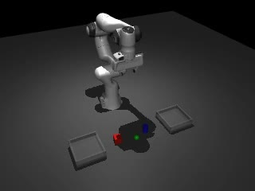
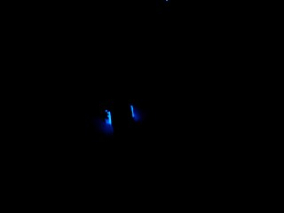
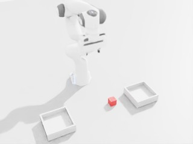
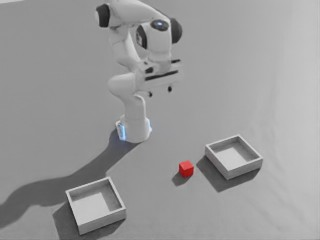

# Badcase 分层归因总表（Data / Interface / Behavior / Task-GT / System）

**冻结日期**：2026-07-25 · **基线 commit**：`d7ba9d53e9df94c0c4565ba31114cf9b1511a878`  
**定位**：把本项目所有已发生的失败按**责任层**归档，说明每一层用什么证据排除或确认，以及每次归因如何改变了后续动作。  
**诚实边界**：**Not task success / Not Sim2Real / Not real robot**。本文只做归因，不宣称任何 badcase「已修复」或「已完全定位唯一根因」。

## 0. 分层定义与归因规则

| Lane | 含义 | 判定权威 | 典型证据 |
|---|---|---|---|
| `data_fail` | 数据本身有问题（schema、泄漏、标签、可见性） | 中游 inspection / release / split 审计 | `manifest.json`、`splits.json`、QA JSON |
| `interface_fail` | 策略无法被正确加载 / 动作无法下发 | policy `report.json` | checkpoint audit、`clipped`、E-stop 计数 |
| `behavior_tag` | 动作可执行但行为形态不对（不下探、不闭合、走廊退化） | EE / gripper 轨迹与行为标签 | `HOME_NO_CLOSE`、`z_min`、`grip_min` |
| `task_gt` | 行为完成但连续 GT 未达成 subgoal | 上游 ContinuousTaskEvaluator | `s4_gate.json`、`episode_results.jsonl` |
| `system_fail` | 运行环境（GPU/驱动/相机/渲染/墙钟）导致的失败 | 运行日志与遥测 | telemetry JPEG、driver log、`early_stopped` |

**归因规则**：
1. 从**最低层往上**排除，任何一层未排除前不得把结论写到更高层。
2. **不得**因为高层数字变好就宣称低层问题已修复。
3. 每条归因必须能指向机器可读产物；无法指向的写「证据不足」。

---

## 1. `data_fail` — 数据层

| # | Badcase | 事实 | 状态 | 证据 | 归因后的动作 |
|---|---|---|---|---|---|
| D1 | **v2 late-close release 训练未按 split 过滤** | release 声明 12 train / 4 validation / 4 benchmark，但训练根与训练日志均为 20 episodes | **确认（事后审计）** | `runs/smolvla_s3/train_v2_lateclose_20260723T160000Z/train_log.txt` | 该 8 条只能称 release-named slices，**不能**称 held-out/OOD；v2 结论降级；Recovery 强制 train-only 物化 |
| D2 | **v1/v2 checkpoint 声明 `state[6]`，release 关节状态是 `[7]`，`ee_pose`/`gripper` 被 preprocessor 丢弃** | policy input 契约与数据契约不一致 | **确认** | `configs/smolvla_s3/recovery_decisions.yaml: state_contract.notes`、`tests/test_smolvla_s3_policy_input_audit.py` | 冻结 `observation.state[15]` = `joint[7] + ee_pose_xyzw[7] + gripper[1]`；排除 `object_pose`（sim privilege）与未标定 `ft` |
| D3 | **wrist 相机在最后 3 cm 看不到红块** | 原 4 条目标不可见；仅翻转视轴的 P0 重试仍 Hold | **确认并止损** | `runs/smolvla_s3/phase1_wrist_smoke_20260723/wrist_smoke_reaudit_target_visibility.json`、`runs/smolvla_s3/phase1_wrist_flip_smoke1_20260723/p0_audit.json` | Recovery v3 冻结为 **scene-only**；P1 按约定跳过，不继续调相机 |
| D4 | **MLP handoff 有 3,275 个 gripper command 越界 `[0,1]`** | 历史 handoff bundle 的 replay 风险 | **确认** | `training/reports/panda_mlp_bc/bridge_handoff/replay_check.json` | 下游必须 clamp 或 reject；成为后续 `clip(raw,0,1)` 执行语义的先例 |
| D5 | prospective eval 数据被阈值设计污染 | v2 的 prospective 10 条参与了 v3 阈值设计讨论 | **确认** | `recovery_decisions.yaml: eval_gate_v3.rationale` | 为 v3 **新采 seeds 70–74 / 2,593 帧**，保证与训练和阈值设计零重叠 |

**当前 v3 数据层结论**：train-only 36 episodes 物化、`splits.json` 三段无交集（`tests/test_smolvla_s3_v3_phaseaware_release.py`、`test_smolvla_s3_train_split_materialization.py`）；v3 的 lift 0/5 **不能**归因到 train/eval 泄漏。

---

## 2. `interface_fail` — 接口层

| # | Badcase | 事实 | 状态 | 证据 |
|---|---|---|---|---|
| I1 | LingBot 55-D 通道无法直接映射 Panda 执行 | 通道切片不等于执行映射；「可逆 delta 映射」表述已纠正 | **确认并归档路线** | `docs/VLA_GATE_V0_COMPATIBILITY_AUDIT.md`、`docs/VLA_GATE_V05_PANDA_ACTION_CONTRACT.md` |
| I2 | 本机 6GB 显存无法承载 LingBot 6B | 本机 RTX PRO 500 / 6113 MiB，V1 **No-Go** | **确认** | `docs/VLA_GATE_V1_PREFLIGHT.md` |
| I3 | SmolVLA base zero-shot 在 absolute-EEF open-loop 上 No-Go | EE RMSE ≈`0.273 m`、gripper acc `0` | **确认（成为 S2 基线）** | `evaluation/examples/smolvla_gate_s2_report.json` |
| I4 | empty-camera 补位疑虑 | `empty_cameras=0`、预期追加空图 0，由契约测试固定 | **结构上已排除** | `recovery_decisions.yaml: local_inference_contract`、`tests/test_smolvla_s3_entrypoints.py` |

**当前 v3 接口层结论**：**已排除为 lift 0/5 的原因**。有界 S4 policy interface **5/5 PASS**；150/150 actions `clipped=False`；无 E-stop、无碰撞中断；checkpoint config audit 全项 Pass（`state[15]` / `camera1` / `action[8]` / chunk10 / K5 / PEFT 正则 / adapter SHA256 `4cfcc46e…`）。

---

## 3. `behavior_tag` — 行为层（当前主要瓶颈）

| # | Badcase | 事实 | 状态 | 证据 |
|---|---|---|---|---|
| B1 | **ACT `HOME_NO_CLOSE`** | close→lift 定向模型 5/5 episode 停在 home 附近不闭合：`grip_min=1.0`、`z_span≈0.014 m` | **确认（冻结为诊断基线）** | `evidence/e3p6_closelift40_5seed_home_20260720/smoke5_gate.json`、`docs/ACT_HOME_NO_CLOSE_HYPOTHESIS_MATRIX.md` |
| B2 | **SmolVLA v1/v2 闭合过早** | v1 平均提前 `65` 帧 / `6.5 s`；v2 late-close data-fix 后仍提前 `68.625` 帧 / `6.862 s`，8/8 episode 均提前 | **确认；data-fix 未修好时序** | `runs/smolvla_s3/openloop_full_stride1_20260723T055500Z/`、`runs/smolvla_s3/openloop_v2_lateclose_full_stride1_20260723T161000Z/` |
| B3 | **S4 近黑场景「习惯走廊」** | EE z 最低仅 `0.20–0.24 m`（专家 `0.040`）、grip 最低 `0.21–0.28`（专家 `0.000`）、方块位移数值零 | **确认（首轮）** | `evidence/smolvla_s4_bounded5_20260724T203700Z/`、`docs/SMOLVLA_S4_LIFT0_OFFLINE_ATTRIBUTION.md` §3 |
| B4 | **修光后仍几乎不闭爪** | 视觉可用（JPEG≈154）后 5/5 seeds `gripper never closed below 0.700`，`grip_min≈0.85–0.93`，z 多停在 `0.42–0.53` | **确认（当前权威 S4 行为）** | `evidence/smolvla_s4_bounded5_relight_20260724T151711Z/` |
| B5 | **训练域 MuJoCo 同样不闭爪** | 同 ckpt、训练域 JPEG≈50：seed1 `grip_min≈0.976`、z 停在 `0.47–0.50`、reach/grasp/lift 0 | **有方向的早期证据（1-seed，人工提前停止）** | `evidence/smolvla_s4_mujoco_bounded5_20260724T155513Z/s4_gate.json`（`early_stopped=true`，`seeds_completed=1`） |

**关键对照（同一 checkpoint）**：

| 量 | 专家 | open-loop 预测（教师强迫观测） | 在线自主闭环 |
|---|---|---|---|
| EE z 最低 | `0.040` | ≤`0.022`（多数 ep） | **`0.20–0.53`** |
| 夹爪最低 | `0.000` | `0.000` | **`0.21–0.93`** |

即：**first-action 精度高，但自主闭环里不会走到抓取姿态**。这是本项目最核心的一条 badcase。

---

## 4. `task_gt` — 任务 GT 层

| # | Badcase | 事实 | 状态 | 证据 |
|---|---|---|---|---|
| T1 | **ACT E3 nominal20 overall 0/20** | reach 10/20；grasp / lift / transport / place 0/20；Wilson 95% CI `[0.000, 0.161]`；`go_no_go=no_go` | **确认 No-Go，已关闭** | `evidence/e3_nominal20_home_30ep_gt_v1_20260719/summary.json` |
| T2 | **SmolVLA S4 lift 0/5** | 权威（修光后）：interface 5/5、reach 1/5、grasp 0/5、lift **0/5**、`outcome_success 0/5`、`pass_threshold=1`、`gate_pass=false` | **确认 Hold** | `evidence/smolvla_s4_bounded5_relight_20260724T151711Z/s4_gate.json` |
| T3 | **GT 阈值口径放大 grasp** | `GRIPPER_CLOSE_MAX=0.70` 把半闭（`grip_min≈0.21–0.28`）记作 closed；reach 也含走廊几何重叠 | **确认为口径 artifact，非 lift 根因** | `docs/SMOLVLA_S4_LIFT0_OFFLINE_ATTRIBUTION.md` §3.3、§5 H4 |
| T4 | **oracle v1 也 lift 0/5** | 专家指令能跑完但方块抬不起来 | **确认为物理链问题并已修复** | `evidence/e3p5_isaac_scripted_oracle_5x_lift_20260720/` |

**T4 的价值（本项目最关键的一次归因）**：先用固定 FSM scripted oracle 测同一 Isaac 抓取链。v1 也 lift 0/5 → 说明当时**不能**把 learned policy 的失败归给策略；修正 pick 高度、PD 夹爪、方块摩擦、grasp pause 与 5 cm 方块侧夹阈值后，v2b 达到 **reach/grasp/lift 5/5、`gate_pass=true`**。这既证明名义物理链可用（**物理链已排除**），也建立了「系统上界参考」。**Oracle 成功 ≠ learned-policy 成功**。

---

## 5. `system_fail` — 系统层

| # | Badcase | 事实 | 状态 | 证据 |
|---|---|---|---|---|
| S1 | **错误 evaluator（v0）** | recorder 把 gripper **command** 混作 **measured state**，评测器读到的不是真实开合 | **确认并隔离** | 旧结果标记 `INVALID_EVALUATOR_V0`；修复后 2101/2102 preflight PASS：`evidence/e3_gt_preflight_v1_20260719/preflight_summary.json` |
| S2 | **Isaac 离线场景缺光 → policy 相机近黑（H1′）** | policy-input JPEG 均值 ≈`0.3`；对照 MuJoCo 训练帧 ≈`50`、oracle 视频 ≈`114` | **确认并修复** | telemetry：`evidence/smolvla_s4_bounded5_telemetry_20260724T144549Z/`；修光冒烟 JPEG≈`233`：`evidence/smolvla_s4_lightfix_smoke1_20260724T150519Z/`；上游 `offline_assets.add_offline_scene_lights`（Dome 450 + Distant 900） |
| S3 | 场景视频 recorder flush 失败 | `videos/seed_*.mp4` 有文件但不可用，以 JPEG 遥测为准 | **确认（已绕过，不影响判定）** | `.../telemetry/.../scene.note.txt` |
| S4 | MuJoCo EGL 与 SmolVLA 争抢本机 GPU | 每 chunk 推理常 `7–13 s`，墙钟过长 → suite 人工提前停止 | **确认为工程原因，不是策略变好** | `evidence/smolvla_s4_mujoco_bounded5_20260724T155513Z_driver.log` |
| S5 | 本机 6GB 显存不足以做正式 LoRA | 训练需外部 GPU（AutoDL RTX 4090 D） | **确认** | `docs/VLA_GATE_V1_PREFLIGHT.md`、`runs/smolvla_s3/recovery_v3_preflight_20260723T124310Z/preflight_report.json` |

**S2 是本项目第二个「差点写错结论」的点**：如果不补相机遥测，首轮的 reach 3/5 · grasp 1/5 很容易被包装成「已经有部分视觉伺服能力」。补上遥测后发现相机近黑，修光复测反而把 funnel 拉低到 reach 1/5 · grasp 0/5 —— **更差但更真实**。

### S2 视觉遥测图例：近黑不是策略能力，修光也没有把 Hold 变成成功

| 训练域参考（MuJoCo） | 首轮在线 policy 输入（Isaac，近黑） |
|---|---|
|  |  |
| 训练数据视觉参考，JPEG 均值约 `50`；只说明训练时目标可见。 | 首轮 seed 1 的 policy 输入，JPEG 均值约 `0.3`；证明当时视觉输入无效，不能据此评价视觉策略能力。 |

| 修光冒烟（非 5-seed Gate） | 权威 relight S4（同 seeds 的正式复测） |
|---|---|
|  |  |
| 修光冒烟 JPEG 均值约 `233`；只验证灯光修复生效，不代表任务 Gate。 | 权威 relight 运行 JPEG 均值约 `154`；视觉已可用，但结果仍为 reach 1/5、grasp 0/5、lift 0/5 → Hold。 |

图组来源与边界见 [`EVIDENCE_INDEX.md`](EVIDENCE_INDEX.md)：它证明首轮的近黑系统问题已被发现和修复，也证明“修光后仍 Hold”；**不**证明任务成功、Sim2Real 或闭环 BC 是唯一根因。

---

## 6. 当前对 `lift 0/5` 的归因结论（谨慎表述）

**已排除**（有直接证据）：

| 层 | 排除项 | 依据 |
|---|---|---|
| data | train/eval 泄漏 | train-only 36 ep 物化 + `splits.json` 无交集 + 契约测试 |
| interface | 加载 / 下发 / 限幅 / 安全 | interface 5/5、150/150 `clipped=False`、无 E-stop、checkpoint audit Pass |
| state 编码 | `state[15]` 约定差（H3） | home 关节 L2 `0.006`、四元数 L2 `6.8e-6`、夹爪同 `[0,1]` 量纲 |
| 物理链 | Isaac 抓不起来（H5） | oracle v2b lift 5/5、`gate_pass=true` |
| 系统/视觉 | 相机失明（H1′） | 修光后 JPEG≈154，同 seeds 复测仍 Hold |

**当前倾向的主因（H2：闭环 BC / covariate shift）**：教师强迫观测下 first-action 精度高（EE `0.0253 m`、grip BA `0.9943`），但自主闭环中策略不下探、不闭爪。支持证据是训练域 MuJoCo 对照在 JPEG≈50 下同样 `gripper never closed below 0.700`。

**必须明确的保留（不要写成已完全证明）**：

1. MuJoCo H2 对照是**人工提前停止的 1-seed 完整 GT**（`early_stopped=true`、`seeds_completed=1`、`policy_interface_pass=0`），**不是**完整 5-seed gate，因此「协变量偏移是唯一根因」**尚未被完全证明**。
2. 修光后的 Isaac 与训练域 MuJoCo 仍存在未量化的其它差异（渲染管线、纹理、材质、相对相机外参、控制时序 / chunk 重规划延迟），当前只能说**外观域差不是主因**，不能说**完全无影响**。
3. Offline async queue bench（2026-07-26）已证明：在本机 LoRA 延迟下 sync 重规划会以 ~20% ticks 超过 100 ms，async double-buffer 可降到冷启动 1 次（见 `QUEUE_RUNTIME_BENCH_RESULTS.md`）。**上游在线节点仍未接线**（`async_double_buffer_online_wired=false`），因此「在线闭环闭合时序是否已被 async 修复」仍属**未验证**；也不能把 bench 写成任务成功。
4. 降级为次级的假设（H1 泛化外观域差、H4 GT 阈值口径）**保留在假设矩阵中**，不删除。

**结论口径**：`lift 0/5` 的**责任层是 Behavior + Task-GT**，**主要嫌疑是闭环 BC 分布偏移**，Data / Interface / 物理链 / state 编码 / 相机失明**已排除**。这是**分层排除后的方向性结论**，不是被完整实验证明的唯一根因。

## 7. 归因如何改变了动作（止损记录）

| 归因 | 触发的决策 | 没做什么 |
|---|---|---|
| S1 错误 evaluator | 隔离旧结果、修 command/state、接 FT、加两 seed 一致性预检，才跑权威 nominal20 | 没有把旧成功率写进报告 |
| T4 oracle v1 lift 0/5 | 先修物理链再谈策略；建立系统上界 | 没有继续给 ACT 堆 epoch |
| T1 ACT 0/20 + B1 `HOME_NO_CLOSE` | ACT 冻结为诊断基线；不启动完整 E4（100+ rollout） | 没有盲目扩数据 / 调参 |
| D1 split 泄漏 + D2 state 契约错 | Recovery 重做 train-only + `state[15]` + 官方 PEFT，而不是继续调超参 | 没有开第三次 data-fix |
| D3 wrist 不可见 | 冻结 scene-only，跳过 P1 | 没有继续调相机位姿 |
| S2 相机近黑 | 补遥测 → 修光 → 同 seeds 复测；把首轮降级为 Superseded | 没有把 reach 3/5 写成部分成功 |
| T2 S4 lift 0/5 + B4/B5 | 冻结候选、转评测框架收口（P1 统一信封、P2 runtime 单源、P3 offline risk 对照） | 没有扩种子、没有重训、没有上真机 |

## 8. 关联文档

- 总结：[FINAL_PROJECT_SUMMARY.md](FINAL_PROJECT_SUMMARY.md)
- S4 归因原文（含假设矩阵 H1–H5 与遥测修订）：[../SMOLVLA_S4_LIFT0_OFFLINE_ATTRIBUTION.md](../SMOLVLA_S4_LIFT0_OFFLINE_ATTRIBUTION.md)
- ACT 假设—证据矩阵：[../ACT_HOME_NO_CLOSE_HYPOTHESIS_MATRIX.md](../ACT_HOME_NO_CLOSE_HYPOTHESIS_MATRIX.md)
- oracle 物理链 triage：[../E3P5_ISAAC_SCRIPTED_ORACLE_EXPERIMENT.md](../E3P5_ISAAC_SCRIPTED_ORACLE_EXPERIMENT.md)
- 通用判定标签与 `failure_lane`：[../EMBODIED_POLICY_EVALUATION_SOP.md](../EMBODIED_POLICY_EVALUATION_SOP.md)、[../POLICY_ADAPTER_CONTRACT.md](../POLICY_ADAPTER_CONTRACT.md)
- 后续路线（P1/P2 仅登记）：[../FUTURE_WORK_ROADMAP.md](../FUTURE_WORK_ROADMAP.md)
