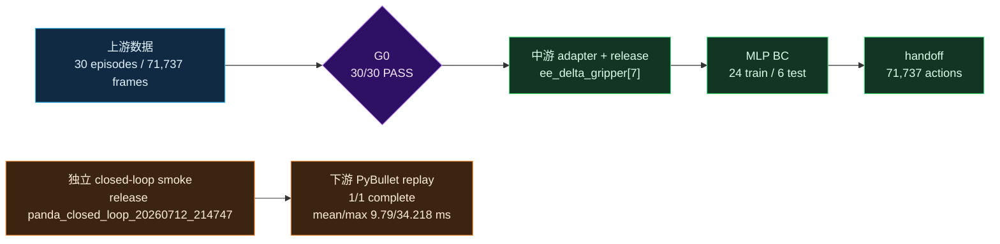

# Panda 30-Episode Training Evidence and Downstream Smoke

本文是作品集的人读摘要。机器可读证据、来源与复现入口见
[`../../evidence/README.md`](../../evidence/README.md)。当前证据由两段不同 run 构成：

1. `panda_30_mlp_20260711`：30-episode 上游数据、中游 release、MLP BC 与 handoff；
2. `panda_closed_loop_20260712_214747`：独立的 1-episode 下游 PyBullet replay smoke。

两段 run 不能拼接成同一个已验证的端到端性能实验。

## 一句话结论

项目已验证 30 条 Panda 仿真 episode 的数据门禁、release、低维 MLP BC 和 handoff 产物；
另有一次独立的下游 Panda replay smoke 完成 1/1 episode。当前没有可追溯的完整 fault campaign，
也不证明真实机械臂部署或已完成 Sim2Real。

## 证据关系

图中两条链没有连接线，表示当前证据不足以确认 30-episode handoff 就是该次下游 smoke 的输入。

## 核心结果

| 阶段 | 当前可验证结果 | 证据 |
|---|---:|---|
| G0 dataset validation | 30/30 PASS | [`../../evidence/upstream/validate_dataset.json`](../../evidence/upstream/validate_dataset.json) |
| G1 release | 71,737 frames, inspection PASS | [`../../data/exports/panda_30_release/manifest.json`](../../data/exports/panda_30_release/manifest.json) |
| MLP BC | train loss 0.04914, test loss 0.23502 | [`../../training/reports/panda_mlp_bc/mlp_metrics.json`](../../training/reports/panda_mlp_bc/mlp_metrics.json) |
| Handoff | 30 episodes / 71,737 actions | [`../../training/reports/panda_mlp_bc/bridge_handoff/handoff_manifest.json`](../../training/reports/panda_mlp_bc/bridge_handoff/handoff_manifest.json) |
| Latest downstream smoke | 1/1 complete, mean/max 9.79/34.218 ms, no fault injection | [`../../evidence/downstream/benchmark_summary.json`](../../evidence/downstream/benchmark_summary.json) |

## 诚实边界

- 本摘要只描述软件仿真、离线训练和 Sim2Sim / Sim2Real-readiness 证据。
- MLP test loss 约为 train loss 的 4.78 倍，小数据泛化仍是主要训练风险。
- 当前是 low-dimensional baseline；缺少图像不应被描述成多模态训练。
- handoff replay check 中的 3,275 个 gripper 越界输出要求执行端 clamp 或 reject。
- 下游数据只有 1-episode no-fault smoke，不能扩展成长期稳定性或 fault response 结论。
- 旧版未溯源的 latency/fault 数字已从当前结果表移除；没有原始 JSON 就不能作为作品集 headline。
