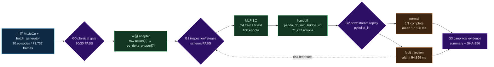

# Canonical Portfolio Experiment · Panda 30-Episode Closed Loop

当前作品集只使用 `panda_30_mlp_20260711` 作为三仓主实验。本文是人读摘要；机器可读证据与
哈希索引见 [`../../evidence/canonical_20260711/`](../../evidence/canonical_20260711/README.md)。

## 一句话结论

上游生成并通过物理门禁的 30 条 Panda 仿真抓取 episode（71,737 frames），经中游 schema
适配、release、MLP BC 和 handoff 后，由下游 `panda_jsonl_replay + pybullet_ik` 在 PyBullet
执行；正常 benchmark 1/1 完成，故障注入告警在 94.399 ms 内检出。

## 数据流与 Gate

**图例**：蓝色为上游，绿色为中游，橙色为下游，紫色菱形为 Gate；实线为主数据/控制流，
虚线为质量或风险反馈。MuJoCo 与 PyBullet 都是软件仿真后端。

## 核心结果

| 阶段 | 结果 | 证据 |
|---|---:|---|
| G0 dataset validation | 30/30 PASS | `data/episodes_mlp/logs/dataset_validation.json` |
| G1 release | 71,737 frames, inspection PASS | `data/exports/panda_30_release/manifest.json` |
| MLP BC | train loss 0.04914, test loss 0.23502 | `training/reports/panda_mlp_bc/mlp_metrics.json` |
| Handoff | 30 episodes / 71,737 actions, PASS | `bridge_handoff/handoff_manifest.json` |
| G2 normal | 1/1 complete, mean/max 17.626/49.508 ms | canonical downstream summary |
| G2 fault | alarm detected in 94.399 ms | canonical fault summary |

## 诚实边界与发现

- 本实验验证 Sim-to-Sim 数据与执行链，不证明真机 Sim2Real。
- MLP test loss 约为 train loss 的 4.78 倍，说明小数据泛化仍是主要训练风险。
- 本次是 low-dimensional baseline，scene/wrist image 缺失被记录为 WARN，而非伪装成多模态训练。
- handoff replay check 发现 3,275 个 gripper 输出越界；执行端必须实施 clamp/reject 和 runtime limits。
- 正常 benchmark 只跑了 1 个计时 episode，适合作为闭环 smoke，不应包装成长稳或统计显著性结果。
