# 中游数据与分析路径全景说明书 (DATA_AND_ANALYSIS_PATHS.md)

中游仓库 `robot-arm-episode-data-lab` 内部实际上存在**两条完全独立的运行路径**。它们的执行目的、使用的仿真机型和数据格式完全不同：

1. **KUKA iiwa7 仿真数据生成与导出链路**（传统物理引擎采集，位于 `scripts/` 目录下）
2. **Franka Panda 策略训练与下游交付链路**（作品集主线，位于 `training/scripts/` 目录下）

为了理清分析和数据流，请参考以下全景架构与具体文件流动图。

---

## 1. 双链路全景数据流图

```mermaid
flowchart TB
    subgraph Path1["1. KUKA 仿真数据生成与导出链路 (PyBullet / npy 格式)"]
        P1_Config["配置 configs/default.yaml"]
        P1_Collect["单步采集 scripts/collect_episode.py"]
        P1_Batch["批量采集 scripts/batch_collect.py"]
        P1_Raw["原始数据目录 dataset/v1/<br/>(npy 数组 + png 图像)"]
        P1_Validate["结构校验 scripts/validate_dataset.py"]
        P1_Viz["可视化回放 scripts/visualize_episode.py"]
        P1_Export["LeRobot 导出 scripts/export_lerobot_style.py"]
        P1_LeRobot["LeRobot 格式数据集 dataset/v1/lerobot_export/<br/>(parquet 表格 + mp4 视频)"]

        P1_Config --> P1_Collect
        P1_Config --> P1_Batch
        P1_Collect --> P1_Raw
        P1_Batch --> P1_Raw
        P1_Raw --> P1_Validate
        P1_Raw --> P1_Viz
        P1_Raw --> P1_Export
        P1_Export --> P1_LeRobot
    end

    subgraph Path2["2. Panda 策略训练与下游交付主线 (JSONL / 契约模式)"]
        P2_RawInput["外部数据源 / 仿真产生<br/>(Raw jsonl / npz)"]
        P2_Mock["模拟生成 training/scripts/make_mock_panda_dataset.py"]
        P2_Schema["机器人契约 configs/robot_schemas/panda.yaml"]
        P2_Inspect["数据合规校验 training/scripts/inspect_dataset.py"]
        P2_Release["数据发布密封 training/scripts/prepare_dataset_release.py"]
        P2_ReleasedDir["发布版本目录 data/exports/*_release/<br/>(frames.jsonl + manifest.json)"]
        P2_Train["模型训练 train_act_smoke.py / train_mlp_policy.py"]
        P2_Checkpoints["训练产物 reports/*/<br/>(checkpoint.npz + metrics.json)"]
        P2_Eval["离线评估 evaluate_policy.py"]
        P2_Replay["轨迹推演 replay_policy.py"]
        P2_Handoff["交付件打包 prepare_bridge_handoff.py"]
        P2_HandoffDir["下游桥接目录 bridge_handoff/<br/>(predicted_actions.jsonl + handoff_manifest.json)"]

        P2_RawInput --> P2_Inspect
        P2_Mock --> P2_Inspect
        P2_Schema --> P2_Inspect
        P2_Inspect --> P2_Release
        P2_Release --> P2_ReleasedDir
        P2_ReleasedDir --> P2_Train
        P2_Train --> P2_Checkpoints
        P2_Checkpoints --> P2_Eval
        P2_Checkpoints --> P2_Replay
        P2_Replay --> P2_Handoff
        P2_Handoff --> P2_HandoffDir
    end
```



---

## 2. 详细执行路径对照表

| 环节 | 路径 1：KUKA 仿真采集与导出 | 路径 2：Panda 策略训练与交付 (主线) |
|---|---|---|
| **核心职责** | 验证物理引擎中的接触、避障和数据导出 | 校验、清洗、训练行为克隆模型，并交付执行轨迹 |
| **机器型号** | KUKA iiwa7 (7-DOF + 并行夹爪) | Franka Panda (7-DOF + 并行夹爪) |
| **物理引擎** | PyBullet 物理仿真起效 | Headless 数据流，无需实时物理窗口 |
| **输入文件** | `configs/default.yaml` | `configs/robot_schemas/panda.yaml` |
| **核心运行数据** | `states.npy`, `actions.npy`, `ee_poses.npy`, `images/*.png` | `frames.jsonl` (包含观测 `observation.state[8]` 与 `action[7]`) |
| **校验标准** | 检测是否有丢帧、抓取是否建立成功、物体是否抬升 | 通过 schema 校验字段存在性、维度一致性和步数完整性 |
| **最终产物** | `lerobot_export/` 满足 HuggingFace/LeRobot 格式 | `bridge_handoff/` 包含预测动作流与合规报告 |

---

## 3. 分析路径与命令行演示

### 路径 1：从零采集 KUKA 数据并导出为 LeRobot 格式
```bash
# 1. 运行 RRT 避障算法，观察 PyBullet 中的运动规划
python3 scripts/run_rrt_demo.py --seed 7 --save-gif assets/gifs/demo_rrt_obstacle.gif

# 2. 单次运行 pick_and_lift 任务采集
python3 scripts/collect_episode.py --task pick_and_lift --num-steps 80 --output dataset_sample/episode_pick_001

# 3. 批量采集 20 个 episode
python3 scripts/batch_collect.py --output dataset/v1 --num-episodes 20 --seed 42

# 4. 校验生成的原始 npy 数组与图像
python3 scripts/validate_dataset.py dataset/v1

# 5. 导出成 LeRobot v2.1 规范（含视频合并、Parquet 列对齐）
python3 scripts/export_lerobot_style.py dataset/v1 --output dataset/v1/lerobot_export
```

### 路径 2：Panda 模型训练与 downstream 交付测试
```bash
# 1. 产生测试用模拟 Panda 轨线
python3 training/scripts/make_mock_panda_dataset.py --output /tmp/panda_mock/raw

# 2. 检查数据是否符合 Panda 契约规范
python3 training/scripts/inspect_dataset.py \
  --dataset /tmp/panda_mock/raw \
  --schema configs/robot_schemas/panda.yaml

# 3. 数据集发布与封装（生成 manifest 和校验指纹）
python3 training/scripts/prepare_dataset_release.py \
  --input /tmp/panda_mock/raw \
  --output /tmp/panda_mock/release \
  --schema configs/robot_schemas/panda.yaml \
  --release-id panda_test_v0

# 4. 训练 baseline 策略模型
python3 training/scripts/train_act_smoke.py \
  --dataset /tmp/panda_mock/release \
  --schema configs/robot_schemas/panda.yaml \
  --output /tmp/panda_mock/train

# 5. 执行推演（Replay），生成无偏预测动作流
python3 training/scripts/replay_policy.py \
  --dataset /tmp/panda_mock/release \
  --checkpoint /tmp/panda_mock/train/checkpoint.npz \
  --schema configs/robot_schemas/panda.yaml \
  --output /tmp/panda_mock/train/predicted_actions.jsonl

# 6. 打包交付件供下游 PyBullet 桥接器播放
python3 training/scripts/prepare_bridge_handoff.py \
  --dataset /tmp/panda_mock/release \
  --replay /tmp/panda_mock/train/predicted_actions.jsonl \
  --schema configs/robot_schemas/panda.yaml \
  --output /tmp/panda_mock/train/bridge_handoff \
  --handoff-id panda_test_handoff_v0
```

---

## 4. 跨仓库数据交互接口规范 (Cross-Repo Data Interactions)

中游并非孤立运行，它与上游遥操作套件和下游仿真桥接器之间有明确的数据契约和脚本接口：

### 4.1 上游 -> 中游 (数据录制与适配)
* **数据来源**：上游 `ros2-arm-teleoperation-suite` 的 `lerobot_recorder` 节点录制的原始轨线，以行级 JSONL 格式存储。
* **原始数据字段**：
  * `observation.state` (维度 7，Panda 关节位置)
  * `observation.gripper` (维度 1，夹爪开合度)
  * `observation.ee_pose` (维度 7，末端位姿 xyz + quaternion)
  * `action` (维度 8，目标绝对位姿 + 目标夹爪开合度，即 `ee_pose_gripper`)
* **中游适配器**：运行 `training/scripts/adapt_upstream_panda_dataset.py` 读取上游目录：
  1. **状态合并**：将 `observation.state[7]` 和 `observation.gripper[1]` 合并，对齐为中游的标准 `observation.state[8]`。
  2. **动作解耦**：通过 `--derive-ee-delta-action` 参数，将绝对位姿 `action[8]` 根据当前 `observation.ee_pose[7]` 计算为增量控制的 `action[7]` (`ee_delta_gripper`，包含增量 xyz[3] + 增量 rpy[3] + 夹爪指令[1])。
  3. **输出**：生成合规的标准化数据集，写入 `data/exports/`。

### 4.2 中游 -> 下游 (策略交付与桥接验证)
* **交付件打包**：中游策略训练完成后，通过 `training/scripts/replay_policy.py` 生成评估集的预测动作流 `predicted_actions.jsonl`，再使用 `training/scripts/prepare_bridge_handoff.py` 打包成 `bridge_handoff/` 交付包。
* **交付包内容**：
  * `predicted_actions.jsonl`：包含每一帧的预测 `action[7]` 序列。
  * `handoff_manifest.json`：声明机器人型号 (`panda`)、动作语义类型 (`ee_delta_gripper`) 和期望执行频率。
* **下游桥接消费**：
  1. 下游 `ros2-moveit-pybullet-bridge` 启动 launch 时指定 `strategy_type:=panda_jsonl_replay` 并挂载中游的交付目录。
  2. 下游 `policy_runner` 节点逐帧读取 `predicted_actions.jsonl` 中的 `action[7]` 指令。
  3. 下游的 `PandaActionAdapter` 将此 `ee_delta_gripper` 指令还原为绝对笛卡尔位姿，再通过 **PyBullet 逆运动学 (IK) 求解器** 转换为机械臂的关节空间指令，驱动仿真机器人执行。
  4. 下游评测智能体（Evaluator）对抓取结果进行物理监控，并输出 success/fail 报告。

---

## 5. 面试时的数据链路表达

当面试官询问您的**数据和分析路径**时，您可以按照如下逻辑分层陈述：

1. **两层解耦**：我的中游实验室将**“仿真数据生产与格式兼容 (LeRobot)”**和**“策略模型训练与下游交付 (Handoff)”**完全解耦，分别在不同的机型（KUKA 和 Panda）上得到了验证。
2. **格式标准化与动作转换**：在数据链路中，上游产生的数据不会直接喂给模型，而是首先通过 `inspect_dataset` 对齐 schema 规范。若上游采集的是绝对位姿动作，中游会在导入时显式推导为增量动作（`ee_delta_gripper[7]`），防止动作语义被误读。
3. **数据发布版本控制**：训练所消费的数据必须由 `prepare_dataset_release` 生成不可变的发布包（`release_id`），附带自动生成的校验 manifest，保证了训练的可追溯性。
4. **下游独立闭环**：训练结束后，我使用 `prepare_bridge_handoff` 打包了由 Policy 生成的预测动作（`predicted_actions.jsonl`），以契约形式传递给下游的 PyBullet 桥接器进行执行期风险评估。
