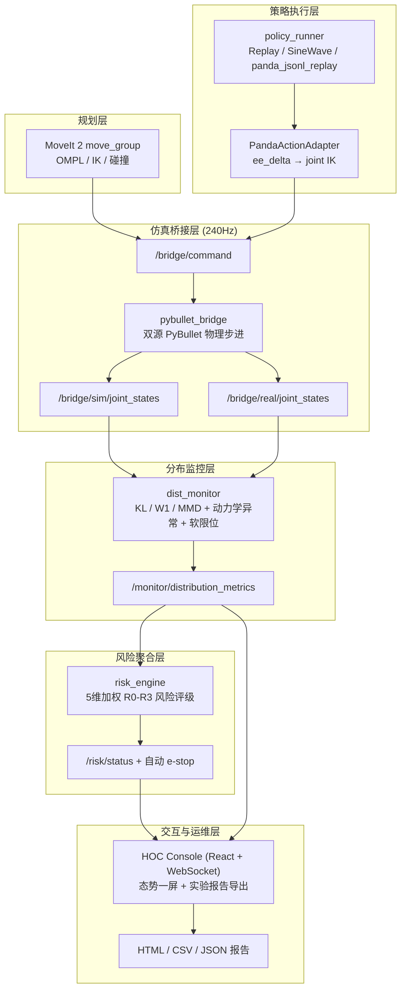

# 三仓库深度设计分析 (DEEP_DESIGN_ANALYSIS.md)

> 面向面试官的技术深度说明：解决了什么问题、训练策略对比、下游架构全景、冗余设计说明。

---

## 1. 解决了什么工程问题（不是功能列表）

### 1.1 上游：`ros2-arm-teleoperation-suite`

**核心挑战：工业级控制栈与仿真器的接口整合**

| 技术难点 | 具体问题 | 解决方案 |
|---|---|---|
| **MuJoCo vs Gazebo 接触模型选型** | 操作任务（pick-and-lift）中，Gazebo 的 ODE/Bullet 求解器在"臂-指-物体"接触边界处会产生"高频抖动跳飞"和"抓取滑落"奇异性，无法满足 LeRobot 数据采集所需的接触稳定性。 | 改用 MuJoCo 凸优化接触模型，自研 `mujoco_sim_node.py`，用接口开发成本换取 tactile-stable 的抓取动力学（见 ADR 01）。 |
| **CANopen vs EtherCAT 总线选型** | EtherCAT 依赖实时内核补丁（RT-preempt）和专用 ESC 芯片，无法在标准 Docker 容器内虚拟化运行，破坏了 CI 一键复验的能力。 | 采用 CANopen / SocketCAN / DS402，利用 Linux 内核原生 `vcan0` 实现 7 个虚拟伺服驱动器（`virtual_servo_driver`）的完整总线闭环（见 ADR 02）。 |
| **抓取接触遥测发布** | MuJoCo 接触判断分散在仿真步进逻辑中，外部无法实时监控"夹爪是否真正建立了物理接触"，导致抓取失败难以诊断。 | 在 `mujoco_sim_node.py` 中新增 `_contact_debug_payload()` 方法，以 JSON 格式向 `/grasp/contact_debug` 话题持续发布结构化遥测（`ee_object_dist`、`finger_object_contacts`、`gripper_force_mode`、`gripper_contact_drop`、`object_z_velocity` 等），完整记录每步仿真中的接触力学状态。 |
| **多模态录制同步** | M6 感知录制器需要同时对齐 joint state（1000Hz）、RGB 相机（30Hz）、触觉图像（30Hz）和 depth 图像，时间戳抖动导致数据对不齐。 | 在 `lerobot_recorder` 中引入 `TimeSync` 模块，以 ROS 2 消息时间戳为轴对齐多模态流，录制的 episode 在中游 inspect 时不会因为时间戳缺失而 FAIL。 |

---

### 1.2 中游：`robot-arm-episode-data-lab`

**核心挑战：跨仿真器数据契约与动作语义一致性**

| 技术难点 | 具体问题 | 解决方案 |
|---|---|---|
| **动作语义不一致（最常见的坑）** | 上游 M6 recorder 录制的 `action[8]` 是绝对末端位姿（`ee_pose_gripper`），而训练框架默认期望增量控制（`ee_delta_gripper[7]`）。若静默截断第8维或直接当成增量使用，会导致模型在推理时输出完全错误的关节命令，且不会有明显的 FAIL 提示。 | 在 `adapt_upstream_panda_dataset.py` 中显式转换：通过 `--derive-ee-delta-action` 参数，对每帧计算 `delta_xyz = target_ee - current_ee`、`delta_rpy = quat_delta_to_rpy(...)` 推导出真正的增量动作。禁止任何静默截断（见 `upstream_m6.py` L79-96）。 |
| **observation.state 维度不对齐** | 上游 `observation.state[7]` 只有关节位置，而 Panda 标准训练要求 8 维（7 关节 + 夹爪开合度）。两者形态不同会导致训练脚本的输入层维度报错，且错误信息不直观。 | 在适配器中检测维度：若为 `[7]`，则自动从 `observation.gripper[1]` 拼接；若为非 `[7]` 也非 `[8]`，立即抛出有意义的 `ValueError`，而不是让 NumPy 广播后悄悄产生错误结果。 |
| **数据可追溯性** | 直接用采集目录训练会造成"这份 checkpoint 到底用了哪几个 episode、哪个过滤规则、哪个 schema 版本训练的"完全不可考。 | 引入 `prepare_dataset_release.py`：凡是进入训练的数据必须先密封为 release（包含 `release_id`、`schema_id`、`filter_rules`、`num_episodes`、`inspection_report`），训练脚本只认 release 目录，不认原始采集目录。 |
| **fail-fast 而非错误静默** | 中游处理中最难排查的问题是"数据通过了但结果是错的"（silent corruption）。 | 在 `inspect_dataset.py` 的 Validation Gates 中，required fields 缺失、shape 不一致、action_type 不可解释均为 `FAIL`（而非 `WARN`），且 release 脚本在 inspection FAIL 时不允许继续执行。 |

---

### 1.3 下游：`ros2-moveit-pybullet-bridge`

**核心挑战：无真实硬件条件下的可量化 Sim2Real-readiness 评估**

| 技术难点 | 具体问题 | 解决方案 |
|---|---|---|
| **MoveIt 规划与物理仿真脱节** | MoveIt 2 的关节轨迹控制器（`joint_trajectory_controller`）发出的命令需要喂给物理仿真器执行，但两者默认没有闭合回路。 | 实现 `pybullet_bridge`：桥接 `/bridge/command` 话题，以 240Hz 的物理步进驱动 PyBullet，同时把 PyBullet 的关节状态发回 `/bridge/sim/joint_states`，形成 MoveIt → PyBullet → ROS 2 的完整闭环。 |
| **Sim/Real 偏移不可量化** | 在没有真机的情况下，无法直接测量"仿真轨迹与真实执行的差距"。 | 用双源 PyBullet 代理：一个进程模拟 Sim 侧（参考轨迹），另一个注入扰动代理 Real 侧，`dist_monitor` 节点用 KL / Wasserstein-1（W1）/ MMD 三种分布距离实时计算两源的偏移量，提供可量化的 `distribution_shift` 维度风险评分。 |
| **风险判断主观、无法记录留痕** | 仿真跑完后只有 CLI 日志，无法对每次实验留下可审计的风险评估记录。 | `risk_engine` 节点聚合 5 个维度的加权风险评分（`distribution_shift×0.35 + tracking_error×0.25 + dynamics_anomaly×0.20 + comm_health×0.10 + planning_failure×0.10`），达到 R3 时自动触发 e-stop（`cancel_move_group`），并由 HOC Console 生成 HTML/CSV 实验报告存档。 |

---

## 2. 训练策略比较

中游有三个策略层级，并非"越高越好"，而是解决不同阶段的不同问题：

| 层级 | 实现 | 依赖 | 作用 | 面试定位 |
|---|---|---|---|---|
| **L1: Linear Smoke** | `training/policies/linear_policy.py` | NumPy only，无 PyTorch | 验证数据链路（dataset → training → evaluation → handoff 工程闭环是否能跑通） | 当前作品集主线 |
| **L2: MLP BC** | `training/policies/mlp_policy.py` | PyTorch（可选） | 验证神经网络 BC 入口可扩展，展示工程路径 | 补充证明，不是主线 |
| **L3: ACT / Diffusion** | 无本地实现，只有 export path | 外部训练框架 | 数据格式预留对接路径 | 未来扩展，当前明确不做 |

### 2.1 Linear Smoke 详细说明

```
policy: observation.state[8] → action[7]
method: ridge regression (λ=1e-6)
outputs: checkpoint.npz, normalization.json, metrics.json, eval.json
```

**为什么用线性回归？**

不是因为线性回归效果好，而是因为它：
1. **CPU-only 运行**，在 CI/Docker 无 GPU 环境下也能跑通。
2. **快速暴露数据问题**：线性模型对 `state_dim / action_dim` 不对齐极其敏感，能立刻报出 shape error。
3. **产出可验证的 metrics**：`train_loss / val_loss / MAE` 都是工程闭环的证明，而非算法效果承诺。

**适合在作品集里讲的指标：**

- `state_dim=8, action_dim=7, action_type=ee_delta_gripper` → schema contract 证据
- `train_mae / val_mae` 的数量级 → 工程可运行证明
- `num_frames` → 数据规模说明

### 2.2 MLP BC 详细说明

```python
MLPPolicy(
    state_dim=8,
    action_dim=7,
    hidden_dims=[128, 128],  # 2层 MLP
    dropout=0.0
)
# 每层: Linear → LayerNorm → ReLU
# 依赖 PyTorch，可选运行
```

**与 Linear Smoke 的核心差别：**

| 对比项 | Linear Smoke | MLP BC |
|---|---|---|
| 模型复杂度 | 线性 `W·x + b` | 2层 MLP，带 LayerNorm |
| 环境依赖 | NumPy only | 需要 PyTorch |
| 训练目的 | 验证工程闭环 | 验证神经网络 BC 路径可扩展 |
| 是否进入 P0 demo | ✅ 是 | ❌ 否（可选运行） |
| 能否代表真实策略效果 | ❌ 不能（mock 数据） | ❌ 不能（mock 数据） |

**面试时的表达边界：**

> 我保留了 MLP BC 入口（`train_mlp_policy.py`），但当前不把它作为主线。核心原因是：项目阶段的瓶颈在于数据契约和接口一致性，而不是模型复杂度。在 schema 稳定、下游 replay 验证完成之前，提升模型复杂度不会带来可信的收益。

---

## 3. 下游仓库完整架构（`ros2-moveit-pybullet-bridge`）

下游不只是一个 PyBullet 桥，它是一个分层的 Sim2Real-readiness 评估系统，由 6 个子系统组成：



### 各子系统职责

| 子系统 | 包名 | 核心职责 |
|---|---|---|
| **pybullet_bridge** | `pybullet_bridge` | 240Hz PyBullet 物理步进，桥接 `/bridge/command` → PyBullet 执行 → `/bridge/sim/joint_states` |
| **policy_runner** | `pybullet_bridge/learning/policy_runner.py` | 插件化策略执行器（`replay` / `sine_wave` / `panda_jsonl_replay`），支持热切换 |
| **PandaActionAdapter** | `pybullet_bridge/learning/panda_action_adapter.py` | 将中游 `ee_delta_gripper[7]` 增量动作通过 PyBullet IK 转换为关节目标位置，支持 `hold` / `delta` / `abs` 三种命令模式 |
| **dist_monitor** | `dist_monitor` | 订阅双源 JointState（Sim / Real），计算 KL 散度、W1 距离、MMD，检测动力学异常和软限位接近度，发布 `DistributionMetrics` 消息 |
| **risk_engine** | `risk_engine` | 聚合 5 维风险（分布偏移 35% + 轨迹追踪误差 25% + 动力学异常 20% + 通信健康 10% + 规划失败率 10%），输出 R0-R3 风险等级，R3 时触发 MoveIt `cancel_goal` 急停 |
| **hoc_console** | `hoc_console` | React + WebSocket 实时看板，聚合 metrics/risk/camera 流，支持实验参数注入（域随机化、分布偏移注入），一键导出 HTML/CSV 报告 |
| **MoveIt 2** | `moveit_config` | OMPL 路径规划 + IK 求解（KDL/BioIK）+ 碰撞检测，轨迹指令通过 `joint_trajectory_controller` 发往 `/bridge/command` |

---

## 4. 三仓库冗余设计说明

这是作品集中最容易被面试官追问的地方。以下是真实存在的功能重叠，以及每个重叠背后是有意设计还是历史遗留：

### 4.1 LeRobot export 在上游和中游都有

| 位置 | 脚本 | 产生什么 | 目的 |
|---|---|---|---|
| 上游 `ros2-arm-teleoperation-suite` | `lerobot_recorder/lerobot_writer.py` | `data/episodes/episode_XXXXXX/train/data-*.arrow` | **录制时实时写入**，产生 HuggingFace Arrow 格式的原始 episode，供中游消费 |
| 中游 `robot-arm-episode-data-lab` | `scripts/export_lerobot_style.py` | `dataset/v1/lerobot_export/` (Parquet + MP4) | **批量整理与展示**，把 PyBullet legacy episode 重新打包成 LeRobot v2.1 样式，用于展示格式兼容性证据 |

**这是有意分工，不是重复**：上游负责"录制实时写出"，中游负责"整理批量导出"。两者的输入来源也不同（上游是 MuJoCo ROS 2 录制流，中游是 legacy PyBullet npy 文件）。

### 4.2 validate 脚本在中游有两套

| 位置 | 脚本 | 校验对象 | 校验标准 |
|---|---|---|---|
| `scripts/validate_dataset.py` | legacy PyBullet episode | 检测 episode 目录结构、帧数、成功标志、物体 Z 抬升量（`object_z_lift > 0.05m`）等物理指标 |
| `training/scripts/inspect_dataset.py` | Panda JSONL dataset | 对照 `panda.yaml` schema 检查 required fields 维度、action_type 合法性、manifest 一致性等数据契约 |

**这两套校验完全不同**：前者是"物理任务成功率"校验，面向 legacy PyBullet 采集，输出 `success=True/False`；后者是"数据契约合规"校验，面向 Panda schema，输出 `Status: PASS/FAIL`。两者都有保留价值，但容易被误认为重复。

**面试表达建议**：
> 两套校验各自有明确的校验层级：`validate_dataset.py` 是任务成功率评测（物理层），`inspect_dataset.py` 是数据契约合规检查（schema 层）。前者回答"任务有没有成功"，后者回答"这个数据能不能进入训练"。

### 4.3 PyBullet 在中游和下游都有

| 位置 | 用途 | 本质 |
|---|---|---|
| 中游 `robot-arm-episode-data-lab` | KUKA iiwa7 pick-and-lift episode 采集（`scripts/collect_episode.py`） | **数据生产工具**，在 PyBullet 中采集 20 个 episode，生成 npy 数组 + 图像，出口是数据集 |
| 下游 `ros2-moveit-pybullet-bridge` | pybullet_bridge 接收 MoveIt/policy_runner 的轨迹指令并执行 | **执行验证平台**，入口是策略/规划器产生的动作，出口是分布偏移和风险评估 |

**这是架构分工，不是冗余**：中游的 PyBullet 是 KUKA 的 legacy 数据采集路径，产生数据；下游的 PyBullet 是 Panda 的轨迹执行验证平台，消费策略输出。两者机型不同、职责完全相反。

**面试表达建议**：
> 两个仓库都用了 PyBullet，但完全不是同一件事：中游的 PyBullet 是"数据工厂"（采集 episode），下游的 PyBullet 是"验收平台"（验证策略执行）。如果要说是否冗余，更准确的说法是：中游 PyBullet 这部分是历史 legacy，当前 Panda 主线的数据采集已经从中游的 PyBullet 切换到了上游的 MuJoCo / ROS 2 录制流。

### 4.4 不是冗余的部分（容易被误读）

| 看起来像冗余 | 实际情况 |
|---|---|
| 中游和上游都有 `ARCHITECTURE*.md` | 内容层次不同：上游是控制栈架构（ROS 2 节点图），中游是数据管道架构（episode schema / training pipeline） |
| 三个仓库都有 `docs/README.md` | 这是每个仓库各自的文档索引，不是重复内容 |
| 上游和中游都有 `panda.yaml` 相关配置 | 上游的是 MuJoCo MJCF 模型（物理参数），中游的是 episode schema（数据契约），用途完全不同 |

---

## 5. 架构设计总结：为什么这样拆三个仓库

**不是因为文件太多才拆开，而是因为以下三件事本来就不该在同一个地方：**

1. **运行时职责分离**：ROS 2 节点、MuJoCo 物理仿真、CAN 总线通信的开发/测试周期，与数据 schema 定义、训练脚本、离线评估的周期完全不同，它们混在一起会相互干扰。

2. **依赖环境隔离**：上游依赖 ROS 2 Jazzy + MuJoCo；中游依赖 Python 3.12 + conda（用于 LeRobot 处理）；下游依赖 ROS 2 + MoveIt 2 + PyBullet。三者环境冲突严重，分仓库才能分别用 GitHub Actions 给每个环境单独跑 CI。

3. **交付粒度清晰**：每个仓库有独立的交付件（上游产出 raw episode，中游产出 handoff bundle，下游产出风险评估报告），面试时可以按仓库展示各自的可运行证据。

**三仓库的本质是**：用"数据接口"（JSONL / Arrow / handoff manifest）而不是"代码调用"连接三个子系统，从而让每个仓库可以独立测试、独立部署、独立演进。
