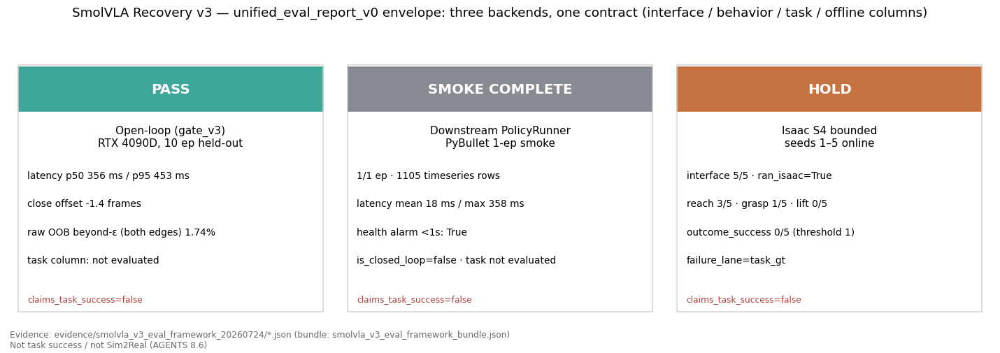
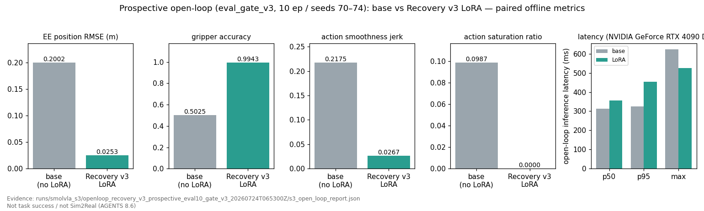
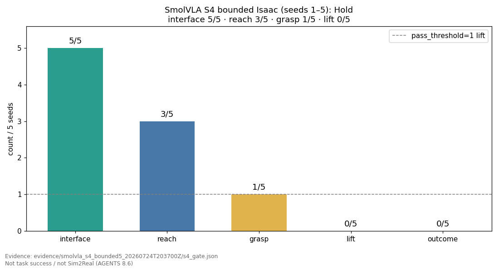
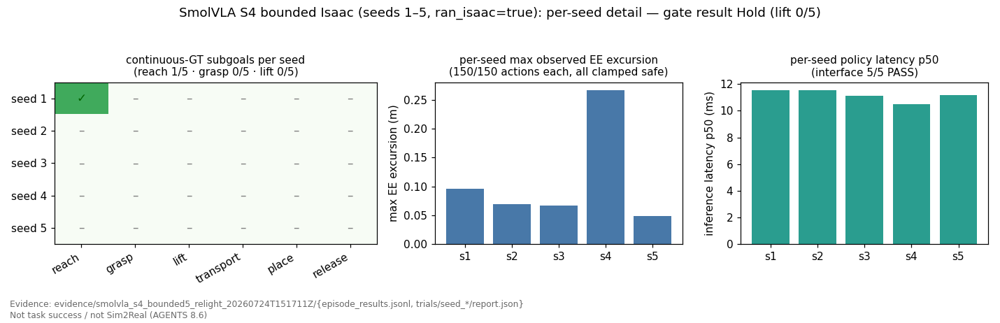
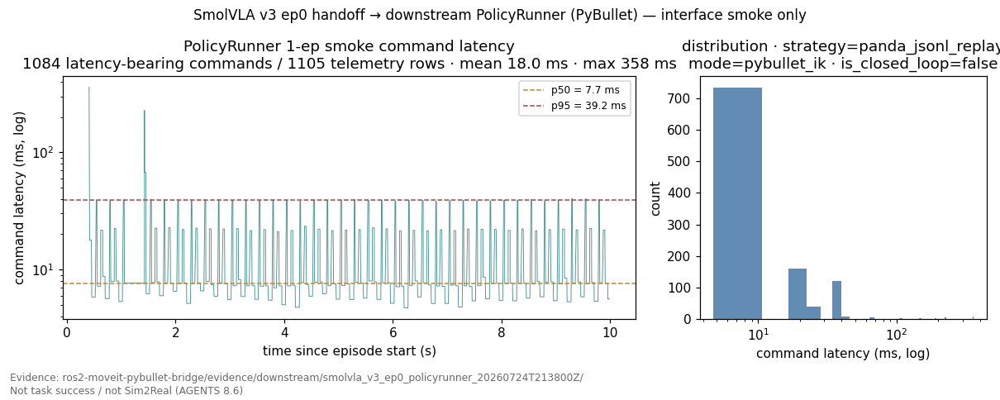

# 具身策略评测框架 — 详细事实底稿

**冻结日期**：2026-07-27（边界冻结见 [BOUNDARY_FREEZE.md](BOUNDARY_FREEZE.md)）；Policy Runtime M0–M6 事实更新：2026-07-26
**基线 commit**：`d7ba9d53e9df94c0c4565ba31114cf9b1511a878`（`main`，中游 `robot-arm-episode-data-lab`）
**本文定位**：详细事实底稿（对外叙事母版见 [PORTFOLIO_REFERENCE.md](PORTFOLIO_REFERENCE.md)，完整导航见 [README.md](README.md)）。所有数字均可回溯到机器可读产物（JSON / YAML lock / SHA256 / manifest）。
**诚实边界（全文有效）**：**Not task success / Not Sim2Real / Not real robot**。open-loop Pass、interface Pass、`ran_isaac=true`、PolicyRunner smoke 完成，都不是任务成功、不是在线自主抓取、不是 Sim2Real、不是真机部署。所有评测产物 `claims_task_success=false`。

---

## 1. 项目一句话定位

> **具身策略数据治理与分层验证框架**——以三仓数据链（采集 → 契约 → release → 训练 → handoff）为基础，Policy Runtime、Risk、HOC 作为**验证配套**（非并列产品线），在同一套 Panda 闭环上为多个策略候选建立可复现、可审计、防包装的判定链路。

这不是一个「训练出能抓取的策略」的项目，而是一个**数据治理 + 分层验证工程**项目：在每一层明确「这一层能证明什么、不能证明什么」。下游 `PolicyRunner` 定位为 **replay harness**（开环重放与接口 smoke），不是在线策略大脑。

项目最有价值的产出是**三次止损判断**，而不是任何一条成功率：

| # | 判断 | 证据 |
|---|---|---|
| 1 | 不把错误 evaluator 的结果当真（recorder 把 gripper command 混作 measured state → 旧结果隔离为 `INVALID_EVALUATOR_V0`） | `docs/EMBODIED_POLICY_EVALUATION_SOP.md`、`evidence/e3_gt_preflight_v1_20260719/preflight_summary.json` |
| 2 | 不把 interface PASS 当任务成功（20/20 动作完成、安全链正常，但 continuous GT overall 0/20） | `evidence/e3_nominal20_home_30ep_gt_v1_20260719/summary.json` |
| 3 | 不把「近黑相机下的 reach 3/5 · grasp 1/5」当部分成功（修光后同 seeds 复测降为 reach 1/5 · grasp 0/5，证明前者是失明 + 阈值假象） | `evidence/smolvla_s4_bounded5_relight_20260724T151711Z/s4_gate.json`、`docs/SMOLVLA_S4_LIFT0_OFFLINE_ATTRIBUTION.md` §6 |

---

## 2. 系统架构与三仓边界

| 系统图 | 怎么读 | 不能证明 |
|---|---|---|
|  | 中游负责合同和证据；上游把观测变成 chunk 并通过 Execution Adapter 做 TTL、sequence、限幅与 Hold/E-stop；下游负责 Risk→Safety 与 Brain / Execution / Safety / Task GT 四泳道关联。红色回路是安全反馈，不是 Task GT。 | 不能由这张架构图声称 SmolVLA 已切到 authoritative、在线抓取成功或完成 Sim2Real。 |

| 仓库 | 模块所有权（冻结） | 明确不负责 | 权威输出 |
|---|---|---|---|
| 上游 `ros2-arm-teleoperation-suite` | **在线 inference**、**scheduler**（chunk/replan）、**execution adapter**（TTL/限幅/Hold）、**task GT**、采集与控制栈 | 中游合同/数据/训练；下游 replay harness | `episode_*/train/` + `meta.json`、runtime outcome、`s4_gate.json` |
| **中游（本仓）** | **合同**、**数据**、**训练**、**离线评测**、**handoff** | ROS 2 实时控制、物理执行、重新推导上游 physical success | release manifest（immutable 须带 SHA）、checkpoint + audit、`s3_open_loop_report.json`、`unified_eval_report_v0` |
| 下游 `ros2-moveit-pybullet-bridge` | **replay**（`PolicyRunner` = replay harness）、**monitor**、**risk**、**HOC** | 采集、清洗、训练、任务真值改判、真机驱动 | `benchmark_summary.json`、offline risk readiness、五轨 trace bundle |

**硬边界**：中游 `filter_scope=training_split_only`，不得从 `observation.object_pose` 重新推导 lift/place 成败；下游 risk R-level 不得覆盖上游 GT 或改写 `failure_lane`。

### 2.1 Policy Runtime M0–M6 收口

| 终点 | 已实现 | 当前不能升级的结论 |
|---|---|---|
| Observable（M0–M3） | 跨仓合同、native chunk10/K5、shadow adapter、validity、四泳道 HOC、live Task GT mirror | HOC 可见不等于小脑已接管 |
| Safety-connected（M4） | R2 Hold、R3 E-stop、受门禁的 `authoritative` 可选路径 | 默认仍为 `legacy`，未在线切换 SmolVLA |
| Auditable（M5） | 五轨 trace bundle、absolute EEF8 replay、严格 SHA/sequence/parent 关联 | replay 明确 `is_closed_loop=false` |
| Wired（M6） | mock PolicyBackend 经真实 ROS/DDS 得到 `EXECUTED → HELD → ESTOPPED`；HOC `issues=[]` | 未加载模型、未启动 PyBullet/Isaac、不证明任务成功 |

当前四泳道前端截图见下游 `docs/assets/hoc-runtime-four-lane-dashboard.png`；它参考诊断 DAG 与
state-transition/status-history 与工业 HMI display hierarchy 模式，用可复现的 Playwright fixture
展示一屏一级态势：最终裁决、原因链、RUN→E_STOP→HOLD 四泳道时间线、风险雷达、分布与
跟踪误差；相机、资源和历史证据进入 Diagnostics / Historical 标签页。常态使用中性石墨灰，
琥珀/红色只强调异常。它不冒充 live wiring 截图。可复核运行结果见
[POLICY_RUNTIME_M6_WIRING_RESULTS.md](POLICY_RUNTIME_M6_WIRING_RESULTS.md)。

---

## 3. 评测框架：六层分栏 + 三后端一信封

每一层只回答自己的问题，禁止跨层升级结论。

| 层级 | 权威产物 | 能证明 | **不能**证明 |
|---|---|---|---|
| Data | inspection report、release manifest、`splits.json` | schema、episode split、上游 gate 已执行、train/eval 无泄漏 | 策略成功 |
| Offline | `metrics.json`、`s3_open_loop_report.json` | loss、EE RMSE、gripper balanced accuracy、闭合时序 | 抓取成功率 |
| Interface | policy `report.json` | checkpoint 加载、动作完成度、限幅/护栏状态、latency | 物体被抓起 |
| Behavior | EE / gripper 轨迹与标签 | 接近、降 Z、XY 对准、闭合时序、走廊退化 | lift / place |
| Task | continuous simulator GT | reach / grasp / lift / place | 真机或 Sim2Real |
| System | GPU/CPU、时延、QoS、cleanup | 本轮运行健康 | hard real-time |

**统一信封 `unified_eval_report_v0`**：三个后端映射到同一契约，`claims_task_success` / `claims_sim2real` / `claims_online_autonomous_grasp` **恒为 false**，`failure_lane` 对齐 Policy Adapter。

| Backend | 源证据 | 主分栏 | 当前判定 |
|---|---|---|---|
| `smolvla_open_loop` | `runs/smolvla_s3/openloop_recovery_v3_prospective_eval10_gate_v3_20260724T065300Z/` | offline + behavior | `eval_gate_v3` **Pass** |
| `downstream_policy_runner` | `evidence/downstream/smolvla_v3_ep0_benchmark_summary.json` | interface | 1-ep smoke complete（`is_closed_loop=false`） |
| `isaac_s4_bounded` | `evidence/smolvla_s4_bounded5_relight_20260724T151711Z/s4_gate.json` | interface + task funnel | **Hold**（lift 0/5） |

信封产物：`evidence/smolvla_v3_eval_framework_relight_20260725/`（schema：`evaluation/schemas/unified_eval_report.schema.json`；normalizer：`evaluation/unified_report.py`）。

| 评测总览 | 怎么读 | 不能证明 |
|---|---|---|
|  | 三列是三个独立后端：open-loop 只判离线行为，PolicyRunner 只判接口复用，Isaac S4 才有 task GT。当前组合结论是 **Pass / Smoke complete / Hold**，不能跨列互相替代。 | open-loop Pass 和 interface smoke 都不能覆盖 S4 的 lift 0/5，也不能证明任务成功。 |

---

## 4. 当前结论（Pass / Hold / No-Go 全表）

### 4.0 小样本计数的统计解释（不可外推）

核心比率用 **Wilson 95% CI**（实现：`evaluation/stats_interpretation.py`）描述点估计不确定度，**不是**扩种子授权：

| 计数 | 点估计 | Wilson 95% CI | 不可外推到 |
|---|---|---|---|
| S4 lift **0/5**（relight 权威） | 0.000 | **[0.000, 0.435]** | 更大 N、OOD、Sim2Real、任务成功 |
| oracle lift **5/5**（v2b） | 1.000 | **[0.566, 1.000]** | learned-policy 成功或真机 |
| ACT E3 overall **0/20** | 0.000 | **[0.000, 0.161]** | 「再采一点就会过」 |

`0/5` 的上界仍可到 ~43%，因此 **Hold + 停止扩种子** 是流程决策，不是「已证明永远为 0」。`5/5` 的下界 ~57%，只证明**该协议下物理链可过**，不等于策略成功率。

### 4.1 候选路线状态

| 候选 | 当前状态 | 关键事实 | 权威证据 |
|---|---|---|---|
| **SmolVLA Recovery v3** | **open-loop Pass（gate_v3）/ 有界 Isaac S4 Hold** | prospective EE RMSE `0.0253 m`、grip BA `0.9943`；S4 interface 5/5、lift **0/5**（Wilson 95% CI 见 §4.0） | `runs/smolvla_s3/openloop_recovery_v3_prospective_eval10_gate_v3_20260724T065300Z/`、`evidence/smolvla_s4_bounded5_relight_20260724T151711Z/` |
| SmolVLA S3 v1 / v2 | **Historical Hold** | v1 全帧 EE `0.0547 m`、grip BA `0.7128`、闭合提前 65 帧；v2 late-close 退化且事后审计发现 split 未过滤 | `runs/smolvla_s3/openloop_full_stride1_20260723T055500Z/`、`runs/smolvla_s3/openloop_v2_lateclose_full_stride1_20260723T161000Z/` |
| **ACT** | **Frozen diagnostic baseline** | E3 nominal20 overall **0/20**（reach 10/20，Wilson 95% CI `[0.000, 0.161]`）；close→lift 定向模型 5-seed lift **0/5**、5/5 `HOME_NO_CLOSE` | `evidence/e3_nominal20_home_30ep_gt_v1_20260719/summary.json`、`evidence/e3p6_closelift40_5seed_home_20260720/smoke5_gate.json` |
| **Scripted oracle** | **Active system reference（系统上界）** | v1 lift 0/5 → 修 pick 高度 / PD 夹爪 / 摩擦 / GT 阈值 → v2b lift **5/5**、`gate_pass=true` | `evidence/e3p5_isaac_scripted_oracle_5x_lift_v2b_20260720/oracle_gate.json` |
| **LingBot-VLA 2.0** | **Closed / Archived** | V0/V0.5 兼容性与 Panda 动作契约审计完成；本机 V1 资源 No-Go；未下 6B 权重、未训练 | `docs/VLA_GATE_V0_COMPATIBILITY_AUDIT.md`、`docs/VLA_GATE_V1_PREFLIGHT.md` |
| MLP BC（历史基线） | Historical baseline | 30 ep / 71,737 frames；test normalized MSE `0.2350` vs 同 split 线性 `0.5800` | `training/reports/panda_mlp_bc/mlp_metrics.json`、`docs/portfolio/linear_same_split_metrics.json` |

状态标签语义：**路线关闭 ≠ 删除审计**；**Hold ≠ Pass**；**活动候选 ≠ 已适配/已成功**；**失败诊断基线 ≠ 可部署策略**；**系统上界参考 ≠ learned-policy 成功**。

### 4.2 SmolVLA Recovery v3 — canonical open-loop **Pass**

评测协议（冻结）：canonical = **完整 episode 全帧 `stride=1`** + **`canonical_first_action`** + **每条专家观测独立 reset**；prospective eval-only 数据与训练集、与阈值设计过程**零重叠**（seeds 70–74 是为 v3 新采的，因为 v2 的 prospective 10 条已被 v3 阈值设计污染）。

| 指标 | base（无 LoRA） | Recovery v3 LoRA | Gate v3 判定 |
|---|---|---|---|
| EE position RMSE | `0.2001752 m` | **`0.0253369 m`** | Pass（≤0.100） |
| gripper balanced accuracy | `0.5025359` | **`0.9942844`** | Pass（≥0.70） |
| 闭合时序偏移（signed） | — | `-1.4` 帧 / `-0.140 s` | Pass |
| close-edge beyond-ε 比例 | — | **`0.386%`** | Pass（≤1%） |
| gripper clip 调整 MAE | — | `0.0069196` | 诊断 |
| clip 分类变化 / 时序变化 | — | **0 / 0** | 执行不变式 Pass |
| latency p50 / p95（RTX 4090 D） | — | `356.3 ms` / `452.8 ms` | 记录项 |
| 相对 S2 基线 EE 改善 | — | **`90.73%`**（S2 = `0.2734164 m`） | 记录项 |

- 覆盖：10 episodes / **2,593 帧** / seeds 70–74（P0–P4 各 2 条）；`full_episode_coverage=true`、`prospective_eval_eligible=true`。
- `gate_decision=pass`，`pass_failures=[]`，`checkpoint_config_verified=true`。
- 阈值冻结：`configs/smolvla_s3/eval_gate_v3.lock.json`，`gate_sha256=37325a1fee3cce2e14361071d39f2a0a5b767044e25472114fcb8684c495d46f`，`frozen_at_utc=2026-07-24T06:25:00Z`，`authorized_isaac=false`（gate 本身不授权 Isaac）。
- 训练身份：`runs/smolvla_s3/recovery_v3_lora_20260723T125632Z/`，5,705 steps、train-only 36 episodes、`state[15]` + scene-only camera + `action[8]`、chunk10 / `n_action_steps=5`、官方精确 PEFT 正则（r=64 / α=64 / `full_training_modules=[]`）；`checkpoint_config_audit.json.passed=true`；adapter SHA256 `4cfcc46e3270cd0b4fe267e36c87c823e1bb9a473742ac99f58652791910d2f7`。

**Pass 的确切含义**：在**专家状态分布上**的 **first-action 离线评测**通过。它不代表闭环会闭爪、不代表任务成功、不代表泛化保证。

| 离线结果图 | 怎么读 | 不能证明 |
|---|---|---|
|  | Recovery v3 的 prospective EE RMSE 为 `0.0253 m`，相对 S2 基线改善约 `90.7%`；这是冻结 gate_v3 下的 first-action 离线结果。 | 不能推出闭环轨迹稳定或抓取成功。 |
|  | 同一 prospective 数据上，LoRA 改善 EE、夹爪、平滑度和饱和指标；最右栏单独报告 base/LoRA 推理 latency，不能与精度指标混成单一分数。 | paired offline 指标不等于自主 rollout 表现。 |

### 4.3 `queued_diagnostic` 的边界

`queued_diagnostic` 会消费 action-chunk 队列，**只作诊断，永不具备 canonical Gate Pass 资格**（`recovery_decisions.yaml: local_inference_contract.queued_diagnostic_gate_eligible=false`）。它与 `canonical_first_action` 的数字**不得混写**：v3 的 Pass 全部来自 canonical first-action；`openloop_recovery_v3_k5_20260723T151853Z_retry1` 的 queued 结果是 Hold 且 gate-ineligible。**异步 double-buffer**：offline GPU bench 已实测（sync deadline miss 20% → async 0.67%；见 [QUEUE_RUNTIME_BENCH_RESULTS.md](QUEUE_RUNTIME_BENCH_RESULTS.md)）；上游在线节点**仍未接线**（`async_double_buffer_runtime_implemented=false` / `async_double_buffer_online_wired=false`）。

### 4.4 有界 Isaac S4 — **Hold**

runtime 合同采用**中游权威合同 + 上游 SHA 锁定镜像**（上游包内字节相同镜像 + 启动 assert）：`control_rate=10 Hz`、`chunk_size=10`、`execute_K=5`、`replan_period=0.5 s`、`gripper_command=clip(raw,0,1)`、scene-only camera、`observation.state[15]`、clamp + E-stop、**bounded seeds 1–5**。当前 scheduler 为同步 replan；async double-buffer 只有离线 bench，在线节点仍未接线。

| 项 | 首轮（近黑场景，**Superseded**） | **修光后权威** |
|---|---|---|
| Evidence | `evidence/smolvla_s4_bounded5_20260724T203700Z/` | `evidence/smolvla_s4_bounded5_relight_20260724T151711Z/` |
| policy 输入 JPEG 均值 | ≈`0.3`（近黑） | ≈`154` |
| interface | 5/5 PASS | **5/5 PASS** |
| reach / grasp / lift | 3/5 · 1/5 · **0/5** | **1/5 · 0/5 · 0/5** |
| outcome_success（threshold 1） | 0/5 | **0/5** |
| `gate_pass` / `ran_isaac` | false / true | **false / true** |
| 典型 failure | `lift_failed delta≈0`（半闭被 `close_max=0.70` 记作 closed） | **`gripper never closed below 0.700`** |

首轮的 reach 3/5 · grasp 1/5 **不是**「修光前部分成功」，而是失明走廊的几何重叠 + 阈值口径放大；修光后同 seeds 复测证伪了它。因此**权威 S4 = relight run**，首轮保留为 `Superseded / historical` 证据。

| 闭环结果图 | 怎么读 | 不能证明 |
|---|---|---|
|  | 漏斗从 interface 5/5 降到 reach 1/5，再到 grasp/lift 0/5；虚线只表示任务门槛要求至少一次 lift，最终判定为 Hold。 | interface 5/5 不能写成“部分抓取成功”。 |
|  | 左侧按 seed 展示连续 GT 子目标，中间和右侧展示动作幅度与推理 latency，用来区分任务失败与执行接口异常。 | 5 个有界 seed 不支持泛化率、Sim2Real 或真机结论。 |

### 4.5 下游复用（interface smoke）

中游 open-loop 预测导出为中立 `predicted_actions.jsonl` handoff → 下游 `panda_jsonl_replay` + `pybullet_ik` + `--launch-stack`：1/1 episode completed、1,105 telemetry rows，其中 1,084 条含 latency 值；mean latency `18.006 ms`、max `357.669 ms`、`is_closed_loop=false`。证明的是 handoff 契约与执行接口可复用，**不是**闭环抓取。

| 下游复用图 | 怎么读 | 不能证明 |
|---|---|---|
|  | 左侧是 1,084 条 latency-bearing command 的时序，右侧是分布；CSV 共 1,105 telemetry rows，差值来自 latency 为空的遥测行。 | 这是 `is_closed_loop=false` 的接口 smoke，不是 PyBullet 自主抓取。 |

另有下游 offline `RiskAggregator` 六维 readiness 对照（`evidence/downstream/smolvla_v3_ep0_risk_offline_20260724T215900Z.json`），硬约束 `use_as_task_go_no_go=false`、`overrides_failure_lane=false`。

---

## 5. Badcase 归因与工程决策

分层归因详见 **[BADCASE_ATTRIBUTION_SUMMARY.md](BADCASE_ATTRIBUTION_SUMMARY.md)**。一句话链条：

> **Data 层无泄漏 → Interface 层 5/5 通过 → Offline first-action Pass → 在线 Task 层 lift 0/5**，且已排除物理链（oracle 5/5）、执行链（150/150 未限幅、无 E-stop）、`state[15]` 编码（home 关节 L2 `0.006`、四元数 L2 `6.8e-6`）与相机失明（修光后 JPEG ≈154 仍 Hold）。训练域 MuJoCo 对照（提前停止，仅 seed1 完整 GT）在 JPEG≈50 的训练域视觉下同样 `gripper never closed below 0.700`（`grip_min≈0.976`）。

因此**当前倾向的主因是闭环 BC / covariate shift**（教师强迫观测下的 first-action 精度不迁移到自主闭环），而不是 MuJoCo→Isaac 外观域差。这是**有方向的诊断，不是已完全证明的唯一根因**：MuJoCo 对照是人工提前停止的 1-seed 结果，不是完整 5-seed gate。

---

## 6. 诚实边界与后续路线

### 6.1 当前证据**不能**支持的声明

| 声明 | 结论 |
|---|---|
| 已完成真实机械臂部署 | 证据不足，无法确认（`not_supported`） |
| 已完成真实 Sim2Real | 只能写 Sim2Sim / Sim2Real-readiness |
| 稳定在线自主抓取 | 已有 rollout，但 ACT 0/20、SmolVLA S4 lift 0/5 → 不能声称 |
| open-loop Pass = 任务成功 | 禁止；Pass 仅是专家分布上的 first-action 离线判定 |
| `ran_isaac=true` = Sim2Real / 真机 | 禁止 |
| interface Pass / reach 计数 = 部分抓取成功 | 禁止（4.4 已证伪） |
| `queued_diagnostic` 可判 canonical Pass | 禁止（gate-ineligible） |
| 离线 loss 提升 = 任务成功率提升 | 证据不足 |

### 6.2 禁止话术 / 正确话术

| 禁止 | 应该说 |
|---|---|
| 「SmolVLA 已完成抓取 / 已 Sim2Real」 | 「open-loop 门禁过了，有界 Isaac 仍 Hold，lift 0/5」 |
| 「改门槛是为了刷过」 | 「按 `clip(raw,0,1)` 执行语义把开爪边过冲降级为诊断；关爪边 beyond-ε 与分类/时序不变式仍是硬门禁，历史 v2 Hold 不改判」 |
| 「Isaac 抓不起来」 | 「scripted oracle lift 5/5 证明名义物理链可用，瓶颈在 learned policy 的闭环行为」 |

### 6.3 后续路线

完整登记见 **[../FUTURE_WORK_ROADMAP.md](../FUTURE_WORK_ROADMAP.md)**：P0 已完成（事实冻结 + 作品集收口）；**P1 / P2 仅登记，不执行**，任何扩种子 / 第三次 data-fix / 重训 / 真机都需要显式人工批准与外部 GPU。

「open-loop + 扰动」已于 2026-07-25 执行（diagnostic）：clean canonical 与 queued K5 **未改**；跑了 **6 阶段锚点 ×4 条件 = 240** 与 **close±10 ×4 条件 = 840**（共 1080 次 H=1），**未**做 H=5/H=10。产物 `runs/smolvla_s3/openloop_perturbation_20260725T045044Z/`；摘要 [OPENLOOP_PERTURBATION_RESULTS.md](OPENLOOP_PERTURBATION_RESULTS.md)。协议见 [../SMOLVLA_OPENLOOP_PERTURBATION_DESIGN.md](../SMOLVLA_OPENLOOP_PERTURBATION_DESIGN.md)。

---

## 7. 复现与追溯

```bash
cd /home/ina/robot-sim-lab/robot-arm-episode-data-lab

# 1) 项目事实检索
python3 -m project_knowledge.cli query --mode auto --no-llm \
  --query "SmolVLA Recovery v3 open-loop Pass 与有界 Isaac S4 Hold 的当前结论"

# 2) CPU 契约与文档一致性回归（不含训练 / Isaac）
PYTEST_DISABLE_PLUGIN_AUTOLOAD=1 pytest -q

# 3) 统一评测信封（只 remap 已有 JSON，不发明指标）
python3 training/scripts/normalize_unified_eval_report.py \
  --open-loop runs/smolvla_s3/openloop_recovery_v3_prospective_eval10_gate_v3_20260724T065300Z/s3_open_loop_summary.json \
  --policy-runner evidence/downstream/smolvla_v3_ep0_benchmark_summary.json \
  --isaac-s4 evidence/smolvla_s4_bounded5_relight_20260724T151711Z/s4_gate.json \
  --risk-readiness evidence/downstream/smolvla_v3_ep0_risk_offline_20260724T215900Z.json \
  --out-dir evidence/smolvla_v3_eval_framework_relight_20260725 \
  --bundle-out evidence/smolvla_v3_eval_framework_relight_20260725/smolvla_v3_eval_framework_bundle.json \
  --bundle-id smolvla_v3_eval_framework_relight_20260725

# 4) 全部作品集图表（读证据，不重评测）
python3 scripts/generate_smolvla_v3_portfolio_figures.py
```

## 8. 文档导航

**对外主导航（五份）**：见 [README.md](README.md) 与 [BOUNDARY_FREEZE.md](BOUNDARY_FREEZE.md)。

| 入口 | 用途 |
|---|---|
| [README.md](README.md) | 压缩作品集导航 |
| [BOUNDARY_FREEZE.md](BOUNDARY_FREEZE.md) | 定位、模块所有权、release 术语、证据包、提交冻结 |
| [BADCASE_ATTRIBUTION_SUMMARY.md](BADCASE_ATTRIBUTION_SUMMARY.md) | 失败归因案例 |
| [EVIDENCE_INDEX.md](EVIDENCE_INDEX.md) | 证据索引 + 最小公开证据包 |
| [resume_description.md](resume_description.md) | 简历话术 |

**内部审计**（不进主导航）：[THREE_REPO_CANONICAL_FACTS.md](THREE_REPO_CANONICAL_FACTS.md)、[UNIFIED_EVAL_REPORT.md](UNIFIED_EVAL_REPORT.md)、[SMOLVLA_RECOVERY_V3_PORTFOLIO.md](SMOLVLA_RECOVERY_V3_PORTFOLIO.md)、[../FUTURE_WORK_ROADMAP.md](../FUTURE_WORK_ROADMAP.md)、[../SMOLVLA_V3_EVAL_SOP.md](../SMOLVLA_V3_EVAL_SOP.md)、[../EMBODIED_POLICY_EVALUATION_SOP.md](../EMBODIED_POLICY_EVALUATION_SOP.md) 等 — 见 [docs/README.md](../README.md)。
