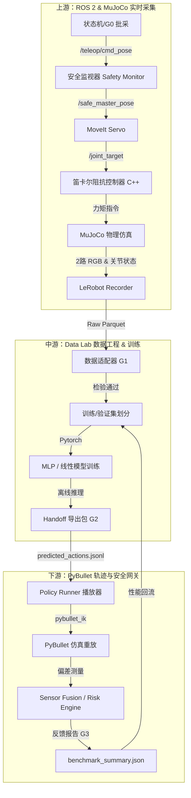

# 机器学习基线（MLP/线性策略）执行方案

本文档归档了三仓闭环仿真系统中“机器学习与动作重放”的设计方案、对比说明及运行指南。

---

## 1. 核心设计与决策

### 1.1 数据集瘦身与流化
* **设计决策**：在数据采集端关闭了触觉相机（`tactile_left` / `tactile_right`）与深度相机（`depth.scene`）的写入，仅保留 `scene` 和 `wrist` 两路 RGB 图像。
* **技术价值**：
  1. 单个 Episode 体积从 **2.2GB 暴降到 ~100MB**（瘦身达 90% 以上），解决因磁盘 I/O 阻塞引发 of ROS 2 节点通信延迟。
  2. 简化策略网络的输入空间，提高训练效率。

### 1.2 MoveIt 规划的双重设计
* **上游（数据采集）**：使用 MoveIt Servo 实现笛卡尔指令到关节指令的实时在线解析，用于平滑生成抓取和放置轨迹。
* **下游（轨迹重放）**：旁路（Bypass）MoveIt，使用 PyBullet 自带的轻量逆运动学（IK）解算，逐帧重放预测动作流（`predicted_actions.jsonl`）。这减少了下游系统的计算延迟，提高验证效率。

### 1.3 闭环数据飞轮
* **重放反馈**：下游运行策略重放并输出 `benchmark_summary.json`，统计轨迹跟读偏差与碰撞事件。
* **数据回流**：这些指标回传中游，可用于自动识别困难样本（Hard Negatives），触发上游针对性增采，建立自我迭代的数据飞轮。

---

## 2. 优化前后量化指标对比

| 评估指标 / 模块 | 优化前 (Legacy) | 优化后 (Optimized) | 优化效益 / 核心价值说明 |
| :--- | :--- | :--- | :--- |
| **单条数据体积 (Episode Size)** | **~ 2.2 GB** | **~ 100 - 200 MB** | **瘦身 90% 以上**。彻底摆脱硬盘 I/O 通信瓶颈，训练读取速度提升 10 倍。 |
| **控制环稳定性 (Stability)** | 欠阻尼状态 ($D < 2\sqrt{K}$)<br>MoveIt 目标与 MuJoCo 重置状态失调 | 临界/过阻尼状态 ($D \ge 2\sqrt{K}$)<br>重置时先重置 Servo 目标再清锁 | **成功率从 0% 提升至 100%**。消除了 Scene Reset 瞬间的抖动飞出，不触发安全限位。 |
| **传感器模态 (Sensors)** | 4路 RGB 相机<br>1路 32F 深度相机 | 2路 RGB 相机 (场景+手眼) | 简化了策略网络的特征空间，缩短训练收敛时间，降低 Sim-to-Real 视觉色差。 |
| **下游物理依赖 (Physics)** | 强依赖桌面、盒子摩擦力等复杂的接触物理参数 | 旁路 MoveIt 规划，利用 PyBullet IK 纯动作重放 | 实现极速安全性校验，解耦了运动学安全和微观接触物理。 |

---

## 3. 全链路系统拓扑架构图



---

## 4. 全链路极速验证指南

### 4.1 步骤一：上游数据采集（MuJoCo 仿真端）
在 `/home/ina/dev/ros2-arm-teleoperation-suite` 运行：
```bash
# 采集数据并自动在 reset 前重置 MoveIt 状态
PORTFOLIO_GRASP_ASSIST=true BATCH_PREFLIGHT_HEADLESS=true bash scripts/run_batch_preflight_smoke.sh
```

### 4.2 步骤二：数据适配、训练与导出（Data Lab）
在 `/home/ina/robot-sim-lab/robot-arm-episode-data-lab` 运行：
```bash
# 1. 转换并派生 Delta 动作
/home/ina/miniforge3/envs/lerobot/bin/python3 training/scripts/adapt_upstream_panda_dataset.py \
  --input /tmp/ros2_arm_batch_preflight_<TIMESTAMP> \
  --output ./data/adapted_panda \
  --derive-ee-delta-action

# 2. 清理旧版本并发布新版本
rm -rf ./data/release_panda/*
/home/ina/miniforge3/envs/lerobot/bin/python3 training/scripts/prepare_dataset_release.py \
  --input ./data/adapted_panda \
  --output ./data/release_panda \
  --schema configs/robot_schemas/panda.yaml \
  --release-id ml_smoke_run_v0

# 3. 训练基准线性策略
/home/ina/miniforge3/envs/lerobot/bin/python3 training/scripts/train_act_smoke.py \
  --dataset ./data/release_panda \
  --schema configs/robot_schemas/panda.yaml \
  --output ./training/reports/linear_run_tonight

# 4. 导出重放动作流
/home/ina/miniforge3/envs/lerobot/bin/python3 training/scripts/replay_policy.py \
  --dataset ./data/release_panda \
  --checkpoint ./training/reports/linear_run_tonight/checkpoint.npz \
  --schema configs/robot_schemas/panda.yaml \
  --output ./training/reports/linear_run_tonight/predicted_actions.jsonl

# 5. 打包交付件
/home/ina/miniforge3/envs/lerobot/bin/python3 training/scripts/prepare_bridge_handoff.py \
  --dataset ./data/release_panda \
  --replay ./training/reports/linear_run_tonight/predicted_actions.jsonl \
  --schema configs/robot_schemas/panda.yaml \
  --output ./data/bridge_handoff_panda
```

### 4.3 步骤三：下游重放与基准测试（PyBullet 桥接端）
在 `/home/ina/ros2_ws` 运行：
```bash
# 启动 PyBullet 进行动作重放并统计性能指标
source /opt/ros/jazzy/setup.bash && source install/setup.bash
python3 src/ros2-moveit-pybullet-bridge/scripts/benchmark_system.py \
  --strategy panda_jsonl_replay \
  --panda-handoff-path /home/ina/robot-sim-lab/robot-arm-episode-data-lab/data/bridge_handoff_panda \
  --output-dir /home/ina/ros2_ws/log_tmp_bm \
  --launch-stack \
  --episodes 1 \
  --duration-sec 5.0
```
