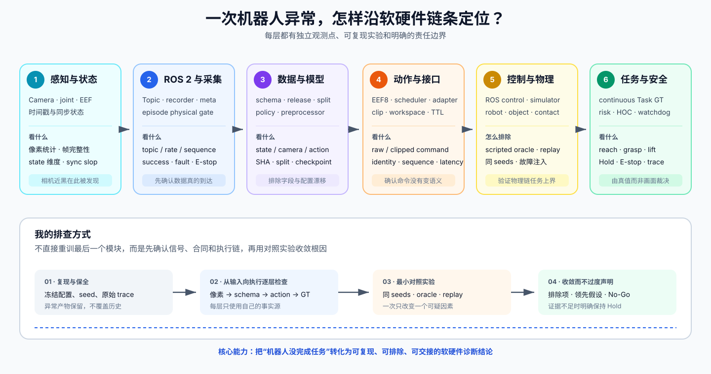
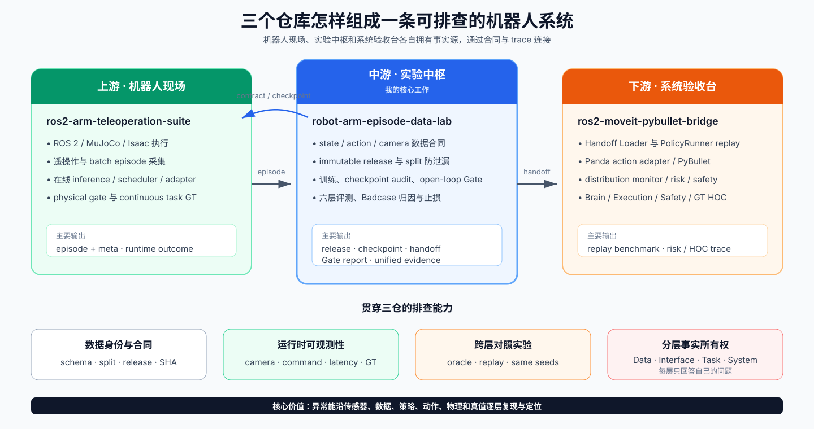
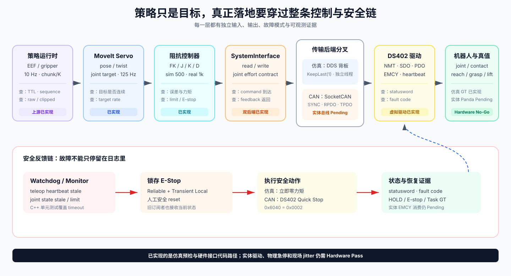
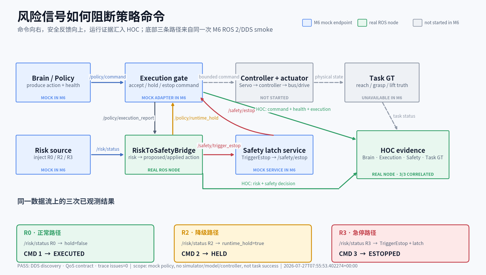
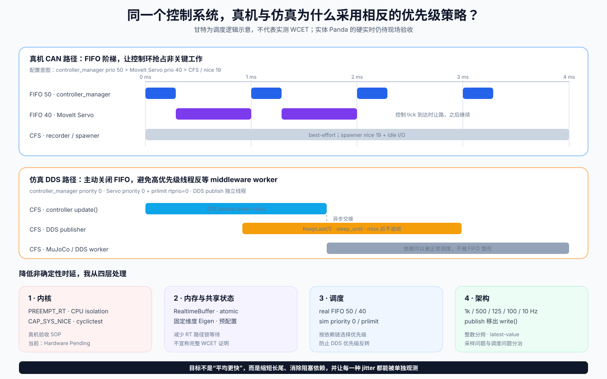

# 我把一个机器人学习 demo，做成了可排查、可验证的软硬件系统

> Panda 策略、实时控制与分层验证系统 · 独立项目 · ROS 2 / ros2_control / CANopen / MuJoCo / Isaac / LeRobot

机器人任务失败时，问题可能来自相机和时序、ROS 2 通信、数据字段、模型输入，也可能出在控制器、`ros2_control` 接口、实时调度、总线、驱动器、EMCY、看门狗或任务判定。只盯着 loss 或最终画面，很难知道应该改哪一层。

我为 Panda 搭建了一条贯穿三个仓库的软硬件验证链，让一次模糊的“机械臂没有完成任务”，可以沿着 **感知 → 数据 → 模型 → 运动生成 → 控制器 → 硬件接口 → 总线/驱动 → 物理真值**逐层复现和排除。

我的核心工作不是证明某个模型“成功”，而是建立观测点、合同和对照实验，快速判断故障位于传感器、软件接口、策略行为还是物理执行层，并给出可复核的证据。

---

## 30 秒看懂这个项目

我把一个容易停留在单次演示的抓取实验，做成了可追溯的三仓诊断与验证系统：

- 上游负责让 Panda 运动、采集示教，并给出 reach / grasp / lift 的物理真值；
- 中游负责把数据做成有版本、有 split、有指纹的训练 release，训练策略并进行独立离线评测；
- 下游负责加载交付物、重放动作、监控漂移与风险。

我主要承担跨仓边界设计与中游实现，同时把运行端的相机、动作、Task GT 和风险证据接入同一套分析口径。最终形成的不是一个只能观看的 demo，而是一条能够回答“输入是否正确、命令是否到达、执行是否生效、任务是否真的完成”的排查链。

## 我做了什么

**给软硬件链条加观测点。** 我把相机帧、state、原始/裁剪后动作、sequence、运行结果和 continuous Task GT 分开记录，使问题能从像素一路追到物体是否真的被抬起。

**冻结跨模块接口。** 我固定 Panda 的 state、camera、action 与 runtime 语义，用 schema、immutable release、SHA lock 和 checkpoint audit 防止训练端、预处理器和执行端各自理解不同。

**用对照实验缩小责任层。** 我使用 scripted oracle、handoff replay、同 seeds 复测和故障注入，依次检查传感器、接口、动作限幅、物理链与闭环策略，而不是直接把所有异常归因给模型。

**让每类证据只回答一个问题。** Data、Offline、Interface、Behavior、Task 和 System 六层分别报告；系统健康不代表任务成功，模型误差改善也不能替代物理真值。

**把实时性问题拆开处理。** 我不把所有“抖动”都归因于控制频率：采样混叠与拍频用多速率整数阶梯处理，OS 调度与 DDS 阻塞则通过真机/仿真两套优先级策略和线程隔离处理。

## 系统如何工作

三个仓库不是三个并列 demo，而是一条有事实所有权的数据与验证链：

1. `ros2-arm-teleoperation-suite` 产生专家 episode，负责 ROS 2 控制、仿真交互和连续任务真值。
2. `robot-arm-episode-data-lab` 负责 schema、release、训练、open-loop Gate、handoff 与 Badcase 归因。
3. `ros2-moveit-pybullet-bridge` 消费 handoff，负责 replay、分布监控、风险与运行证据。

最重要的边界是：**物理成功只能由运行时 Task GT 给出。** 中游不能从 object pose 重新解释“抓取成功”，下游的 risk 健康也不能覆盖 task failure。

## 策略以下，还有一整条控制与安全链

策略只产生目标，机器人能否稳定执行还取决于后面的每一层：MoveIt Servo 生成关节目标，笛卡尔阻抗控制器计算力矩，`ros2_control SystemInterface` 负责读写，仿真通过 DDS 背板进入 MuJoCo，CAN 路径则通过 SocketCAN、RPDO/TPDO 和 DS402 状态机连接驱动器。

我在项目中建立了几条关键的故障闭环：

- teleop heartbeat 或 joint state 变 stale，C++ watchdog 锁存 E-Stop；
- E-Stop 在仿真侧立即将输出力矩置零，在 CAN 路径下发 DS402 Quick Stop；
- 虚拟伺服驱动实现 DS402 上电、Quick Stop、Fault Reset、heartbeat 和 EMCY 故障注入；
- 下游 replay watchdog 在活动轨迹超时后清空旧轨迹并切到当前位置 HOLD。

这张图要回答的是“风险怎样真的阻断一条策略命令”。上方是前向执行链：Brain 产生 `/policy/command`，Execution gate 决定接受、HOLD 或 ESTOP；Controller / actuator 和 Task GT 属于完整系统的后半段。下方是反向安全链：`/risk/status` 进入 `RiskToSafetyBridge`，R2 通过 `/policy/runtime_hold` 回到执行门，R3 通过 `/safety/trigger_estop` 锁存后再以 `/safety/estop` 反馈。HOC 只是旁路订阅这些事件并按 sequence / trace ID 关联证据，不参与裁决。

颜色直接标出本次证据边界：蓝色是 M6 mock 端点，绿色是真实运行的 ROS 节点，灰色是没有启动的控制器、执行器与 Task GT。底部三条结果才是本次观测事实：`R0 → EXECUTED`、`R2 → HELD`、`R3 → ESTOPPED`。因此它证明 ROS 2/DDS 接线、风险反馈和裁决链按合同工作，但不证明物理力矩已经归零或任务成功。机器可读摘要与来源 SHA 见 [M6 公开证据](public_evidence/m6_wiring_20260727/README.md)。

这里也保留一条重要边界：**虚拟 DS402/EMCY 与 SocketCAN 代码路径已经实现，实体驱动器的 EMCY 接收闭环、总线 Bus-Off、控制柜和物理急停验收仍是 Hardware Pending。**

## 同一套实时优先级，不能照搬到仿真和真机

我处理非确定性时延时，不只调一个 `thread_priority`，而是从四层同时约束长尾来源：

- **内核层**：为真机路径定义 PREEMPT_RT、实时权限、CPU isolation 与 `cyclictest` 验收；当前属于 Hardware Pending，不冒充现场结果。
- **内存层**：回调与控制环之间使用 `RealtimeBuffer` / atomic latest-value，固定维度控制计算在配置阶段准备，减少 RT 路径的锁等待和共享状态竞争。
- **调度层**：真机用 FIFO 阶梯保证控制环可抢占，仿真则禁用 FIFO，避免高优先级线程等待普通 DDS worker。
- **架构层**：控制计算与 middleware publish 分线程，多速率整数分层，QoS 只保留最新 setpoint，miss 后不 burst catch-up。

目标不是让平均耗时更漂亮，而是减少 page fault、锁竞争、优先级反转、middleware 阻塞和追帧造成的长尾，并让每一类 jitter 都有独立观测点。

真机直连总线时，设计目标是让控制环拥有确定的抢占关系：`controller_manager` 为 FIFO 50，MoveIt Servo 为 FIFO 40，spawner 降到 `nice 19`。控制周期到来时，控制器应优先于运动生成和录制任务。

仿真却刻意反过来：控制写路径跨进程 DDS，若高优先级 FIFO 线程等待普通优先级 middleware worker，就会形成优先级反转。因此仿真将两级实时优先级都设为 `priority=0`，并用 `prlimit --rtprio=0:0` 阻止 MoveIt Servo 自行升为 FIFO；DDS publish 也从 `controller_manager::write()` 移到独立线程，miss 后只保留最新力矩，不做突发追帧。

这不是“仿真不重视实时性”，而是根据依赖链选择调度策略：**真机直连总线时建立 FIFO 阶梯；仿真经过 DDS 时避免高优先级线程反等低优先级依赖。** 当前代码与契约测试已经固定这条分叉，但 PREEMPT_RT、CPU isolation、实体 Panda jitter 仍需现场验收。

### 我怎样处理频率抖动与奈奎斯特问题

系统采用 1000 Hz physics、500 Hz controller/encoder、125 Hz Servo、约 100 Hz observation、10 Hz policy 的多速率阶梯。MoveIt 以 125 Hz 更新目标，其离散流可表达的最高频率不超过 62.5 Hz；500 Hz 控制环对每个目标周期提供 4 次更新，满足采样下界并保留控制余量。更重要的是，各层尽量采用整数频率比，减少非整数周期造成的拍频和相位漂移。

但奈奎斯特只回答“采样够不够快”，不解决 Linux 抢占、DDS 阻塞或回调拥塞。因此我把问题拆成两类：

- **采样/混叠风险**：整数分频、从 physics tick decimate、控制与 encoder 同为 500 Hz；
- **调度/通信 jitter**：FIFO 分叉、DDS publish 隔离、KeepLast(1)、miss 后不 burst catch-up。

这比简单地把所有节点都提高到 1 kHz 更可靠，也更容易定位异常来自采样设计还是运行时调度。

## 一次跨软硬件链条的排查

一次 bounded Isaac 运行出现了不稳定的 reach / grasp 表现。面对“策略为什么没有完成任务”，我没有直接重训，而是从链条最前端开始检查。

| 首轮输入：近黑 | 修光后的同 seeds 复测 |
| --- | --- |
|  |  |
| JPEG 均值约 0.3；策略几乎看不见场景。 | JPEG 均值约 154；任务结果反而下降到 reach 1/5、grasp 0/5、lift 0/5。 |

这次排查沿着软硬件链逐层推进：

- **感知层**：相机遥测发现策略输入近黑，JPEG 均值约 0.3；
- **场景层**：修复光照后用相同 seeds 复测，避免把场景变化和样本变化混在一起；
- **接口层**：核对 150/150 动作均成功进入执行链，未因限幅发生语义改变；
- **物理层**：scripted oracle 在同一环境完成 lift 5/5，说明机器人与仿真物理链具备任务上界；
- **数据/模型层**：检查 `state[15]`、相机、action 与 checkpoint 合同，排除已知输入错配；
- **策略行为层**：剩余证据收敛到闭环 BC / covariate shift 的领先假设，但不把它写成已证明的唯一根因。

我保留首轮产物并标记为 `Superseded`，让修复前后的判断都可追溯。这个案例真正展示的是：我能把“机器人没抓起来”拆成一组软硬件检查点，逐层排除，而不是凭直觉修改最后看到的模块。

| 模型层证据 | 任务层证据 |
| --- | --- |
|  |  |
| 独立数据上的下一步预测已经明显改善，说明训练与模型链路不是“完全没有学到”。 | 连续任务仍暴露闭环行为缺口，说明问题不能停在离线指标层解释。 |

## 这件事体现了什么

- **跨层系统排查**：能从相机、ROS 2 topic、策略动作一路检查到控制器、硬件接口、总线、驱动与 Task GT。
- **实时系统设计**：能区分内核抢占、内存竞争、调度反转、DDS 阻塞和多速率采样，并选择不同治理手段。
- **控制与总线语义**：理解 MoveIt Servo、阻抗力矩、`SystemInterface`、RPDO/TPDO、DS402、EMCY、watchdog 和 E-Stop 的责任边界。
- **数据与 ML 工程**：能处理 schema、split、PEFT、checkpoint audit 与 prospective evaluation，而不把 loss 当任务成功率。
- **验证与归因**：会设计 oracle、故障注入、同 seeds 复测和 No-Go，并明确区分 Sim Precheck 与 Hardware Pass。

如果招聘岗位需要把策略接进真实的机器人软件栈，并能跨控制、通信、驱动和安全链定位问题，这正是我希望承担的工作。

## 想继续了解哪一部分

- 想看完整事实与数字： [最终事实底稿](FINAL_PROJECT_SUMMARY.md)
- 想看失败如何逐层排除： [Badcase 分层归因](BADCASE_ATTRIBUTION_SUMMARY.md)
- 想核对机器可读产物： [最小公开证据包](public_evidence/canonical_v3/README.md)
- 想看三仓代码与职责对应： [三仓权威事实表](THREE_REPO_CANONICAL_FACTS.md)
- 想准备面试表达： [简历与长短话术](resume_description.md)

---

## 技术面试可以从哪里继续

下面不是必须顺序阅读的报告，而是六个可展开的讨论入口。每一项都能从设计取舍追到代码、配置和冻结证据。

<strong>1. 数据如何从 episode 变成可信的模型输入？</strong>

训练线与评测线在进入 evaluator 前保持分离：36 条 train episode 物化为 Recovery release；另采 10 条、2,593 帧 eval-only episode，用于 prospective Gate。它们与训练集、阈值设计数据的 overlap 均为空。

Recovery 合同冻结为：

- `state[15] = joint[7] + ee_pose[7] + gripper[1]`
- 单路 scene camera
- `action[8] = absolute EEF pose[7] + gripper[1]`
- chunk length 10，在线每次执行 K=5

Immutable release 记录 split、逐文件 SHA 和 content fingerprint；checkpoint audit 同时核对 policy 与 preprocessor 的 state、camera、action、chunk/K 和 PEFT。它回答的不是“模型好不好”，而是“训练实际吃了什么，以及运行时是否还在说同一种动作语言”。

适合追问：为什么 non-overwrite 不等于 immutable？怎样发现 split 泄漏？为什么 policy 和 preprocessor 必须一起审计？

<strong>2. 为什么离线指标与连续任务必须分开验证？</strong>

Canonical open-loop 每一帧都重新给定专家观测，只比较当前 first action。它能回答“在专家状态分布上，下一步是否预测正确”，不能回答“模型执行自己的动作后，能否从偏离状态恢复”。

因此评测被拆成六层：

- **Data**：字段、split、图像和轨迹是否健康；
- **Offline**：冻结数据上的预测误差是否过线；
- **Interface**：动作能否加载、映射和下发；
- **Behavior**：闭爪时机、平滑度和饱和是否合理；
- **Task**：reach / grasp / lift 是否由 continuous GT 确认；
- **System**：latency、risk、资源和 watchdog 是否健康。

Recovery v3 的 prospective open-loop 为 EE RMSE 0.0253 m、gripper balanced accuracy 0.9943；bounded Isaac S4 则是 interface 5/5、reach 1/5、grasp 0/5、lift 0/5。两组数字并不矛盾，它们回答的是不同问题。

适合追问：first-action 与 queued diagnostic 的语义差别是什么？为什么 queued 模式永远不能获得 canonical Pass？闭环分布偏移如何设计最小诊断实验？

<strong>3. 三仓为什么这样分，而不是放在一个大仓库？</strong>

拆分依据不是语言或文件数量，而是运行时职责与事实所有权：

- 上游拥有控制、采集、在线策略执行和 Task GT；
- 中游拥有数据合同、release、训练、离线 Gate 和 handoff；
- 下游拥有 handoff loader、replay、risk 和 HOC 运行证据。

跨仓共享的不是复制代码，而是带版本与 SHA 的合同。Policy Runtime 在上游，是因为它参与实时闭环；PolicyRunner 在下游，是因为它验证静态 handoff 与 replay，不声称在线自主控制。

当前 M6 的 ROS/DDS wiring 由 mock PolicyBackend 验证；SmolVLA authoritative cutover 尚未启用。Async double-buffer 只有离线 bench，也没有被写成已接入线上。

适合追问：action contract 如何防止中游与执行端静默漂移？Safety、Task GT 和 Risk 为什么必须分泳道？哪些模块若移动仓库会造成职责重复？

<strong>4. Gate v3 为什么是语义修正，而不是为了过线而放宽？</strong>

执行端实际下发 `clip(raw, 0, 1)`。Gate v2 被开爪边的 raw 过冲阻挡，但这些帧裁剪后仍完全张开，夹爪分类与闭合时序都没有改变。

Gate v3 因而把开爪边幅值改为诊断项，同时保留关爪边 beyond-ε、clip 前后分类变化、闭合时序变化和极端范围等硬门禁；阈值与评测配置通过 SHA lock 冻结，并重新使用零重叠 prospective 数据验证。

这个修改可以审计，也可以被反驳：它改变的是“与执行语义无关的 raw 幅值是否应一票否决”，没有改变任务成功的定义。open-loop 通过后仍必须进入 bounded closed-loop Gate，而后者最终给出 Hold。

适合追问：何时修改指标是合理的？怎样防止看完结果再移动门槛？为什么重新采 prospective 数据是必要的？

<strong>5. 控制器、接口、总线和驱动分别怎样排查？</strong>

沿命令方向检查：`/joint_target` 是否更新 → 阻抗控制器是否产生有限力矩 → `SystemInterface::write()` 是否收到同一组 joint/effort → DDS 或 RPDO 是否发出 → TPDO/encoder 是否返回 → Task GT 是否变化。

沿安全方向检查：heartbeat / joint state 是否 stale → watchdog 是否产生 fault → `/safety/estop` 是否锁存 → 力矩是否归零 → CAN 路径是否发出 `0x6040=0x0002` Quick Stop。EMCY 目前由虚拟驱动器产生并可注入，但 `CanopenSystem::can_rx_loop()` 只解码 TPDO1/2，实体 EMCY 消费、错误码映射与 Bus-Off 恢复仍是明确缺口。

适合追问：为什么软件 HOLD、DS402 Quick Stop 与物理双通道急停不能混为一谈？CANopen heartbeat 和 ROS heartbeat 应分别保护哪一段链路？

<strong>6. 频率够高，为什么系统仍会抖？</strong>

因为至少有四种不同机制会表现成“抖”：采样混叠、非整数频率拍频、调度 deadline miss，以及通信阻塞后突发追帧。提高频率只会改善第一类，有时还会加重 DDS 负载和 deadline miss。

本项目将物理/控制/Servo/观测/策略固定为分层整数频率，并把仿真 effort DDS publish 移出实时写路径；真机配置保留 1 kHz + FIFO 阶梯，仿真则采用 500 Hz + 普通调度。面试时应明确：这是代码与仿真契约已实现，不是实体 Panda 硬实时已经验收。

适合追问：奈奎斯特条件与控制带宽是什么关系？为什么 KeepLast(1) 适合力矩 setpoint，却不适合所有业务消息？怎样用 `cyclictest`、`ros2 topic hz`、`ros2 topic delay` 和 `candump` 区分四类抖动？

边界提醒：当前 RT 路径使用 `RealtimeBuffer`、atomic 与固定维度 Eigen，但尚无实体目标机上的 `mlockall`、page-fault 计数和 WCET 报告，因此对外应说“降低内存非确定性”，不能说“已证明零分配、零抖动”。

## 可以聊半小时的问题

- `state[15]` 的顺序怎样在 adapter、checkpoint 和在线端保持一致？
- absolute EEF8 怎样经过 adapter 变成机器人可执行命令？
- chunk10 / K5 对 replanning、延迟和误差积累有什么影响？
- 为什么真机开 FIFO、仿真反而关闭 FIFO？
- 怎样从 controller deadline miss 一路排查到 DDS worker 或 CAN 驱动？
- EMCY、ROS watchdog、DS402 Quick Stop 和物理 E-Stop 的责任边界是什么？
- 奈奎斯特采样约束与操作系统调度 jitter 为什么必须分开讨论？
- oracle 5/5 排除了什么，又没有证明什么？
- 相机修光后的同 seeds 复测为什么是比继续训练更优先的实验？
- 对 0/5 和 5/5，怎样避免用小样本做过度统计结论？
- 如果只批准下一项实验，怎样最小化成本并最大化信息增益？
- 哪些条件满足后，项目才有资格讨论真实机器人部署？

## 最后一句

我希望这个项目传达的不是“我训练过一个 VLA”，而是：

> **我能把策略、数据、机器人运行时和验证证据连成一个系统，也能在漂亮指标不足以支持部署时，准确地说出为什么。**

完整证据索引见 [EVIDENCE_INDEX.md](EVIDENCE_INDEX.md)，后续 P1 / P2 只登记在 [FUTURE_WORK_ROADMAP.md](../FUTURE_WORK_ROADMAP.md)，不因作品集叙事而自动执行。

当前边界：这套系统展示的是软硬件链路诊断与验证能力，**Not task success · Not Sim2Real · Not real robot deployment**。
