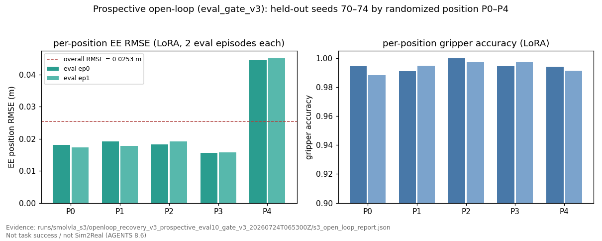

# SmolVLA Recovery v3 — 作品集一页纸（诚实口径）

**状态（2026-07-24）**：独立 prospective open-loop **Pass**（`eval_gate_v3`）；有界 Isaac S4 seeds 1–5 **已跑**（`ran_isaac=true`；lift 0/5 → **Hold**）。  
**不是**：任务成功、Sim2Real、真机部署。

## 一句话

在三仓 Panda 闭环上，把官方 SmolVLA 接到自有 `state[15]+scene` 数据与执行语义门禁：修好 train-only split / PEFT / 相机后完成 LoRA；用**独立 held-out** 全帧 open-loop 证明 EE/夹爪分类与关爪时序过线；把「开爪边 raw 过冲」从挡 Pass 的代理指标修订为执行侧 `clip(raw,0,1)` 语义，并冻结有界 S4 runtime 合同。

## 可写进简历的量化事实（均有产物）

| 声明 | 数字 | 证据 |
|---|---|---|
| Recovery LoRA | 5,705 steps；train-only 36 ep；checkpoint audit Pass | `runs/smolvla_s3/recovery_v3_lora_20260723T125632Z/` |
| Prospective Pass（gate v3） | 10 ep / 2,593 帧；EE RMSE **0.0253 m**；grip BA **0.994**；close-edge beyond-ε **0.386%** | `.../openloop_recovery_v3_prospective_eval10_gate_v3_20260724T065300Z/` |
| 相对 S2 基线 | EE 相对改善 ≈ **90.7%**（S2 EE 0.273 m） | `configs/smolvla_s3/eval_gate_v3.yaml` baselines |
| 执行不变式 | clip 分类变化 **0**、关爪时序变化 **0**、mapped==clip | 同上 report |
| 物理链上界（非本策略） | Isaac scripted oracle lift **5/5** | `evidence/e3p5_isaac_scripted_oracle_5x_lift_v2b_20260720/` |
| S4 runtime 合同 | chunk10 / K5 / 10 Hz / gripper clip；**单源** `configs/smolvla_s3/s4_runtime_contract.json`（上游包内同 SHA）；CPU 单测 Pass | `training/smolvla_s3/runtime_s4.py` |
| Bounded Isaac S4（修光后权威） | seeds 1–5；interface 5/5；reach 1/5；grasp **0/5**；lift **0/5**；Hold；JPEG≈154 | `evidence/smolvla_s4_bounded5_relight_20260724T151711Z/s4_gate.json` |
| S4 首轮（近黑场景，**Superseded**） | reach 3/5 · grasp 1/5 · lift 0/5；JPEG≈0.3；reach/grasp 为失明走廊几何重叠 + `close_max=0.70` 口径放大，**不作权威** | `evidence/smolvla_s4_bounded5_20260724T203700Z/s4_gate.json` |
| 训练域 MuJoCo H2 对照（提前停止） | 同 ckpt、JPEG≈50；seed1 `gripper never closed below 0.700`（`grip_min≈0.976`）→ 倾向闭环 BC，**不是**完整 5-seed gate | `evidence/smolvla_s4_mujoco_bounded5_20260724T155513Z/s4_gate.json` |
| Downstream PolicyRunner reuse | 1-ep `panda_jsonl_replay` + `pybullet_ik` + `--launch-stack`；`is_closed_loop=false` | `evidence/downstream/smolvla_v3_ep0_benchmark_summary.json` |

## 图表（全部可由 `scripts/generate_smolvla_v3_portfolio_figures.py` 复现）

均为诚实口径：open-loop Pass / interface Pass / `ran_isaac=true` ≠ 任务成功 ≠ Sim2Real。

| 图 | 内容 | 数据源 |
|---|---|---|
|  | prospective EE RMSE vs S2 基线（相对改善 ≈ 90.7%） | gate_v3 report + `eval_gate_v3.yaml` baselines |
|  | base vs LoRA 成对离线指标（EE / 夹爪 / 平滑 / 饱和 / latency p50-p95-max） | 同一 gate_v3 report（paired） |
|  | held-out seeds 70–74 按 P0–P4 位置分解（P4 为最难位） | gate_v3 report `per_episode_raw_results` |
|  | S4 有界 funnel：interface 5/5 → reach 1/5 → grasp/lift 0/5 → Hold | **relight** `s4_gate.json`（权威） |
|  | S4 逐种子：subgoal 矩阵 + max EE excursion + latency p50 | **relight** `episode_results.jsonl` + `trials/seed_*/report.json` |
|  | 下游 PolicyRunner 1-ep smoke：1,105 telemetry rows，其中 1,084 条含 latency 值；p50 7.7 ms / p95 39 ms / max 358 ms | 下游 `benchmark_timeseries.csv` |
|  | 三后端 unified_eval_report_v0 一图汇总（Pass / Smoke / Hold） | `evidence/smolvla_v3_eval_framework_20260724/` |

## 面试 STAR（60 秒）

1. **Situation**：v1/v2 LoRA 全帧 open-loop 卡在关爪时序与饱和；Recovery 又暴露 train/val 泄漏与 state/相机契约错误。  
2. **Task**：在不盲扫超参、不进 Isaac 的前提下，做出可复现的 Isaac-readiness 门禁。  
3. **Action**：冻结 train-only + `state[15]` + 官方 PEFT；独立采 prospective；v2 因开爪边 raw 过冲 Hold 后，用执行语义把严重度按边拆开并保留关爪边/不变式硬门禁。  
4. **Result**：v3 prospective **Pass**；S4 ≤5 seeds 已在本机执行（`ran_isaac=true`），lift 0/5 → Hold；不扩种子、不声称任务成功。

## 禁止话术

- 「SmolVLA 已完成抓取 / 已 Sim2Real」  
- 「open-loop Pass = 任务成功」  
- 「改门槛是为了刷过」——应说「按 `clip(raw,0,1)` 执行语义修订，关爪边与分类/时序不变式仍硬挡」

## 关联

- **最终项目总结（统一入口）**：`docs/portfolio/FINAL_PROJECT_SUMMARY.md`
- 分层 Badcase 归因：`docs/portfolio/BADCASE_ATTRIBUTION_SUMMARY.md`
- 后续路线（P1/P2 仅登记）：`docs/FUTURE_WORK_ROADMAP.md`
- v3 全链评测 SOP：`docs/SMOLVLA_V3_EVAL_SOP.md`
- S4 lift 0/5 离线归因（含遥测：相机近黑 / H3 排除）：`docs/SMOLVLA_S4_LIFT0_OFFLINE_ATTRIBUTION.md`
- 权威事实表：`docs/portfolio/THREE_REPO_CANONICAL_FACTS.md`  
- S4 清单：`docs/SMOLVLA_S3_ISAAC_S4_RUN_CHECKLIST.md`  
- 简历长文：`docs/portfolio/resume_description.md`
- 统一评测信封（P1）：`docs/portfolio/UNIFIED_EVAL_REPORT.md`
