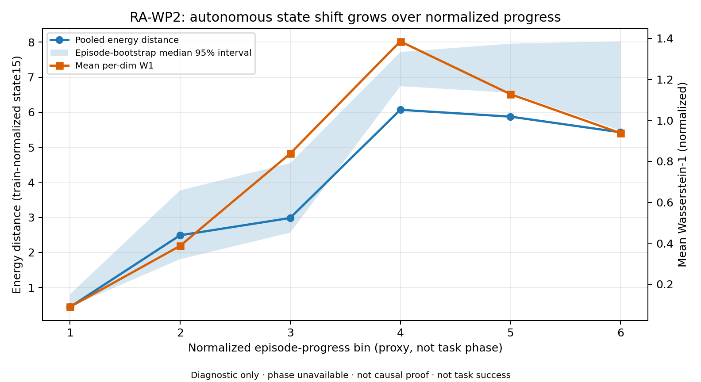
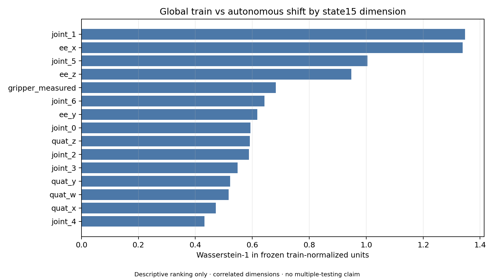

# Closed-Loop State Shift Results

**版本**：v1.0  
**研究问题**：expert-state first-action Pass 与 autonomous closed-loop Hold 之间是否存在可量化 state shift？  
**结果状态**：Directional support / phase-specific and causal claims unavailable  
**权威 JSON**：[closed_loop_shift_v1/report.json](../../../../evidence/closed_loop_shift_v1/report.json)  
**边界**：**Diagnostic only / Gate ineligible / Not causal proof / Not task success / Not Sim2Real**。

返回：[RA 科研助理文档包](README.md)

---

## 1. 数据与协议

| Source | Episodes | Frames | Role |
|---|---:|---:|---|
| Recovery v3 immutable train split | 36 | 9,122 | expert-state reference |
| authoritative relight S4 | 5 | 750 | autonomous comparison |

两侧使用同一 `observation.state[15]`：joint7 + EE pose xyzw7 + measured gripper1。所有状态使用冻结训练集 mean/std 标准化；`object_pose` 和 FT 没有进入 distance。

不确定性采用 episode-level median bootstrap（2,000 次，seed `20260730`），没有把连续帧视为独立样本。W1 使用 512 个共享 quantile；multivariate energy distance 对两侧确定性最多取 1,024 帧，以控制 CPU/内存并保证复现。

## 2. 数据审计导致的预注册修订

train parquet 与 online observations 均没有可靠 task phase；S4 `gt_events.jsonl` 为空。因此原计划的 hover/approach/close/lift 分析不可执行。metric 计算前冻结的 Amendment A 改用六个 normalized-progress bins：

```text
bin = floor(frame_index * 6 / episode_length)
```

它只比较相对运行进度，不能命名为任务阶段，也不能判断 shift 是否先于具体 failure onset。

## 3. Global shift

| Metric | Pooled | Episode median | 95% bootstrap interval |
|---|---:|---:|---:|
| mean W1（normalized） | `0.7228` | `0.8131` | `[0.6665, 0.8734]` |
| energy distance | `2.0554` | `2.7953` | `[1.6511, 3.4008]` |
| mean delta L2 | `2.4556` | `2.6410` | `[2.1607, 3.0645]` |

这些数值说明当前 train 与 autonomous state distributions 在冻结归一化空间中不同；energy/W1 没有预定义的任务 Pass 阈值，不能把绝对值直接翻译成成功率。

## 4. Shift 随 normalized progress 的变化



| Progress bin | Energy distance | Mean W1 | Episode energy median |
|---:|---:|---:|---:|
| 1/6 | `0.4424` | `0.0886` | `0.5291` |
| 2/6 | `2.4894` | `0.3871` | `3.0758` |
| 3/6 | `2.9831` | `0.8379` | `3.8355` |
| 4/6 | `6.0691` | `1.3855` | `7.1590` |
| 5/6 | `5.8742` | `1.1279` | `7.2927` |
| 6/6 | `5.4279` | `0.9378` | `7.2850` |

5/5 online episode 的末 bin energy distance 均高于首 bin。距离从第 2–4 progress bin 显著扩大，随后保持高位。这支持“自主运行后段比起点更偏离训练参考”的方向性陈述；它不是任务 phase 或 failure precedence 证据。

## 5. 哪些 state dimensions 贡献较大



| Rank | Dimension | W1 | Standardized mean difference |
|---:|---|---:|---:|
| 1 | `joint_1` | `1.3467` | `-1.3464` |
| 2 | `ee_x` | `1.3385` | `-1.3377` |
| 3 | `joint_5` | `1.0041` | `-0.9483` |
| 4 | `ee_z` | `0.9475` | `+0.8517` |
| 5 | `gripper_measured` | `0.6828` | `+0.5412` |

这与行为观察一致：多数 rollout 保持较高 EE z，且夹爪保持开态。但各维度相关、未进行逐维因果干预，所以排序只用于诊断，不是 feature importance 或 causal attribution。

## 6. Behavior alignment

- 5/5 的 `gripper_cmd_min > 0.85`，command 从未低于 `0.7`；
- 5/5 的 measured gripper 从未低于 `0.7`；
- seed 4 的 EE z 最低约 `0.238 m`，其余四条最低约 `0.427–0.445 m`；
- 所有 episode 最终均未 grasp/lift。

所以 state shift 与“不下探/不闭爪”同时出现，并且 gripper 的差异已经存在于 policy command，不是执行器单独吞掉 close command。

## 7. Hypothesis update

**H2 更新为**：`directional_support_from_progress_proxy_not_causal_proof`。

支持部分：

- global distribution distance 非零且 episode-level interval 远离零；
- 5/5 episode 的 late-vs-early energy 同向上升；
- 高 W1 维度包含 EE z 和 measured gripper，与已知行为失败一致。

仍不可证明：

- shift 首先出现在哪个真实 task phase；
- shift 是否先于 failure onset；
- shift 是原因、结果还是其它时序/视觉变量的共同结果；
- MuJoCo/Isaac 域差的相对贡献；
- 对其它 policy、任务或真实机器人是否成立。

## 8. 结论

RA-WP2 把 H2 从“仅靠 offline Pass / closed-loop Hold 的推断”推进为“由 state15 global 和 progress-conditioned distance 支持的方向性假设”。同时，字段审计阻止了更强的 phase/causal claim。结果不改变任何 Gate：Recovery v3 仍为 open-loop Pass、bounded S4 Task Hold。

## 9. RA-WP2b：True phase contract

后续补齐了真实 phase / failure-onset 合同，但旧证据仍不能被回填：

- 上游 `panda_task_timeline_v1` 写入 `gt_events.jsonl`，每行含 `phase`、subgoal、monotonic timestamp 与 failure-onset censoring；
- policy observation sidecar 升级为 `smolvla_observation_telemetry_v2`，含同一 `episode_id` 与 `observation_monotonic_ns`；
- 训练参考新增 `panda_train_frame_phase_v1` 物化入口，只接受 upstream Task GT phase；
- 中游 `phase_conditioned_closed_loop_shift_v1` 分析器只接受新合同，旧 proxy / 空 timeline / stale join 全部拒绝。

对冻结历史证据的 readiness audit 结果为 `blocked_missing_source_telemetry`：train split 缺 frame-level phase，旧 online observations 缺 monotonic v2，旧 `gt_events.jsonl` 为空。因此当前仍没有真实 phase-conditioned 数字；这不是未实现，而是证据源不足。
