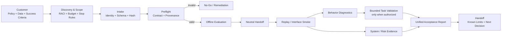
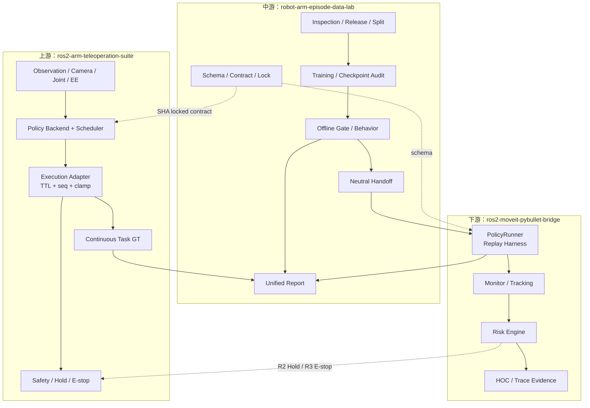

# Reference Architecture：具身策略上线前分层验证

**版本**：v0.1  
**状态**：Reference / portfolio scope  
**日期**：2026-07-30  
**边界**：逻辑架构复用已实现三仓能力，但不证明任务成功（Not task success）；Robot Edge、真实硬件、安全认证、云 HA 与多租户均为未实现或 Hardware Pending。

返回：[解决方案架构文档包](README.md)

---

## 1. 架构目标

1. 在昂贵执行前发现 policy/data/contract 问题；
2. 保留模型原生 observation/action 语义，不做静默切片；
3. 把 Offline、Interface、Behavior、Task 和 System 证据分栏；
4. 让 Safety/Risk、Task GT 和系统健康拥有独立权威；
5. 用中立 handoff 和 trace 支持跨仓 replay、审计和移交；
6. 任何 invalid/stale/unknown 输入默认 fail closed。

---

## 2. 客户视角逻辑架构



客户不需要理解三个代码仓才能使用该流程，但每个结论必须能追到事实 owner 和机器可读证据。

---

## 3. 三仓部署与所有权



**权威边界：**

- 上游拥有在线命令与物理 Task GT；
- 中游拥有合同、数据身份、训练/离线评测和报告口径；
- 下游 `PolicyRunner` 是 replay harness，不是在线 policy brain；
- Risk 不得改写 Task GT 或 `failure_lane=task_gt`。

---

## 4. 信任边界

| 边界 | 不可信输入 | 验证 | 失败动作 |
|---|---|---|---|
| Customer → Intake | checkpoint、manifest、schema | identity、hash、license、shape | invalid / reject |
| Data → Training | split、frame、camera、action | inspection、overlap、release fingerprint | No-Go |
| Model → Runtime | action chunk、latency、NaN/Inf | schema、dim、TTL、sequence、limits | Hold / reject |
| Runtime → Controller | bounded command | workspace、gripper、joint/safety checks | Hold / E-stop |
| Simulator → Report | task/state/system telemetry | provenance、GT completeness、trace correlation | report downgrade |
| Risk → Safety | R-level/status | source validity、policy, mapping | R2 Hold / R3 E-stop |

未知 action schema 或缺失 Task GT 不允许 best-effort 自动兼容。

---

## 5. 合同与 artifact

| Artifact | Canonical contract | Owner |
|---|---|---|
| Panda dataset | `configs/robot_schemas/panda.yaml` | 中游 |
| Policy adapter metadata | `policy_adapter_contract_v0` | 中游 |
| Policy runtime | `panda_policy_runtime_v1` | 中游合同 / 上游实现 |
| Action | `panda_absolute_eef_gripper_v0` 或 `panda_ee_delta_gripper_v0` | policy identity |
| Handoff | `predicted_actions.jsonl` + manifest | 中游 → 下游 |
| Unified report | `unified_eval_report_v0` | 中游 |
| Task GT | continuous task evaluator evidence | 上游 |

absolute EEF8 → delta EEF7 或 task-space → joint-space 转换必须使用具名 adapter，记录版本与输入状态；不能把 channel mapping 冒充执行映射。

---

## 6. 部署拓扑

### Profile A：Local CPU preflight

```text
Developer laptop/workstation
  ├─ schema + release validation
  ├─ onboarding preflight
  ├─ unified report normalization
  └─ unit/contract tests
```

不加载真实 VLA，不运行 Isaac，不声称 runtime task behavior。

### Profile B：Lab GPU offline evaluation

```text
GPU workstation
  ├─ dependency/version audit
  ├─ checkpoint load + forward
  ├─ open-loop / perturbation / latency
  └─ immutable evidence export
```

需要显式 GPU/计费授权；结果仍为 Offline/Behavior。

### Profile C：Bounded simulation

```text
Simulation workstation
  ├─ ROS 2 control/runtime
  ├─ MuJoCo or Isaac
  ├─ continuous Task GT
  ├─ risk / trace
  └─ bounded gate
```

所有进程有生命周期上限，结束前 Nuke On Done。扩 seed、再跑 Isaac 或新采集需另批。

### Profile D：Robot edge

仅为 future reference。实体驱动、校准、PREEMPT_RT、物理 E-stop、EMCY/Bus-Off、网络与安全认证均需独立项目和现场验收。

---

## 7. 可观测性

最小四泳道：

| Lane | 关键字段 | 权威 |
|---|---|---|
| Brain | policy identity、obs seq、chunk、latency、raw action | Policy Backend |
| Execution | command seq、TTL、bounded action、clip、decision | Execution Adapter |
| Safety | R-level、Hold/E-stop、reason、ack | Safety/Risk |
| Task GT | reach/grasp/lift/place、completeness、failure | Continuous evaluator |

所有 lane 使用 `trace_run_id`、episode、sequence/parent event 关联。HOC 是旁路展示，不参与最终裁决。

---

## 8. 关键架构决策

| ADR | 决策 | 原因 |
|---|---|---|
| SA-ADR-01 | 三仓按事实所有权拆分 | 隔离 ROS 控制、ML 环境与 replay/risk；避免多头 GT |
| SA-ADR-02 | 中立 handoff | 下游不绑定 PyTorch/LeRobot 训练栈 |
| SA-ADR-03 | 六层验收 | 防止 offline/interface/system 指标越权 |
| SA-ADR-04 | Fail closed | 未知语义比显式 Hold 风险更高 |
| SA-ADR-05 | Risk 与 Task GT 分权 | 系统健康不能改写物理失败 |
| SA-ADR-06 | Evidence immutable / historical preserved | 防止阈值、split 或结果静默漂移 |
| SA-ADR-07 | 先 mock/replay PoC，后 authoritative | 降低接线与安全变更风险 |

---

## 9. 当前能力与缺口

| 能力 | 状态 |
|---|---|
| schema/release/checkpoint/unified report | 已实现，有代码/测试证据 |
| replay harness / action adapter | 已实现，有下游测试与 smoke |
| M6 mock ROS/DDS safety wiring | 已验证；非物理任务证据 |
| SmolVLA authoritative online cutover | 未启用 |
| async double-buffer online wiring | 未实现；只有 offline bench |
| real Panda / Sim2Real / production safety | Hardware Pending / 未开始 |
| cloud IAM/HA/multi-tenant/compliance | 未实现 |
